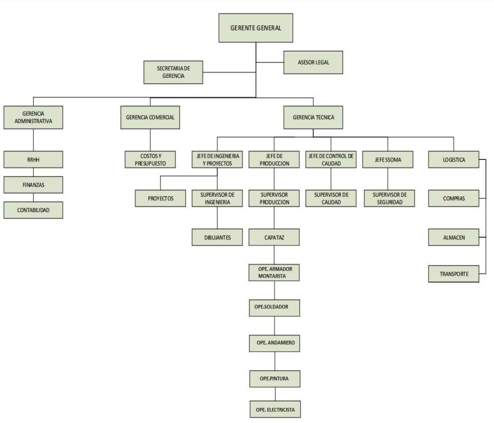
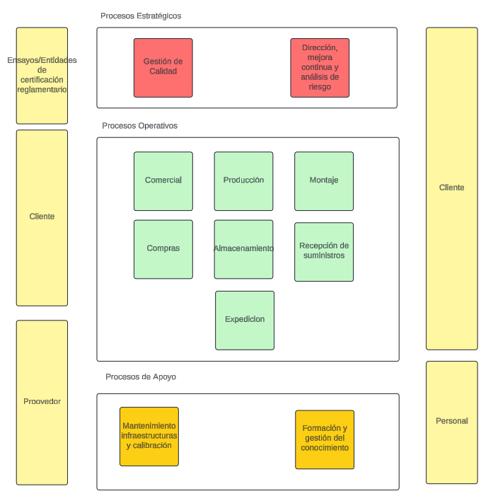
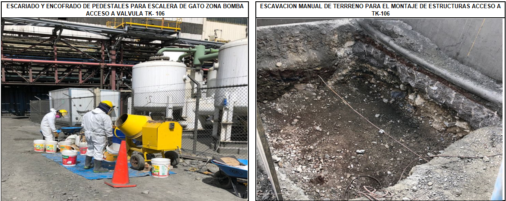
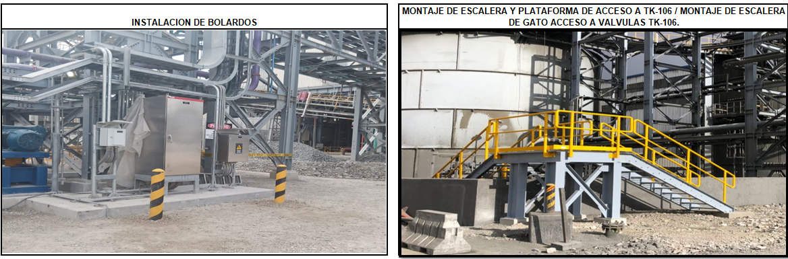
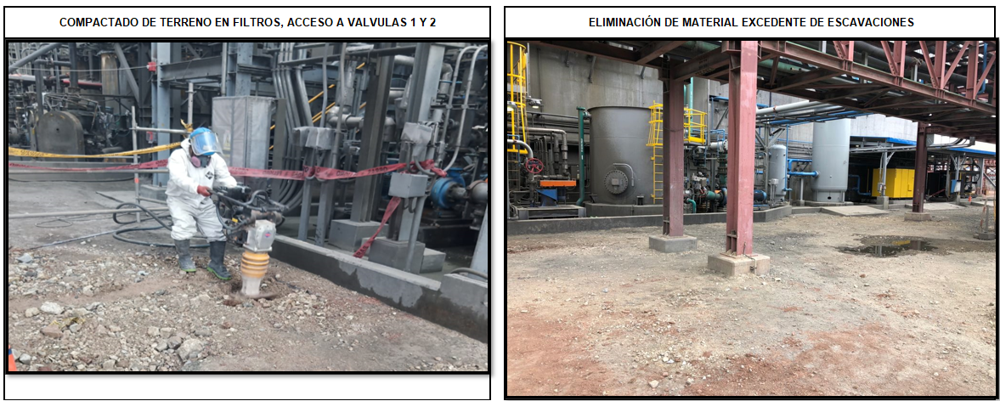
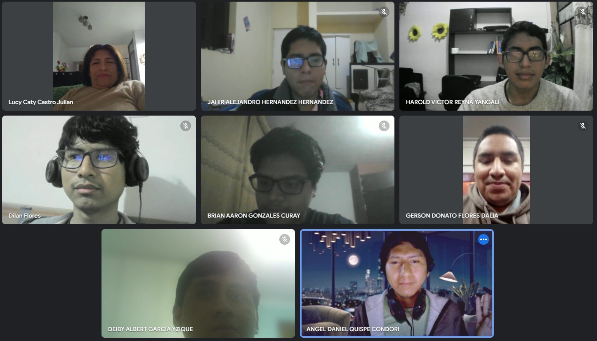

# 1.2. Modelo de Negocio

## Organigrama

## Mapa de procesos

## Imagenes sobre el negocio

## Entrevista

<= [1.1. Datos de la Empresa](../1.1/1.1.md) | [ÍNDICE](../../README.md) | [1.3. Procesos de Negocio Identificados](../1.3/1.3.md) =>