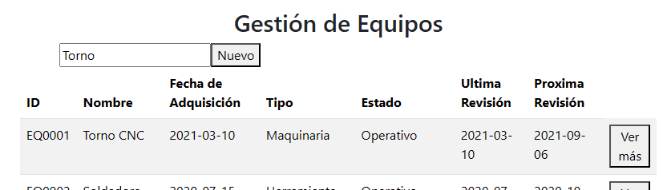
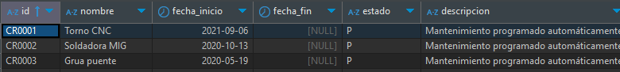

# 10.5. Resultado final (salida)
## Resultado Final (Salida) para el Módulo de Reclutamiento

El **resultado final (salida)** para el módulo de reclutamiento refleja la culminación de todo el flujo de trabajo desde la creación de vacantes hasta la selección final de los candidatos. A continuación se detallan los resultados de cada una de las funcionalidades:

### 1. Registro de Vacantes
- **Entrada**: Datos de la vacante proporcionados por el administrador (como el puesto, descripción, área, ubicación, salario, etc.).
- **Proceso**: El sistema valida y registra la vacante en la base de datos.
- **Salida**: 
  - Confirmación de creación de vacante.
  - Mensaje de éxito.
  - Identificador único `id_vacante` generado automáticamente.

### 2. Recepción y Gestión de Postulaciones
- **Entrada**: El postulante envía su postulación a través de la interfaz.
- **Proceso**: El sistema valida los datos de la postulación y asigna un estado de postulación.
- **Salida**:
  - Mensaje de confirmación de postulación exitosa.
  - Identificador único `ID_postulacion` generado automáticamente.
  - Estado de la postulación (por ejemplo, "pendiente", "aceptada", "rechazada").

### 3. Revisión de Candidaturas
- **Entrada**: El reclutador revisa las postulaciones recibidas.
- **Proceso**: El sistema muestra las postulaciones con los datos correspondientes. El reclutador puede actualizar el estado de la postulación, programar entrevistas o rechazar candidatos.
- **Salida**:
  - Actualización del estado de la postulación (por ejemplo, "en revisión", "entrevista programada", "rechazada").
  - Confirmación de las acciones tomadas (por ejemplo, programación de entrevista).

### 4. Entrevistas Finales
- **Entrada**: El reclutador selecciona candidatos para entrevistas finales.
- **Proceso**: El sistema gestiona la programación de entrevistas y la asignación de los resultados de las entrevistas.
- **Salida**:
  - Notificación de entrevista final programada con detalles.
  - Actualización del estado de la postulación (por ejemplo, "entrevista finalizada", "candidato seleccionado", "rechazado").

### 5. Selección Final de Candidatos
- **Entrada**: El reclutador toma la decisión final sobre el candidato seleccionado.
- **Proceso**: El sistema registra la decisión final de selección del candidato.
- **Salida**:
  - Confirmación del candidato seleccionado.
  - Actualización del estado de la postulación a "seleccionado".
  - Envío de notificación al candidato con los detalles de la oferta.

### 6. Notificaciones
- **Entrada**: Generación automática de notificaciones para los candidatos durante cada etapa del proceso (postulación, entrevistas, selección).
- **Proceso**: El sistema envía notificaciones automáticas de aceptación, entrevista o rechazo, basándose en los estados de las postulaciones.
- **Salida**:
  - Notificación enviada al candidato, confirmando el cambio de estado o la acción tomada (por ejemplo, "su postulación ha sido aceptada para una entrevista final").

# Módulo de mantenimiento
- Un cronograma de mantenimiento programado automáticamente con el estado inicial `P` (pendiente).
- Ejemplo de registro en `Cronograma__de_mantenimiento`:

1. Primero se hace un registro en Equipos o en infraestructura.
2. Luego el registro se crea automaticamente en Cronograma__de_mantenimiento con el estado inicial `P` (pendiente) y con la fecha de inicio y fin de la tarea de mantenimiento calculados a partir de la frecuencia de mantenimiento dada en el registro del equipo o infraestructura.

