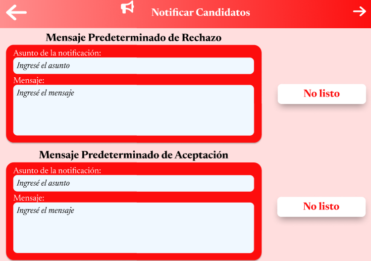

# 11.3. Flujo de Pantallas por Módulo

# Modulo CRM

### Enviar invitacion

El cliente al entrar a solicitar servicio procede a rellenar los datos para enviar la invitacion.


### Invitacion Sin Revivar

El cliente al entrar a ver el estado del servicio despues de enviar la invitacion vera que aun se esta a la espera de revision.


### Lista de Clientes

El empleado podra visualizar 3 listas donde podra ver las invitaciones a revisar, las propuestas a elaborar y las repuestas de adjudicacion.


### Mostrar Invitacion

El empleado revisa la invitacion y podra decidir si participar o no.


### Invitacion Rechazada

El cliente al entrar a ver el estado del servicio despues de la respuesta vera que se rechaza participar.


### Invitacion Aceptada

El cliente al entrar a ver el estado del servicio despues de la respuesta vera que se acepta participar.


### Enviar Propuesta

El empleado procede a rellenar los datos para enviar la propuesta.


### Mostrar Propuesta

El cliente al entrar a ver el estado del servicio despues de esperar el tiempo vera ya la propuesta y podra decidir si aceptarla o rechazarla.


### Adjudicacion Rechazada

El empleado vera la respuesta del cliente a la propuesta.


### Adjudicacion Aceptada

El empleado vera la respuesta del cliente a la propuesta.


# Modulo de Reclutamiento
### Menú Principal


### Postular Vacante


### Crear Vacante


### Revisar Postulación


### Notificar Candidatos



## 7. Módulo de Inventario

### Enviar invitacion

El cliente al entrar a solicitar servicio procede a rellenar los datos para enviar la invitacion.
|

Eventos:

1. Al cargar la pagina se presentaran las 4 funcionalidades del modulo, para el primer requerimiento consideraremos la funcionalidad de recepción de materiales y al entrar a la función de recepciones se mostrara la tabla de guias de remisión de recepciones de recursos y/o productos.

```sql
SELECT
    id_guia_remision AS "ID",
    entidad_origendestino AS "Contacto",
    fecha_programada AS "Fecha Programada",
    documento_origen AS "Documento de Origen",
    CASE
        WHEN cod_estado_guia = '1' THEN 'Listo'
        WHEN cod_estado_guia = '2' THEN 'Proceso'
        ELSE 'Pendiente'
    END AS "Estado"
FROM
    guia_remision
ORDER BY
    fecha_programada;
```

**Caso 2**
|Codigo Requerimiento |R701|
|---|---|
|Codigo Interfaz| I702|
|Imagen Interfaz| |

Eventos:

2. Al presionar en una de las filas clickeables nos redireccionará a los detalles de la guía de remision seleccionada

```sql
SELECT
    p.nombre_producto AS "Nombre del Producto",
    dg.cantidad_producto AS "Cantidad Producto",
    r.nombre AS "Nombre del Recurso",
    dg.cantidad_recurso AS "Cantidad Recurso",
    dg.demanda AS "Demanda"
FROM
    detalle_guia dg
JOIN
    recurso r ON dg.id_detalle_guia = r.id_detalle_guia
JOIN
    producto p ON dg.id_detalle_guia = p.id_detalle_guia
WHERE
    p.nombre_producto = 'Tanque de Almacenamiento';
```

3. Al presionar en el botón de editar los detalles de una de las guías de remisión nos redireccionará a un apartado en el cual se podrán editar todos los datos menos el ID de la guía de Remisión.
4. Al darle al botón agregar podremos añadir registros en añadir un registro en la entidad Detalle Guía.

```sql
INSERT INTO Detalle_guia (ID_detalle_guia, Cantidad_producto, Cantidad_recurso, Demanda, id_guia_remision) VALUES
('DG0001', 10, 5, 15, 'GR0001');

```

5. Al darle al botón de borrar podremos eliminar un registro de la entidad Detalle Guía.

```sql
DELETE FROM Detalle_guia
WHERE ID_detalle_guia = 'DG0001';
```

**Caso 3**
|Codigo Requerimiento |R701|
|---|---|
|Codigo Interfaz| I703|
|Imagen Interfaz| |

Eventos:

1. Al presioanr el botón eliminar nos redirigirá a un apartado de eliminacion de guías de remisión, el cual añadirá un campo con la opición de borrar individualmente
2. Al presionar el botón borrar dentro de una de las filas podremos eliminar este registro.

```sql
DELETE FROM Guia_remision
WHERE id_guia_remision = 'GR0001';
```

3. Al presionar el botón nuevo podremos insertar un registro de gría de remisión.

```sql
INSERT INTO Detalle_guia (ID_detalle_guia, Cantidad_producto, Cantidad_recurso, Demanda, id_guia_remision) VALUES
('DG0011', 10, 5, 15, 'GR0011');
```

**Caso 4**
|Codigo Requerimiento |R702|
|---|---|
|Codigo Interfaz| I704|
|Imagen Interfaz| |

Eventos:

1. Al cargar la pagina se presentaran las 4 funcionalidades del modulo, para el primer requerimiento consideraremos la funcionalidad de entrega de materiales y al entrar a la función de entregas se mostrara la tabla de guias de remisión de entregas de recursos y/o productos.

```sql
SELECT
    id_guia_remision AS "Referencia",
    entidad_origendestino AS "Contacto",
    fecha_programada AS "Fecha Programada",
    documento_origen AS "Documento de origen",
    CASE
        WHEN cod_estado_guia = '1' THEN 'Listo'
        WHEN cod_estado_guia = '2' THEN 'Proceso'
        ELSE 'Pendiente'
    END AS "Estado"
FROM
    guia_remision
WHERE
    id_guia_remision IN ('GR0006', 'GR0007', 'GR0008', 'GR0009', 'GR0010')
ORDER BY
    fecha_programada;
```

**Caso 5**
|Codigo Requerimiento |R702|
|---|---|
|Codigo Interfaz| I705|
|Imagen Interfaz| |

Eventos:

2. Al presionar en una de las filas clickeables nos redireccionará a los detalles de la guía de remision seleccionada

```sql
SELECT
    p.nombre_producto AS "Nombre del Producto",
    dg.cantidad_producto AS "Cantidad Producto",
    r.nombre AS "Nombre del Recurso",
    dg.cantidad_recurso AS "Cantidad Recurso",
    dg.demanda AS "Demanda"
FROM
    detalle_guia dg
JOIN
    recurso r ON dg.id_detalle_guia = r.id_detalle_guia
JOIN
    producto p ON dg.id_detalle_guia = p.id_detalle_guia
WHERE
    p.nombre_producto = 'Tanque de Almacenamiento';
```

3. Al presionar en el botón de editar los detalles de una de las guías de remisión nos redireccionará a un apartado en el cual se podrán editar todos los datos menos el ID de la guía de Remisión.
4. Al darle al botón agregar podremos añadir registros en añadir un registro en la entidad Detalle Guía.

```sql
INSERT INTO Detalle_guia (ID_detalle_guia, Cantidad_producto, Cantidad_recurso, Demanda, id_guia_remision) VALUES
('DG0011', 10, 5, 15, 'GR0001');

```

5. Al darle al botón de borrar podremos eliminar un registro de la entidad Detalle Guía.

```sql
DELETE FROM Detalle_guia
WHERE ID_detalle_guia = 'DG0001';
```

**Caso 6**
|Codigo Requerimiento |R701|
|---|---|
|Codigo Interfaz| I706|
|Imagen Interfaz| |

Eventos:

1. Al presioanr el botón eliminar nos redirigirá a un apartado de eliminacion de guías de remisión, el cual añadirá un campo con la opición de borrar individualmente
2. Al presionar el botón borrar dentro de una de las filas podremos eliminar este registro.

```sql
DELETE FROM Guia_remision
WHERE id_guia_remision = 'GR0006';
```

3. Al presionar el botón nuevo podremos insertar un registro de gría de remisión.

```sql
INSERT INTO Detalle_guia (ID_detalle_guia, Cantidad_producto, Cantidad_recurso, Demanda, id_guia_remision) VALUES
('DG0011', 25, 8, 20, 'GR0006');
```

**Caso 7**
|Codigo Requerimiento |R703|
|---|---|
|Codigo Interfaz| I707|
|Imagen Interfaz| |

Eventos:

1. Al cargar la pagina se presentaran las 4 funcionalidades del modulo, para el tercer requerimiento consideraremos la funcionalidad de reabastecimiento de materiales y al entrar a la función de reabastecimiento se mostrara la tabla de guias de recursos y sus valores a considerar para un reabastecimiento futuro.

```sql
SELECT
    r.nombre AS "Producto",
    r.costo_unitario AS "Stock",
    r.peso AS "Disponible",
    r.volumen AS "Mínimo",
    r.plazo_entrega AS "Máximo",
    (r.costo_unitario * 2) AS "A pedir"
FROM
    recurso r
WHERE
    r.cod_estado_recurso = 'A';
```

**Caso 8**
|Codigo Requerimiento |R703|
|---|---|
|Codigo Interfaz| I708|
|Imagen Interfaz| |

Eventos:

2. Al presionar en una de las filas clickeables nos redireccionará a los detalles de las guías de remisión que han entregado o recibido a dicho recurso.

```sql
SELECT
    R.id_recurso AS "ID del Recurso",
    R.nombre AS "Nombre",
    R.descripcion AS "Descripción",
    R.costo_unitario AS "Costo Unitario",
    R.peso AS "Peso",
    R.volumen AS "Volumen",
    R.plazo_entrega AS "Plazo de Entrega",
    R.cod_estado_recurso AS "Estado del Recurso",
    R.fecha_registro AS "Fecha de Registro",
    G.id_guia_remision AS "Documento",
    D.cantidad_recurso AS "Cantidad",
    G.fecha_efectiva AS "Fecha"
FROM
    recurso R
JOIN
    detalle_guia D ON R.id_detalle_guia = D.id_detalle_guia
JOIN
    guia_remision G ON D.id_guia_remision = G.id_guia_remision
WHERE
    R.id_recurso = 'RC0001';
```

3. Al presionar en el botón de editar los detalles de una de los recursos nos redireccionará a un apartado en el cual se podrán editar todos los datos menos el ID del Recurso.
4. Al darle al botón agregar podremos añadir registros en añadir un registro en la entidad Guía de Remisión.

```sql
INSERT INTO Guia_remision (id_guia_remision, Cod_tipo_guia, Entidad_origendestino, Fecha_programada, Fecha_efectiva, Cod_tipo_operacion, Cod_estado_guia, Documento_origen, ID_empleado) VALUES
('GR0011', '1', 'Proveedores S.A.', '2023-01-01', '2023-01-02', '1', '1', 'OC0001', 'E01008');
```

5. Al darle al botón de borrar podremos eliminar un registro de la entidad Detalle Guía.

```sql
DELETE FROM Guia_remision
WHERE ID_guia_remision = 'GR0001';
```

**Caso 9**
|Codigo Requerimiento |R703|
|---|---|
|Codigo Interfaz| I709|
|Imagen Interfaz| |

Eventos:

1. Al presionar el botón eliminar nos redirigirá a un apartado de eliminacion de recursos, el cual añadirá un campo con la opición de borrar individualmente
2. Al presionar el botón borrar dentro de una de las filas podremos eliminar este registro.

```sql
DELETE FROM Recurso
WHERE id_recurso = 'RC0001';
```

3. Al presionar el botón nuevo podremos insertar un registro de recurso.

```sql
INSERT INTO Recurso (ID_recurso, Nombre, Descripcion, Cod_tipo_recurso, Rastreo_inventario, Costo_unitario, Peso, Volumen, Plazo_entrega, Cod_estado_recurso, Fecha_registro, ID_inspeccion, ID_lote, ID_certificado_calidad, ID_ficha_tecnica, ID_informe_stock, ID_detalle_orden, ID_detalle_guia) VALUES
('RC0011', 'Acero', 'Acero para construcción de estructuras', '1', TRUE, 1000.00, 100.00, 1.00, 7, 'A', '2023-01-01', 'IP0001', 'L00101', 'CC0001', 'FT0001', 'IS0001', 'DO0001', 'DG0001');
```

**Caso 10**
|Codigo Requerimiento |R704|
|---|---|
|Codigo Interfaz| I710|
|Imagen Interfaz| |

Eventos:

1. Al cargar la pagina se presentaran las 4 funcionalidades del modulo, para el cuarto requerimiento consideraremos la funcionalidad de entrega de reportes de stock y al entrar a la función de informes de stock se mostrara la tabla de informes de stock recursos y/o productos.

```sql
SELECT
    id_informe_stock AS "ID de Informe",
    mes_informe AS "Mes",
    año_informe AS "Año",
    fecha_generacion AS "Fecha de Generación",
    CASE
        WHEN estado_informe = 'A' THEN 'Generado'
        WHEN estado_informe = 'B' THEN 'En Proceso'
        WHEN estado_informe = 'C' THEN 'Finalizado'
        ELSE 'Desconocido'
    END AS "Estado"
FROM
    informe_stock
ORDER BY
    año_informe, mes_informe;
```

**Caso 11**
|Codigo Requerimiento |R704|
|---|---|
|Codigo Interfaz| I711|
|Imagen Interfaz| |

Eventos:

2. Al presionar en una de las filas clickeables nos redireccionará a los detalles del informe de stock

```sql
SELECT
    informe_stock.id_informe_stock AS "ID del Informe",
    informe_stock.mes_informe AS "Mes",
    informe_stock.año_informe AS "Año",
    informe_stock.fecha_generacion AS "Fecha de Generación",
    CASE
        WHEN informe_stock.estado_informe = 'A' THEN 'Generado'
        WHEN informe_stock.estado_informe = 'B' THEN 'En Proceso'
        WHEN informe_stock.estado_informe = 'C' THEN 'Finalizado'
        ELSE 'Desconocido'
    END AS "Estado del Informe",
    detalle_orden.id_detalle_orden AS "ID Detalle Orden",
    recurso.nombre AS "Nombre Recurso",
    detalle_orden.cantidad_recurso AS "Cantidad Recurso",
    producto.nombre_producto AS "Nombre Producto",
    detalle_orden.cantidad_producto AS "Cantidad Producto",
    orden_produccion.fecha_creacion AS "Fecha Creación"
FROM
    informe_stock
JOIN recurso ON recurso.id_informe_stock = informe_stock.id_informe_stock
JOIN detalle_orden ON recurso.id_detalle_orden = detalle_orden.id_detalle_orden
JOIN producto ON detalle_orden.id_detalle_orden = producto.id_detalle_orden
JOIN orden_produccion ON detalle_orden.id_orden_produccion = orden_produccion.id_orden_produccion
WHERE informe_stock.id_informe_stock = 'IS0001';
```

3. Al presionar en el botón de editar los detalles de una de las guías de remisión nos redireccionará a un apartado en el cual se podrán editar todos los datos menos el ID de la guía de Remisión.
4. Al darle al botón agregar podremos añadir registros en añadir un registro en la entidad Detalle Guía.

```sql
INSERT INTO Informe_stock (ID_informe_stock, Mes_informe, Año_informe, Fecha_generacion, Cantidad_actual_recurso, Cantidad_actual_producto, Stock_inicial, Stock_final, Stock_real, Stock_teorico, Observaciones, Estado_informe,id_empleado) VALUES
('IS0011', 1, 2023, '2023-01-31', 500, 300, 400, 600, 450, 500, 'Inventario de enero', 'A','E01003');

```

5. Al darle al botón de borrar podremos eliminar un registro de la entidad Detalle Guía.

```sql
DELETE FROM Informe_stock
WHERE ID_informe_stock = 'IS0001';
```

**Caso 12**
|Codigo Requerimiento |R704|
|---|---|
|Codigo Interfaz| I712|
|Imagen Interfaz| |

Eventos:

1. Al presioanr el botón eliminar nos redirigirá a un apartado de eliminacion de guías de remisión, el cual añadirá un campo con la opición de borrar individualmente
2. Al presionar el botón borrar dentro de una de las filas podremos eliminar este registro.

```sql
DELETE FROM Informe_stock
WHERE ID_informe_stock = 'IS0001';
```

3. Al presionar el botón nuevo podremos insertar un registro de gría de remisión.

```sql
INSERT INTO Informe_stock (ID_informe_stock, Mes_informe, Año_informe, Fecha_generacion, Cantidad_actual_recurso, Cantidad_actual_producto, Stock_inicial, Stock_final, Stock_real, Stock_teorico, Observaciones, Estado_informe,id_empleado) VALUES
('IS0011', 1, 2023, '2023-01-31', 500, 300, 400, 600, 450, 500, 'Inventario de enero', 'A','E01003');

```
