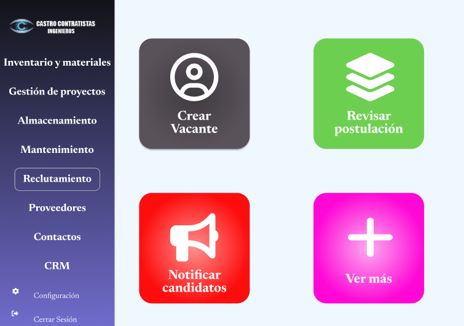
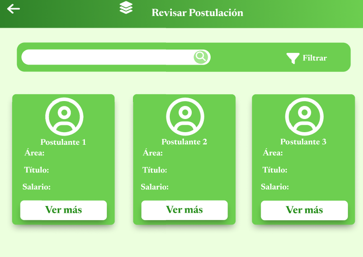

# 11.3. Flujo de Pantallas por Módulo

# Modulo CRM

### Invitacion Sin Revivar

El cliente al entrar a ver el estado del servicio despues de enviar la invitacion vera que aun se esta a la espera de revision.

### Mostrar Propuesta

El cliente al entrar a ver el estado del servicio vera ya la propuesta y podra decidir si aceptarla o rechazarla.

# Modulo de Reclutamiento
### Menú Principal

### Postular Vacante

### Crear Vacante

### Revisar Postulación

### Notificar Candidatos

