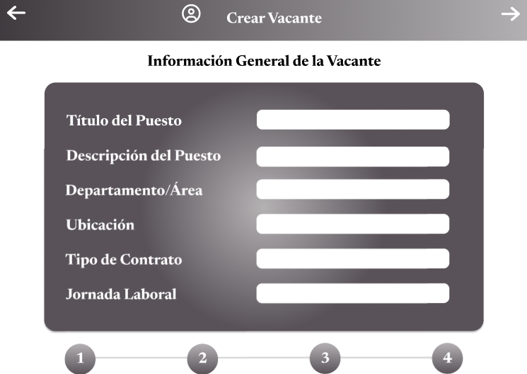

# 11.3. Flujo de Pantallas por Módulo

# Modulo CRM

### Enviar invitacion

El cliente al entrar a solicitar servicio procede a rellenar los datos para enviar la invitacion.

### Invitacion Sin Revivar

El cliente al entrar a ver el estado del servicio despues de enviar la invitacion vera que aun se esta a la espera de revision.

### Lista de Clientes

El empleado podra visualizar 3 listas donde podra ver las invitaciones a revisar, las propuestas a elaborar y las repuestas de adjudicacion.

### Mostrar Invitacion

El empleado revisa la invitacion y podra decidir si participar o no.

### Invitacion Rechazada

El cliente al entrar a ver el estado del servicio despues de la respuesta vera que se rechaza participar.

### Invitacion Aceptada

El cliente al entrar a ver el estado del servicio despues de la respuesta vera que se acepta participar.

### Enviar Propuesta

El empleado procede a rellenar los datos para enviar la propuesta.

### Mostrar Propuesta

El cliente al entrar a ver el estado del servicio despues de esperar el tiempo vera ya la propuesta y podra decidir si aceptarla o rechazarla.

### Adjudicacion Rechazada

El empleado vera la respuesta del cliente a la propuesta.

### Adjudicacion Aceptada

El empleado vera la respuesta del cliente a la propuesta.

# Modulo de Reclutamiento
### Menú Principal

### Postular Vacante

### Crear Vacante

### Revisar Postulación

### Notificar Candidatos

# módulo de Mantenimiento

### Módulo de Gestión de Equipos
1. **Pantalla de inicio de sesión**: Los usuarios autenticados pueden acceder al sistema.

2. **Pantalla de listado de equipos**: Vista de todos los equipos registrados, con filtros por tipo, estado y ubicación.

3. **Pantalla de detalle de equipo**: Detalles completos del equipo seleccionado, con la opción de agregar un nuevo equipo o editar el existente.

### Módulo de Gestión de Infraestructura
1. **Pantalla de listado de infraestructura**: Muestra todas las infraestructuras disponibles, con filtros para la ubicación y estado.

2. **Pantalla de detalle de infraestructura**: Información detallada de la infraestructura seleccionada, y la opción de agregar o editar detalles.

### Módulo de Solicitudes de Mantenimiento
1. **Pantalla de solicitudes de mantenimiento**: Permite al operario generar una solicitud para el mantenimiento de un equipo o infraestructura, con campos para la descripción, urgencia y equipo asociado.

2. **Pantalla de cronograma de mantenimiento**: Visualización de los cronogramas de mantenimiento programados con opción para editar fechas y asignar recursos.

## 7. Módulo de Inventario

### Entrar al submodulo de recepciones

El almacenero ingresará al submodulo de recepcines de entre los 4 submodulos disponibles
|

### Entrar a los detalles de una guia de remision

El almacenero se ingresará a los detalles de una guia de remision en especifico
|

### Verificar los detalles de una guia de remision

El almacenero se informara sobre los detalles de una guia de remision en especifico
|

### Editar los detalles de una guia de remision

El almacenero actualizara los detalles de una guia de remision
|

### Añadir detalles de guia de una guia de remision

El almacenero añadira detalles de guia a la guia de remision
|

### Eliminar detalles de guia de una guia de remision

El almacenero eliminará detalles de guia a la guia de remision
|

### Eliminar una guia de remision

El almacenero eliminará la guia de remision seleccionada.
|

### Añadir una guia de remision

El almacenero insertará una guia de remision con datos provistos por el almacenero.
|

### Entrar al submodulo de entregas

El almacenero ingresará al submodulo de entregas de entre los 4 submodulos disponibles
|

### Entrar a los detalles de una guia de remision

El almacenero se ingresará a los detalles de una guia de remision en especifico
|

### Verificar los detalles de una guia de remision

El almacenero se informara sobre los detalles de una guia de remision en especifico
|

### Editar los detalles de una guia de remision

El almacenero actualizara los detalles de una guia de remision
|

### Añadir detalles de guia de una guia de remision

El almacenero añadira detalles de guia a la guia de remision
|

### Eliminar detalles de guia de una guia de remision

El almacenero eliminará detalles de guia a la guia de remision
|

### Eliminar una guia de remision

El almacenero eliminará la guia de remision seleccionada.
|

### Añadir una guia de remision

El almacenero insertará una guia de remision con datos provistos por el almacenero.
|

### Entrar al submodulo de reabastecimiento

El almacenero ingresará al submodulo de reabastecimiento de entre los 4 submodulos disponibles
|

### Entrar a los detalles de un recurso

El almacenero se ingresará a los detalles de una recurso en especifico
|

### Verificar los detalles de un recurso
El almacenero se informara sobre los detalles de un recurso en especifico
|

### Editar los detalles de un recurso

El almacenero actualizara los detalles de un recurso.
|

### Entrar al submodulo de informe de stock

El almacenero ingresará al submodulo de informe de stock de entre los 4 submodulos disponibles
|

### Entrar a los detalles de un informe de stock

El almacenero se ingresará a los detalles de un informe de stock en especifico
|

### Verificar los detalles de un informe de stock
El almacenero se informara sobre los detalles de un informe de stock en especifico
|

### Editar los detalles de un informe de stock

El almacenero actualizara los detalles de un informe de stock.
|

