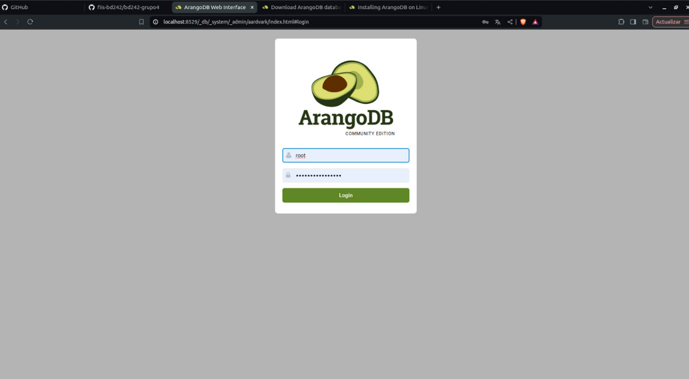
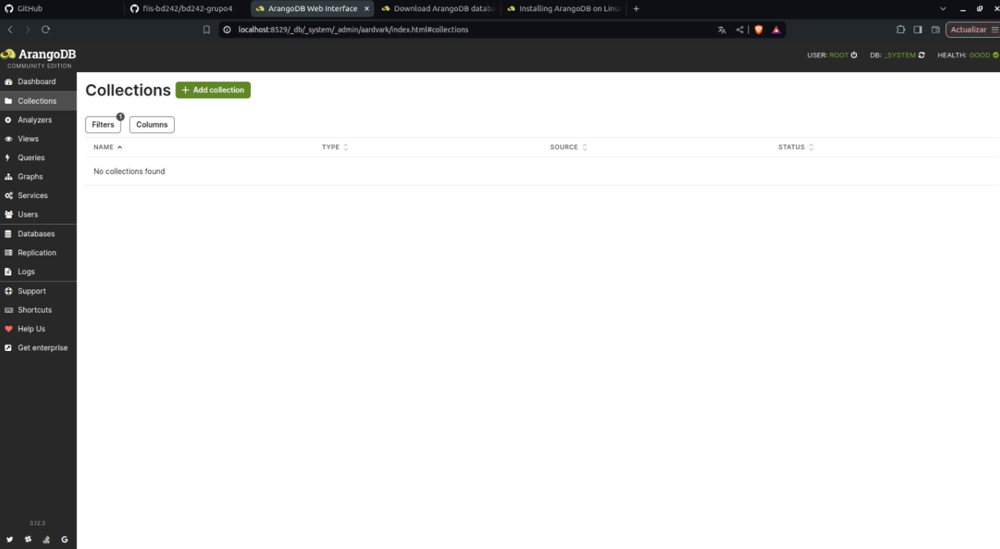

# 12.3. Configuración
## **Proceso de Configuración de ArangoDB**

### **Paso 1: Instalación de ArangoDB**

1. **Descarga e instalación**:


Utilizando los comandos proporcionados en la página oficial de ArangoDB se instala en Linux, ya que no cuenta con soporte para Windows.


### **Paso 2: Iniciar el Servidor ArangoDB**
Acceder a la interfaz web: Abre un navegador web y accede a la interfaz de administración en:
http://localhost:8529


Con esto ya podemos usar la base de datos Nosql

### **Paso 3: Configuración del Entorno de Desarrollo**
A. Conexión desde Spring Boot
Agrega la dependencia de Spring Data ArangoDB en tu archivo pom.xml o build.gradle:
```xml
   <dependency>
       <groupId>com.arangodb</groupId>
       <artifactId>spring-data-arangodb</artifactId>
       <version>[versión más reciente]</version>
   </dependency>
```
B. Conexión desde Angular
Comunica Angular con el backend de Spring Boot mediante servicios REST, que consultarán y actualizarán datos en ArangoDB.