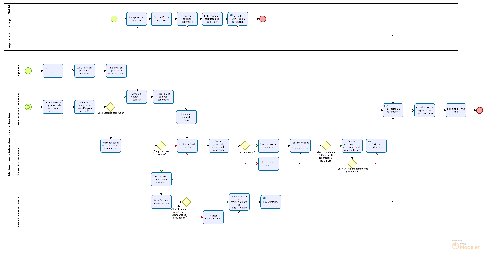

# 2.1. Procesos AS-IS

## 2.1.1. PRODUCCION

## Tabla de actividades:

| Secuencia | Actividad                      | Descripción                                                                 | Responsable                |
|-----------|---------------------------------|-----------------------------------------------------------------------------|----------------------------|
| 1         | Recepción de materiales         | Se reciben y verifican los materiales metálicos según las órdenes de compra.| Supervisor de Producción    |
| 2         | Corte y conformado de materiales| Los materiales se cortan y conforman de acuerdo con las especificaciones del proyecto.| Operarios               |
| 3         | Ensamblaje y soldadura          | Se ensamblan y sueldan los componentes metálicos.                            | Operarios                   |
| 4         | Revisión de calidad intermedia  | El departamento de calidad revisa los componentes ensamblados antes del acabado.| Departamento de Calidad   |
| 5         | Acabado y pintura               | Los productos pasan por el proceso de acabado, que incluye pintura y otras terminaciones.| Operarios               |
| 6         | Control de calidad final        | Se realiza una inspección final para asegurar que el producto cumpla con las especificaciones del cliente.| Departamento de Calidad |
| 6.1       | Aprobación del producto         | Si cumple con los estándares, se autoriza el despacho.                      | Departamento de Calidad     |
| 6.2       | Correcciones al producto        | Si no cumple, se realizan las correcciones necesarias antes del despacho.   | Departamento de Calidad     |
| 7         | Despacho del producto           | El producto terminado se traslada al área de expedición para su envío al cliente.| Supervisor de Producción  |

## 2.1.2.AS-IS COMPRAS

**Tabla de actividades:**
| Secuencia | Actividad                             | Descripción                                                                 | Área Responsable |
|-----------|---------------------------------------|-----------------------------------------------------------------------------|------------------|
| 1         | Emisión de Orden de Pedido            | El área de producción emite una orden de pedido de acuerdo con sus necesidades. | Producción       |
| 2         | Búsqueda de Proveedores               | Logística busca y compara proveedores según precios, tiempo de entrega, y condiciones de pago. | Logística        |
| 3         | Cuadro Comparativo de Proveedores     | Logística elabora un cuadro comparativo con las mejores opciones de proveedores. | Logística        |
| 4         | Selección del Proveedor               | Se elige al proveedor que ofrece las mejores condiciones, y se adjudica la orden de compra. | Logística        |
| 4.1       | ¿El proveedor cumple con las condiciones de entrega y precio? | Condicional: Si el proveedor cumple con las condiciones, se adjudica la compra. Si no, se selecciona un nuevo proveedor. | Logística        |
| 4.2       | Adjudicación de Orden de Compra       | Si el proveedor cumple con los requisitos, se adjudica la orden y se procede a la creación de la orden de compra. | Logística        |
| 4.3       | Búsqueda de Alternativas              | Si el proveedor no cumple con los requisitos (precio, tiempo de entrega, condiciones de pago), se selecciona otro proveedor del cuadro comparativo. | Logística        |
| 5         | Emisión de la Orden de Compra         | Se crea la orden de compra en el sistema ERP Starsoft y se envía al proveedor. | Logística        |
| 6         | Recepción de Productos                | El área de almacén recibe los productos y verifica su calidad.               | Almacén          |
| 7         | Gestión de Facturas y Pagos           | Se gestionan las facturas de acuerdo con las condiciones de pago (contado, crédito, etc.). | Finanzas         |
| 8         | Control de Inventario                 | El área de almacén actualiza el inventario según los productos recibidos y su estado. | Almacén          |
| 9         | Evaluación de Proveedores             | Se realiza una evaluación periódica del desempeño de los proveedores en términos de calidad y cumplimiento. | Logística        |

## 2.1.3. AS-IS Comercial

**Tabla de actividades:**
|Secuencia|Actividad|Descripción|Encargado|
|---|---|---|---|
|1|Envío de la invitación|El cliente envía una invitación por correo electrónico con los requerimientos y bases de cotización.|Cliente|
|2|Recepción de invitación|La invitación del cliente es recibida por la gerencia comercial.|Gerencia Comercial|
|3|Revisión técnica inicial|El equipo revisa los planos y requisitos proporcionados por el cliente para evaluar el alcance del proyecto.|Área de Ingeniería|
|4|Decisión de participar en el proyecto|¿Se participa?| |
|4.1|Rechazo de Participación|Si se decide no participar, se rechaza formalmente la participación en el proyecto.|Gerencia Comercial|
|4.2|Visita técnica|Se realiza una visita técnica al sitio del cliente para verificar los detalles del proyecto.|Gerencia Comercial|
|5|Preparación de propuesta|Se prepara la propuesta técnica y económica en colaboración con varias áreas.|Gerencia Comercial|
|6|Presentación de propuesta|La gerencia comercial presenta la oferta al cliente, explicando beneficios y diferenciadores.|Gerencia Comercial|
|7|Envío de expediente|Se envía al cliente un expediente completo con la propuesta técnica y económica.|Gerencia Comercial|
|8|Revisión del cliente|El cliente revisa la propuesta enviada y comunica su decisión de adjudicación o no adjudicación.|Cliente|
|9|Decisión del Cliente|¿Satisface al cliente?|	|
|9.1|Documentación de rechazo|Si el cliente no acepta la propuesta, se documenta la decisión del cliente de no adjudicar el contrato y se cancela el proceso.|Gerencia Comercial|
|9.2|Adjudicación|Si la propuesta es aceptada, el cliente envía la carta de adjudicación.|Cliente|

## 2.1.4.

## 2.1.5.

## 2.1.6. AS-IS Mantenimiento, infraestructura y calibración

**Tabla de actividades:**
|Secuencia|Actividad|Descripción|Encargado|
|---|---|---|---|
|1|Iniciar revisión programada de maquinaria y equipos|El supervisor de mantenimiento inicia el cronograma de revisión regular de todas las maquinarias y equipos.|Supervisor de Mantenimiento|
|2|Verificar equipos de medición para calibración|El supervisor revisa si los equipos de medición necesitan calibración.|Supervisor de Mantenimiento|
|3|Envío de equipos a calibrar|El supervisor envía los equipos de medición a una empresa certificada por INACAL para su calibración.|Supervisor de Mantenimiento|
|4|Recepción de equipos calibrados|El supervisor recibe los equipos calibrados de la empresa certificadora.|Supervisor de Mantenimiento|
|5|Evaluar el estado del equipo|Tras la notificación del operario, el supervisor evalúa el estado del equipo que presenta fallas.|Supervisor de Mantenimiento|
|6|Recepción de documentos|El supervisor recibe los documentos relacionados al mantenimiento y calibración.|Supervisor de Mantenimiento|
|7|Actualización de registros de mantenimiento|El supervisor actualiza los registros de mantenimiento para dejar constancia del trabajo realizado.|Supervisor de Mantenimiento|
|8|Elaborar informe final|El supervisor prepara un informe final sobre las actividades de mantenimiento y calibración.|Supervisor de Mantenimiento|
|9|Detección de falla|El operario identifica una falla en el equipo durante su operación.|Operario|
|10|Evaluación del problema detectado|El operario evalúa si el problema está relacionado con la maquinaria o si es otro factor el causante.|Operario|
|11|Notificación al supervisor|El operario notifica al supervisor de mantenimiento sobre la falla detectada.|Operario|
|12|Proceder con el mantenimiento programado|El técnico realiza el mantenimiento según el cronograma establecido.|Técnico de Mantenimiento|
|13|Identificación de la falla|El técnico identifica la falla del equipo que ha sido reportada.|Técnico de Mantenimiento|
|14|Evaluar gravedad y opciones de reparación|El técnico evalúa la gravedad del problema y las opciones para repararlo.|Técnico de Mantenimiento|
|15|Proceder con la reparación|El técnico lleva a cabo las reparaciones necesarias en el equipo.|Técnico de Mantenimiento|
|16|Reemplazar equipo|Si el equipo no se puede reparar, el técnico procede a reemplazarlo.|Técnico de Mantenimiento|
|17|Realizar pruebas de funcionamiento|El técnico prueba el equipo para asegurarse de que funcione correctamente después de la reparación.|Técnico de Mantenimiento|
|18|Elaborar certificado del equipo reparado o reemplazado|El técnico redacta un certificado que indique que el equipo ha sido reparado o reemplazado.|Técnico de Mantenimiento|
|19|Envío de certificado|El técnico envía el certificado al supervisor para completar el proceso de documentación.|Técnico de Mantenimiento|
|20|Revisión de la infraestructura|El personal de infraestructura revisa las condiciones de la infraestructura para verificar posibles mejoras.|Personal de Infraestructura|
|21|Realizar mantenimiento|El personal de infraestructura efectúa las reparaciones y el mantenimiento necesario.|Personal de Infraestructura|
|22|Elaborar informe de mantenimiento de infraestructura|Se prepara un informe detallado sobre las acciones realizadas en el mantenimiento de la infraestructura.|Personal de Infraestructura|
|23|Enviar informe|El informe de mantenimiento de infraestructura es enviado al supervisor.|Personal de Infraestructura|
|24|Recepción de equipos|La empresa certificadora recibe los equipos que requieren calibración.|Terceros certificados por INACAL|
|25|Calibración de equipos|Los equipos de medición son calibrados conforme a los estándares establecidos por INACAL.|Terceros certificados por INACAL|
|26|Envío de equipos calibrados|Los equipos calibrados son enviados de vuelta al supervisor de mantenimiento.|Terceros certificados por INACAL|
|27|Elaboración de certificados de calibración|Se emiten los certificados que acreditan la calibración de los equipos.|Terceros certificados por INACAL|
|28|Envío de certificado de calibración|Los certificados de calibración son enviados al supervisor de mantenimiento.|Terceros certificados por INACAL|

## 2.1.7. AS-IS Almacenamiento

**Tabla de actividades:**
| Secuencia | Actividad                                            | Descripción                                                                                       | Responsable    |
|-----------|------------------------------------------------------|---------------------------------------------------------------------------------------------------|----------------|
| 1         | Recepción de materiales                              | Se reciben y verifican los materiales según órdenes de compra y guías de remisión.                | Almacenero     |
| 2         | Supervisión bajo orden de cliente                    | Se asigna un espacio para la supervisión del cliente en el almacén.                               | Jefe de Almacén|
| 3         | Supervisión del cliente en producción y expedición   | El cliente monitorea la producción y transporte de sus productos en el almacén.                   | Cliente        |
| 4         | Almacenamiento de materiales                         | Los materiales se almacenan correctamente según su clasificación.                                 | Almacenero     |
| 5         | Revisión de órdenes de producción                    | Se revisan y priorizan las órdenes de producción según urgencia y tiempo de entrega.              | Jefe de Almacén|
| 6         | Evaluación de priorización de órdenes de producción  | Se verifica si las órdenes de producción cumplen con las especificaciones y prioridades.          | Jefe de Almacén|
| 6.1       | Traslado de productos con órdenes más urgentes       | Si cumplen, se trasladan los materiales a producción.                                             | Almacenero     |
| 6.2       | Mantener los productos en reserva hasta su turno     | Si no son prioritarios, los materiales se mantienen almacenados hasta su turno.                   | Almacenero     |
| 7         | Revisión de producto pintado                         | Se verifica si los productos cumplen con los estándares de pintura.                               | Almacenero     |
| 7.1       | Aprobación del producto pintado                      | Si cumplen, se despachan.                                                                         | Almacenero     |
| 7.2       | Corrección del producto pintado                      | Si no cumplen, se retorna a pintura.                                                              | Almacenero     |
| 8         | Despacho de productos acabados                       | Los productos se trasladan al área de expedición para entrega final.                              | Almacenero     |
| 9         | Decisión sobre la continuidad del proyecto           | Se decide si el cliente continuará con un nuevo proyecto o no.                                    | Jefe de Almacén|
| 9.1       | Renovación de permisos de supervisión                | Si continúa, se actualizan los permisos de supervisión.                                            | Jefe de Almacén|
| 9.2       | Denegación de permisos del proyecto                  | Si no continúa, el cliente desocupa el espacio y se bloquean sus permisos.                        | Jefe de Almacén|
| 10        | Control mensual de inventarios                       | Se realiza el control mensual y se reabastecen los materiales según stock.                        | Jefe de Almacén|
