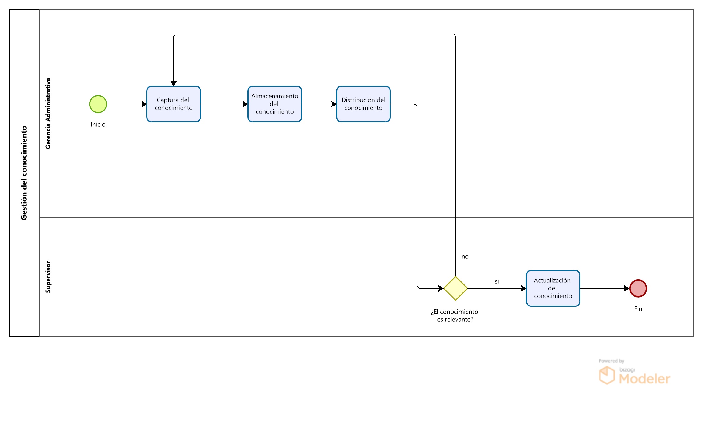

# 2.1. Procesos AS-IS

## 2.1.1. PRODUCCION

## Tabla de actividades:

| Secuencia | Actividad                      | Descripción                                                                 | Responsable                |
|-----------|---------------------------------|-----------------------------------------------------------------------------|----------------------------|
| 1         | Recepción de materiales         | Se reciben y verifican los materiales metálicos según las órdenes de compra.| Supervisor de Producción    |
| 2         | Corte y conformado de materiales| Los materiales se cortan y conforman de acuerdo con las especificaciones del proyecto.| Operarios               |
| 3         | Ensamblaje y soldadura          | Se ensamblan y sueldan los componentes metálicos.                            | Operarios                   |
| 4         | Revisión de calidad intermedia  | El departamento de calidad revisa los componentes ensamblados antes del acabado.| Departamento de Calidad   |
| 5         | Acabado y pintura               | Los productos pasan por el proceso de acabado, que incluye pintura y otras terminaciones.| Operarios               |
| 6         | Control de calidad final        | Se realiza una inspección final para asegurar que el producto cumpla con las especificaciones del cliente.| Departamento de Calidad |
| 6.1       | Aprobación del producto         | Si cumple con los estándares, se autoriza el despacho.                      | Departamento de Calidad     |
| 6.2       | Correcciones al producto        | Si no cumple, se realizan las correcciones necesarias antes del despacho.   | Departamento de Calidad     |
| 7         | Despacho del producto           | El producto terminado se traslada al área de expedición para su envío al cliente.| Supervisor de Producción  |

## 2.1.2.AS-IS COMPRAS

**Tabla de actividades:**
| Secuencia | Actividad                             | Descripción                                                                 | Área Responsable |
|-----------|---------------------------------------|-----------------------------------------------------------------------------|------------------|
| 1         | Emisión de Orden de Pedido            | El área de producción emite una orden de pedido de acuerdo con sus necesidades. | Producción       |
| 2         | Búsqueda de Proveedores               | Logística busca y compara proveedores según precios, tiempo de entrega, y condiciones de pago. | Logística        |
| 3         | Cuadro Comparativo de Proveedores     | Logística elabora un cuadro comparativo con las mejores opciones de proveedores. | Logística        |
| 4         | Selección del Proveedor               | Se elige al proveedor que ofrece las mejores condiciones, y se adjudica la orden de compra. | Logística        |
| 4.1       | ¿El proveedor cumple con las condiciones de entrega y precio? | Condicional: Si el proveedor cumple con las condiciones, se adjudica la compra. Si no, se selecciona un nuevo proveedor. | Logística        |
| 4.2       | Adjudicación de Orden de Compra       | Si el proveedor cumple con los requisitos, se adjudica la orden y se procede a la creación de la orden de compra. | Logística        |
| 4.3       | Búsqueda de Alternativas              | Si el proveedor no cumple con los requisitos (precio, tiempo de entrega, condiciones de pago), se selecciona otro proveedor del cuadro comparativo. | Logística        |
| 5         | Emisión de la Orden de Compra         | Se crea la orden de compra en el sistema ERP Starsoft y se envía al proveedor. | Logística        |
| 6         | Recepción de Productos                | El área de almacén recibe los productos y verifica su calidad.               | Almacén          |
| 7         | Gestión de Facturas y Pagos           | Se gestionan las facturas de acuerdo con las condiciones de pago (contado, crédito, etc.). | Finanzas         |
| 8         | Control de Inventario                 | El área de almacén actualiza el inventario según los productos recibidos y su estado. | Almacén          |
| 9         | Evaluación de Proveedores             | Se realiza una evaluación periódica del desempeño de los proveedores en términos de calidad y cumplimiento. | Logística        |

## 2.1.3. AS-IS Comercial

**Tabla de actividades:**
|Secuencia|Actividad|Descripción|Encargado|
|---|---|---|---|
|1|Envío de la invitación|El cliente envía una invitación por correo electrónico con los requerimientos y bases de cotización.|Cliente|
|2|Recepción de invitación|La invitación del cliente es recibida por la gerencia comercial.|Gerencia Comercial|
|3|Revisión técnica inicial|El equipo revisa los planos y requisitos proporcionados por el cliente para evaluar el alcance del proyecto.|Área de Ingeniería|
|4|Decisión de participar en el proyecto|¿Se participa?| |
|4.1|Rechazo de Participación|Si se decide no participar, se rechaza formalmente la participación en el proyecto.|Gerencia Comercial|
|4.2|Visita técnica|Se realiza una visita técnica al sitio del cliente para verificar los detalles del proyecto.|Gerencia Comercial|
|5|Preparación de propuesta|Se prepara la propuesta técnica y económica en colaboración con varias áreas.|Gerencia Comercial|
|6|Presentación de propuesta|La gerencia comercial presenta la oferta al cliente, explicando beneficios y diferenciadores.|Gerencia Comercial|
|7|Envío de expediente|Se envía al cliente un expediente completo con la propuesta técnica y económica.|Gerencia Comercial|
|8|Revisión del cliente|El cliente revisa la propuesta enviada y comunica su decisión de adjudicación o no adjudicación.|Cliente|
|9|Decisión del Cliente|¿Satisface al cliente?|	|
|9.1|Documentación de rechazo|Si el cliente no acepta la propuesta, se documenta la decisión del cliente de no adjudicar el contrato y se cancela el proceso.|Gerencia Comercial|
|9.2|Adjudicación|Si la propuesta es aceptada, el cliente envía la carta de adjudicación.|Cliente|

## 2.1.4. AS-IS Recepción de suministros

**Tabla de actividades:**
| Secuencia | Actividad | Descripción | Área responsable |
| --- | --- | --- | --- |
| 1 | Cronograma de compras | Se establece un cronograma de entrega, que normalmente dura de 2 a 3 días para materiales estándar, y 7 días para pintura personalizada. | Logística |
| 2 | Emisión de la orden de compra | Se contacta al proveedor para realizar la compra de materiales. | Logística |
| 3 | Registro de entrada | Si los materiales cumplen, se genera una hoja de entrada. | Almacén |
| 4 | Recepción de los materiales | Los materiales llegan al almacén de la empresa. | Almacén |
| 5 | Verificación de documentos | Se revisa la ficha técnica y el certificado de calidad de los materiales. | Almacén y Calidad |
| 6 | Control dimensional | El Área de Calidad realiza un control dimensional y verifica espesores. | Calidad |
| 7 | Registro de salida | Cuando los materiales salen del almacén, se emite una hoja de salida. | Almacén |
| 8 | Emisión de documento de no conformidad | Si los materiales no cumplen, se emite un documento de no conformidad y se solicita devolución o cambio al proveedor. | Calidad |
| 9 | Movilización a producción | Los materiales aprobados son enviados a producción. | Almacén |

## 2.1.5. AS-IS Formación del conocimiento
**Tabla de actividades:**
# Proceso de Formación del Conocimiento

| Secuencia | Actividad                        | Descripción                                                                 | Área Responsable                           |
|-----------|----------------------------------|-----------------------------------------------------------------------------|-------------------------------------------|
| 1         | Detección de necesidades de formación | Identificación de las áreas en las que los empleados requieren desarrollo de habilidades o competencias. | Área Recursos Humanos / Área de Gerencia General |
| 2         | Planificación de la formación    | Diseño de programas formativos que aborden las necesidades detectadas, ya sea mediante charlas, talleres, cursos o entrenamientos específicos. | Área de Recursos Humanos                 |
| 3         | Ejecución de la formación        | Impartición de la formación a los empleados, a cargo de instructores internos o externos, y supervisada por los jefes de área. | Área de Recursos Humanos / Área de Gerencia General |
| 4         | Evaluación de la formación       | Medición de la efectividad del proceso formativo, evaluando si los empleados han adquirido las competencias esperadas. | Área Recursos Humanos                   |

## 2.1.5.2 AS-IS Gestión del conocimiento
**Tabla de actividades:**
# Proceso de Gestión del Conocimiento

| Secuencia | Actividad                        | Descripción                                                                 | Área Responsable                           |
|-----------|----------------------------------|-----------------------------------------------------------------------------|-------------------------------------------|
| 1         | Captura del conocimiento         | Registro y almacenamiento de información relevante como buenas prácticas, lecciones aprendidas, y procedimientos. | Área de Gerencia Administrativa / Área de Ingeniería y Proyectos |
| 2         | Almacenamiento del conocimiento  | Organización y clasificación del conocimiento capturado en bases de datos o servidores digitales para facilitar su acceso. | Área de Gerencia Administrativa           |
| 3         | Distribución del conocimiento    | Provisión de acceso al conocimiento a través de sistemas de gestión como Starsoft, asegurando que esté disponible para quienes lo necesiten. | Área de Gerencia Administrativa           |
| 4         | Actualización del conocimiento   | Revisión periódica y actualización del conocimiento almacenado para garantizar que esté vigente y útil para los empleados. | Área de Gerencia Administrativa           |

## 2.1.6. AS-IS Mantenimiento, infraestructura y calibración

**Tabla de actividades:**
| Secuencia | Actividad   | Descripción  | Encargado                        |
|-----------|----------------------------------------------|-----------------------------------------------------------------------------------------------------------------------------------------------------|----------------------------------|
| 1         | Iniciar revisión programada de maquinaria y equipos | El supervisor inicia manualmente la revisión regular de todas las maquinarias y equipos, basándose en cronogramas previos o experiencia previa.       | Supervisor de Mantenimiento      |
| 2         | Verificar equipos de medición para calibración | El supervisor revisa los equipos de medición y determina si requieren calibración según los registros físicos o su experiencia.                      | Supervisor de Mantenimiento      |
| 3         | Envío de equipos a calibrar                  | Tras identificar los equipos, el supervisor se comunica con una empresa certificada por INACAL y organiza el envío de los equipos a calibrar.         | Supervisor de Mantenimiento      |
| 4         | Recepción de equipos calibrados              | El supervisor recibe los equipos calibrados de la empresa certificadora, junto con los documentos que acreditan la calibración realizada.            | Supervisor de Mantenimiento      |
| 5         | Evaluar el estado del equipo                 | Tras la notificación de una falla por parte del operario, el supervisor evalúa el estado del equipo, basándose en el informe verbal o escrito del operario. | Supervisor de Mantenimiento      |
| 6         | Recepción de documentos                      | El supervisor recibe manualmente los documentos relacionados al mantenimiento y calibración, tales como informes y certificados.                    | Supervisor de Mantenimiento      |
| 7         | Actualización de registros de mantenimiento  | El supervisor actualiza manualmente los registros de mantenimiento en documentos físicos o digitales, como hojas de cálculo.                         | Supervisor de Mantenimiento      |
| 8         | Elaborar informe final                      | El supervisor elabora un informe final escrito que incluye detalles sobre el mantenimiento y la calibración realizados.                              | Supervisor de Mantenimiento      |
| 9         | Detección de falla                           | El operario identifica una falla en el equipo mientras lo opera y genera un informe verbal o escrito para el supervisor.                             | Operario                         |
| 10        | Evaluación del problema detectado            | El operario analiza la naturaleza del fallo para determinar si está relacionado con la maquinaria o con un factor externo.                            | Operario                         |
| 11        | Notificación al supervisor                   | El operario informa manualmente al supervisor sobre la falla, ya sea verbalmente o a través de un reporte escrito.                                   | Operario                         |
| 12        | Proceder con el mantenimiento programado     | El técnico de mantenimiento realiza el mantenimiento según el cronograma establecido en papel o en archivos simples.                                 | Técnico de Mantenimiento         |
| 13        | Identificación de la falla                   | El técnico inspecciona el equipo reportado por el operario para identificar la falla, basándose en el informe recibido y en la evaluación directa.    | Técnico de Mantenimiento         |
| 14        | Evaluar gravedad y opciones de reparación    | El técnico evalúa la gravedad de la falla y propone las opciones de reparación, registrando estas opciones en documentos físicos o digitales simples. | Técnico de Mantenimiento         |
| 15        | Proceder con la reparación                   | El técnico procede con la reparación del equipo, dejando constancia escrita del trabajo realizado en el reporte de mantenimiento.                    | Técnico de Mantenimiento         |
| 16        | Reemplazar equipo                            | Si el equipo no puede repararse, el técnico lo reemplaza, notificando el cambio al supervisor mediante un informe escrito.                           | Técnico de Mantenimiento         |
| 17        | Realizar pruebas de funcionamiento           | El técnico realiza pruebas al equipo reparado o reemplazado para verificar su funcionamiento, registrando manualmente los resultados.                | Técnico de Mantenimiento         |
| 18        | Elaborar certificado del equipo reparado o reemplazado | El técnico redacta un certificado en formato físico o digital simple que indica el estado del equipo tras la reparación o el reemplazo.              | Técnico de Mantenimiento         |
| 19        | Envío de certificado                         | El técnico entrega manualmente o envía por correo electrónico el certificado al supervisor para completar la documentación.                          | Técnico de Mantenimiento         |
| 20        | Revisión de la infraestructura               | El personal de infraestructura revisa manualmente las condiciones físicas de las instalaciones, tomando nota en registros escritos.                  | Personal de Infraestructura      |
| 21        | Realizar mantenimiento                       | El personal de infraestructura realiza el mantenimiento necesario en las instalaciones y lo registra en informes físicos o digitales básicos.        | Personal de Infraestructura      |
| 22        | Elaborar informe de mantenimiento de infraestructura | Se genera un informe manual sobre el mantenimiento realizado en las instalaciones, detallando los trabajos efectuados.                               | Personal de Infraestructura      |
| 23        | Enviar informe                               | El personal de infraestructura entrega manualmente o envía por correo el informe de mantenimiento al supervisor.                                     | Personal de Infraestructura      |
| 24        | Recepción de equipos                         | La empresa certificadora recibe los equipos enviados para calibración y confirma la recepción mediante un documento físico o electrónico.            | Terceros certificados por INACAL |
| 25        | Calibración de equipos                       | La empresa certificadora calibra los equipos manualmente y genera registros de calibración en formato físico o digital.                              | Terceros certificados por INACAL |
| 26        | Envío de equipos calibrados                  | La empresa certificadora envía los equipos calibrados de vuelta al supervisor, junto con los documentos de calibración.                              | Terceros certificados por INACAL |
| 27        | Elaboración de certificados de calibración   | La empresa certificadora elabora los certificados de calibración que avalan la precisión de los equipos calibrados.                                  | Terceros certificados por INACAL |
| 28        | Envío de certificado de calibración          | La empresa certificadora envía los certificados de calibración al supervisor, ya sea en formato físico o digital.                                    | Terceros certificados por INACAL |

## 2.1.7. AS-IS Almacenamiento

**Tabla de actividades:**
| Secuencia | Actividad                                            | Descripción                                                                                       | Responsable    |
|-----------|------------------------------------------------------|---------------------------------------------------------------------------------------------------|----------------|
| 1         | Recepción de materiales                              | Se reciben y verifican los materiales según órdenes de compra y guías de remisión.                | Almacenero     |
| 2         | Supervisión bajo orden de cliente                    | Se asigna un espacio para la supervisión del cliente en el almacén.                               | Jefe de Almacén|
| 3         | Supervisión del cliente en producción y expedición   | El cliente monitorea la producción y transporte de sus productos en el almacén.                   | Cliente        |
| 4         | Almacenamiento de materiales                         | Los materiales se almacenan correctamente según su clasificación.                                 | Almacenero     |
| 5         | Revisión de órdenes de producción                    | Se revisan y priorizan las órdenes de producción según urgencia y tiempo de entrega.              | Jefe de Almacén|
| 6         | Evaluación de priorización de órdenes de producción  | Se verifica si las órdenes de producción cumplen con las especificaciones y prioridades.          | Jefe de Almacén|
| 6.1       | Traslado de productos con órdenes más urgentes       | Si cumplen, se trasladan los materiales a producción.                                             | Almacenero     |
| 6.2       | Mantener los productos en reserva hasta su turno     | Si no son prioritarios, los materiales se mantienen almacenados hasta su turno.                   | Almacenero     |
| 7         | Revisión de producto pintado                         | Se verifica si los productos cumplen con los estándares de pintura.                               | Almacenero     |
| 7.1       | Aprobación del producto pintado                      | Si cumplen, se despachan.                                                                         | Almacenero     |
| 7.2       | Corrección del producto pintado                      | Si no cumplen, se retorna a pintura.                                                              | Almacenero     |
| 8         | Despacho de productos acabados                       | Los productos se trasladan al área de expedición para entrega final.                              | Almacenero     |
| 9         | Decisión sobre la continuidad del proyecto           | Se decide si el cliente continuará con un nuevo proyecto o no.                                    | Jefe de Almacén|
| 9.1       | Renovación de permisos de supervisión                | Si continúa, se actualizan los permisos de supervisión.                                            | Jefe de Almacén|
| 9.2       | Denegación de permisos del proyecto                  | Si no continúa, el cliente desocupa el espacio y se bloquean sus permisos.                        | Jefe de Almacén|
| 10        | Control mensual de inventarios                       | Se realiza el control mensual y se reabastecen los materiales según stock.                        | Jefe de Almacén|
