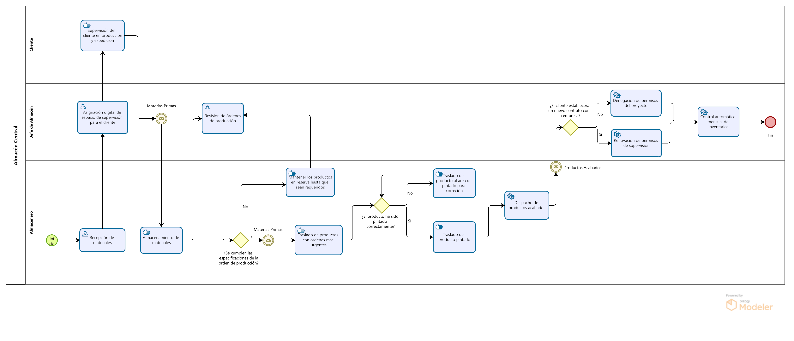

# 2.2 Procesos TO-BE
## 2.2.1. TO-BE PRODUCCION 

## Tabla de actividades mejorada:

| Secuencia | Actividad | Descripción | Responsable |
| --- | --- | --- | --- |
| 1 | Escanear materiales | Registrar los materiales escaneando sus códigos de barra, verificando cantidades y especificaciones de forma inmediata. | Jefe de Producción |
| 2 | Asignar materiales con el sistema | Distribuir los materiales automáticamente a las estaciones de trabajo según las prioridades de producción y plazos. | Sistema de gestión |
| 3 | Cortar materiales eficientemente | Realizar el corte de los materiales siguiendo las recomendaciones del sistema para reducir desperdicios y mejorar la eficiencia. | Operarios |
| 4 | Ensamblar componentes | Ensamblar y soldar los componentes siguiendo las especificaciones y registrar el avance en el sistema. | Operarios |
| 5 | Revisar calidad con apoyo digital | Inspeccionar los componentes ensamblados utilizando herramientas digitales que detectan fallos y envían alertas. | Sistema de calidad |
| 6 | Pintar y dar acabado | Ejecutar el proceso de pintura y acabado siguiendo los tiempos y estándares definidos. | Operarios |
| 7 | Revisar producto final con el sistema | Verificar el producto terminado utilizando el sistema para asegurar que cumple con los estándares. | Sistema de calidad |
| 7.1 | Aprobar producto | Aprobar el producto que cumple con los estándares y generar la orden de despacho. | Sistema de calidad |
| 7.2 | Corregir producto | Generar una orden para corregir el producto que no cumple con los estándares y enviarlo de nuevo a la estación correspondiente. | Sistema de calidad |
| 8 | Enviar productos a despacho | Gestionar el envío de productos desde la producción al área de entrega, actualizando los registros e informando a logística. | Sistema de logística |

## 2.2.2. TO-BE COMPRAS

**Tabla de actividades mejorada:**
| Secuencia | Actividad                                      | Descripción                                                                                                                                       | Área Responsable   |
|-----------|------------------------------------------------|---------------------------------------------------------------------------------------------------------------------------------------------------|--------------------|
| 1         | Emisión Automatizada de Orden de Pedido        | El sistema  detecta las necesidades de producción y emite automáticamente una orden de pedido según el inventario disponible.                    | Producción     |
| 2         | Búsqueda Automática de Proveedores             | El sistema  selecciona automáticamente proveedores basados en precios, condiciones de pago y tiempos de entrega óptimos previamente configurados. |  Logística     |
| 3         | Cuadro Comparativo Automático                  | El sistema  genera automáticamente un cuadro comparativo de los mejores proveedores basados en criterios definidos, como precio y calidad histórica.| ERP / Logística     |
| 4         | Selección Automática del Proveedor             | El sistema selecciona automáticamente al proveedor más adecuado y envía una alerta al departamento de logística para la aprobación final.            |  / Logística     |
| 5         | **Condicional: Búsqueda de Alternativas**      | Si el proveedor no cumple con los requisitos de precio, tiempo de entrega o condiciones de pago, el sistema selecciona automáticamente una alternativa.|  / Logística     |
| 5.1       | **Verificación de Condiciones y Aprobación**   | Si el proveedor cumple con los requisitos, el sistema verifica las condiciones y procede con la aprobación para emitir la orden de compra.           |  / Logística     |
| 5.2       | **Reevaluación y Selección de Nuevo Proveedor** | Si el proveedor no cumple con los requisitos, el sistema reevalúa las opciones y selecciona un nuevo proveedor antes de emitir la orden de compra.   |  / Logística     |
| 6         | Recepción Automatizada de Productos            | El almacén recibe productos, se verifica la calidad automáticamente a través de sistemas de sensores y se actualiza el inventario en el ERP.          |  / Almacén       |

## 2.2.3. TO-BE Comercial

**Tabla de actividades mejorada:**
|Secuencia|Actividad|Descripción|Encargado|
|---|---|---|---|
|1|Envío de la invitación|El cliente utiliza un portal web para enviar la invitación de cotización y especificaciones.|Cliente|
|2|Recepción automatizada|La invitación es recibida y registrada automáticamente en el CRM, asignando un número de caso.|Módulo CRM / Gerencia Comercial|
|3|Revisión técnica|Los ingenieros revisan los planos y materiales requeridos, viendo disponibilidad de stock.|Área de Ingeniería|
|4|Decisión de participación|¿Se participará?| |	
|4.1|Rechazo de Participación|La decisión se registra en el CRM, el cual comunica el resultado al cliente.|Gerencial Comercial|
|4.2|Visita técnica|Se realiza una visita técnica al lugar del cliente para validar los requerimientos.|Área de Ingeniería|
|5|Preparación de propuesta|Se prepara la propuesta técnica y económica.|Area de Ingenieria|
|6|Presentación de propuesta|La propuesta es enviada al cliente mediante el CRM, con seguimiento automatizado.|Gerencia Comercial|
|7|Revisión del cliente|El cliente revisa la propuesta en el portal y responde a través del CRM.|Cliente|
|8|Decisión final del cliente|¿Acepta propuesta?|	|
|8.1|Rechazo de propuesta|Se documenta el rechazo en el CRM y se comunica formalmente.|Cliente|
|8.2|Adjudicación|Envía la carta de adjudicación a través del CRM.|Cliente|

## 2.2.4. TO-BE Recepción de materiales

Tabla de Actividades Mejoradas para el Proceso TO-BE

| Secuencia | Actividad | Descripción | Área Responsable |
| --- | --- | --- | --- |
| 1 | Crear cronograma de compras automatizado | El sistema genera automáticamente un cronograma con base en niveles de inventario, demanda de producción y tiempos de entrega de proveedores. | Logística |
| 2 | Emitir orden de compra automatizada | Orden de compra generada automáticamente cuando los niveles de stock alcanzan el mínimo, vinculada al proveedor adecuado. | Logística |
| 3 | Registrar hoja de entrada | Se genera la hoja de entrada con los detalles del proveedor antes de recibir los materiales para validar la recepción. | Almacén |
| 4 | Generación de notificación automática | El sistema notifica automáticamente a las áreas relevantes la llegada de los materiales con todos los detalles del proveedor y el pedido. | Almacén |
| 5 | Evaluación automática del rendimiento de proveedores | El sistema evalúa el rendimiento de los proveedores en base a tiempos de entrega, calidad de materiales y cantidad de no conformidades. | Logística |
| 6 | Recepción de materiales | Los materiales son recibidos físicamente en el almacén, y el sistema actualiza el estado del pedido y la recepción. | Almacén |
| 7 | Verificación de documentos y control dimensional | Se validan los certificados de calidad, fichas técnicas del proveedor y se realiza el control dimensional de los materiales recibidos. | Calidad |
| 7.1 | Registro automático de salida | El sistema registra automáticamente la salida de los materiales cuando se envían a producción. | Almacén |
| 7.2 | Emisión automática de no conformidad | Si los materiales no cumplen con los requisitos, el sistema genera automáticamente una no conformidad y notifica al proveedor involucrado. | Calidad |
| 8 | Enviar materiales a producción | Después de ser aprobados los materiales, se envían inmediatamente a producción. | Almacén |
| 9 | Generación de notificación automática al área de producción | El sistema notifica automáticamente al área de producción el envío de los materiales con todos los detalles. | Almacén |

## 2.2.5.1 TO-BE Formación del conocimiento

| Secuencia | Actividad                                           | Descripción                                                                                                                                                  | Área responsable                                      |
|-----------|-----------------------------------------------------|--------------------------------------------------------------------------------------------------------------------------------------------------------------|-------------------------------------------------------|
| 1         | Detección proactiva y automatizada de necesidades   | Usar herramientas de análisis predictivo y encuestas inteligentes para detectar automáticamente áreas de mejora y necesidades formativas, basadas en el desempeño y roles futuros de los empleados. | Área de Recursos Humanos / Área de Gerencia General   |
| 2         | Planificación personalizada de la formación         | Diseñar programas formativos personalizados utilizando IA, alineados con las necesidades de cada empleado, y ofrecer múltiples modalidades (e-learning, clases presenciales, talleres) según el perfil y estilo de aprendizaje de cada uno. | Área de Recursos Humanos                              |
| 3         | Ejecución digital y flexible de la formación        | Implementar plataformas digitales para que los empleados puedan acceder a la formación en cualquier momento y lugar, con instructores internos o externos, asegurando flexibilidad y adaptación a su horario. Monitorización continua del avance mediante dashboards interactivos. | Área de Recursos Humanos / Área de Gerencia General   |
| 4         | Evaluación continua y adaptativa de la formación    | Realizar evaluaciones formativas dinámicas y adaptativas, personalizadas a los empleados, usando métodos automáticos de análisis de desempeño post-formación. A través de dashboards se mide el impacto en habilidades y desempeño laboral en tiempo real. | Área de Recursos Humanos                              |

## 2.2.5.1 TO-BE Gestión del conocimiento

| Secuencia | Actividad                                   | Descripción                                                                                                                                                     | Área responsable                 |
|-----------|---------------------------------------------|-----------------------------------------------------------------------------------------------------------------------------------------------------------------|----------------------------------|
| 1         | Captura automatizada del conocimiento       | Implementar herramientas automáticas (IA, minería de datos) para capturar información clave de proyectos, buenas prácticas, y lecciones aprendidas en tiempo real. | Área de Ingeniería y Proyectos   |
| 2         | Almacenamiento dinámico y seguro            | Utilizar una plataforma de gestión de conocimiento basada en la nube con capacidad de auto-organización, metadatos inteligentes, y seguridad reforzada.           | Área de Recursos Humanos         |
| 3         | Distribución personalizada                  | Implementar un sistema de distribución basado en inteligencia artificial que sugiera contenido relevante a los usuarios según su perfil y necesidades.            | Área de Gerencia Administrativa  |
| 4         | Actualización proactiva del conocimiento    | Automatizar la actualización de contenidos mediante herramientas de IA, asegurando que la información obsoleta se identifique y renueve proactivamente.           | Área de Gerencia Administrativa  |
| 5         | Fomento de la colaboración                  | Integrar plataformas de colaboración y redes sociales internas que promuevan la co-creación de conocimientos y la retroalimentación constante entre empleados.     | Área de Recursos Humanos         |

## 2.2.6. TO-BE Mantenimiento, infraestructura y calibración

**Tabla de Actividades :**

| Secuencia | Actividad | Descripción | Responsable |
|-----------|-----------|-------------|-------------|
| 1         | Generación de cronograma | El sistema CMMS genera automáticamente el cronograma de mantenimiento y calibración. | CMMS |
| 2         | Iniciar revisión simultánea de mantenimiento e infraestructura | El sistema CMMS inicia la revisión simultánea de maquinaria y de la infraestructura. | CMMS |
| 3         | Detección de falla | El operario identifica una falla durante la operación de un equipo. | Operario |
| 4         | Evaluación del problema detectado | El operario evalúa si el problema está relacionado con el equipo o con un mal uso. | Operario |
| 5         | Notificación al supervisor de mantenimiento | El operario notifica al supervisor sobre la falla detectada. | Operario |
| 6         | Verificar equipos de medición para calibración | El supervisor de mantenimiento revisa qué equipos de medición necesitan calibración. | Supervisor de mantenimiento |
| 7         | Envío de equipos a calibrar | Los equipos de medición son enviados a la empresa certificadora. | Supervisor de mantenimiento |
| 8         | Recepción de equipos por la empresa certificadora | La empresa certificada recibe los equipos para calibración. | Empresa Tercera (INACAL) |
| 9         | Calibración de equipos | La empresa certificada realiza el proceso de calibración de los equipos de medición. | Empresa Tercera (INACAL) |
| 10        | Envío de equipos calibrados | La empresa certificada devuelve los equipos calibrados al supervisor de mantenimiento. | Empresa Tercera (INACAL) |
| 11        | Elaboración de certificados de calibración | La empresa certificada elabora los certificados correspondientes a la calibración realizada. | Empresa Tercera (INACAL) |
| 12        | Envío de certificado de calibración | La empresa certificada envía los certificados de calibración junto con los equipos. | Empresa Tercera (INACAL) |
| 13        | Recepción de equipos calibrados | El supervisor de mantenimiento recibe los equipos calibrados y los certificados. | Supervisor de mantenimiento |
| 14        | Identificación de la falla | El técnico de mantenimiento inspecciona los equipos que presentan fallas. | Técnico de mantenimiento |
| 15        | Evaluar gravedad y opciones de reparación | El técnico determina la gravedad del problema y evalúa si el equipo puede ser reparado o necesita ser reemplazado. | Técnico de mantenimiento |
| 16        | Proceder con la reparación | El técnico realiza la reparación del equipo si es necesario. | Técnico de mantenimiento |
| 17        | Reemplazar el equipo | Si el equipo no puede ser reparado, se procede con el reemplazo. | Técnico de mantenimiento |
| 18        | Realizar pruebas de funcionamiento | El técnico verifica que el equipo funcione correctamente tras la reparación o reemplazo. | Técnico de mantenimiento |
| 19        | Elaborar certificado del equipo reparado o reemplazado | El técnico documenta las acciones realizadas en un certificado. | Técnico de mantenimiento |
| 20        | Enviar certificado | El técnico envía el certificado al supervisor de mantenimiento. | Técnico de mantenimiento |
| 21        | Actualización de registros de mantenimiento | El supervisor actualiza los registros de mantenimiento con los detalles de la reparación o reemplazo. | Supervisor de mantenimiento |
| 22        | Revisión de la infraestructura | El personal de infraestructura revisa las instalaciones para verificar su estado. | Personal de infraestructura |
| 23        | Realizar mantenimiento de infraestructura | Se realizan las tareas necesarias para el mantenimiento de la infraestructura. | Personal de infraestructura |
| 24        | Elaborar informe de mantenimiento de infraestructura | Se documentan las acciones realizadas en un informe. | Personal de infraestructura |
| 25        | Enviar informe de infraestructura | El informe de mantenimiento es enviado al supervisor para su revisión. | Personal de infraestructura |
| 26        | Elaborar informe final | El supervisor de mantenimiento elabora un informe final consolidado de todo el proceso, incluyendo maquinaria e infraestructura. | Supervisor de mantenimiento |

## 2.2.7. TO-BE Almacenamiento

**Tabla de Actividades :**

| Secuencia | Actividad | Descripción | Responsable |
| --- | --- | --- | --- |
| 1 | Recepción de materiales | Verificación automática de cantidades y calidad, con registro de discrepancias. | Almacenero |
| 2 | Asignación digital de espacio de supervisión para el cliente | Asignación de espacio e informes en tiempo real. | Jefe de Almacén |
| 3 | Supervisión del cliente en producción | Monitoreo del cliente sobre el proceso de producción y expedición vía sistema. | Cliente |
| 4 | Almacenamiento de materiales | Asignación automática de áreas de almacenamiento con actualización de inventario en tiempo real. | Almacenero |
| 5 | Revisión de órdenes de producción | Priorización automática de órdenes según urgencia y tiempo de entrega. | Jefe de Almacén |
| 6 | Evaluación y traslado de órdenes urgentes | Priorización de órdenes de producción basada en especificaciones y tiempos. | Jefe de Almacén |
| 6.1 | Traslado de productos con órdenes más urgentes | Traslado automático de materiales prioritarios hacia el área de producción correspondiente. | Almacenero |
| 6.2 | Mantenimiento de productos en reserva | Almacenamiento temporal de materiales no prioritarios hasta su despacho. | Almacenero |
| 7 | Revisión y aprobación del producto pintado | Validación automática del producto, generando órdenes de despacho o retrabajo si es necesario. | Almacenero |
| 8 | Traslado del producto pintado | Gestión automática del traslado a expedición y entrega. | Almacenero |
| 9 | Decisión sobre la continuidad del proyecto | El sistema gestiona la renovación o denegación de permisos para la supervisión del proyecto. | Jefe de Almacén |
| 9.1 | Renovación de permisos de supervisión | Actualización de permisos de entrada para el cliente cuando se renueva el proyecto. | Jefe de Almacén |
| 9.2 | Denegación de permisos del proyecto | Eliminación de permisos y liberación de espacio asignado si no se renueva el proyecto. | Jefe de Almacén |
| 10 | Control automático mensual de inventarios | Control automatizado de inventarios mensuales y generación de órdenes de reabastecimiento. | Jefe de Almacén |

