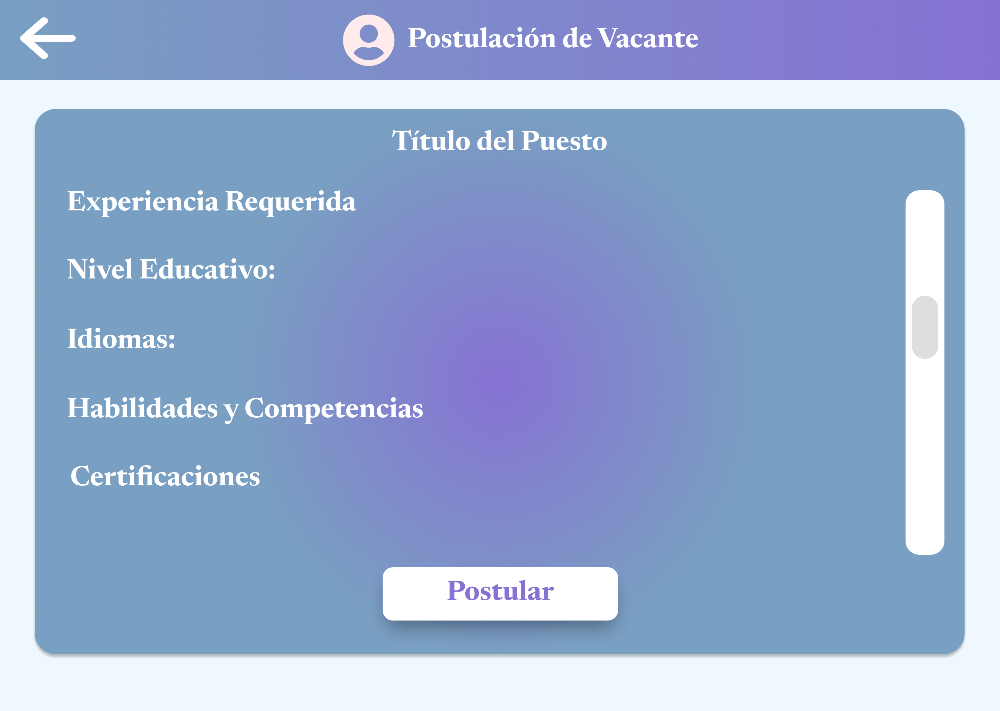

# 4.5. Módulo 5: Reclutamiento

## **1.- Requerimientos del Módulo de Reclutamiento**

### **1.1.- Requerimientos Funcionales**

### a. **Usuarios**

- **Administrador:** Encargado de gestionar todo el sistema, usuarios y procesos relacionados con el reclutamiento.
- **Usuario (empleados internos, jefes de área):** Utilizan el sistema para realizar solicitudes, consultar estados, y participar en los procesos de reclutamiento.

### b. Casos de Uso

### **Caso de Uso #1: Crear una vacante**

| **Código** | M501 |
| --- | --- |
| **Objetivo** | Registrar una nueva vacante en el sistema. |
| **Descripción** | Este caso de uso describe el proceso mediante el cual el Administrador de Reclutamiento crea una nueva vacante en el sistema, especificando los detalles del puesto y los requisitos que los candidatos deben cumplir. |
| **Actor Primario** | Administrador de Reclutamiento |
| **Actor Secundario** | N/A |
| **Precondiciones** | El Administrador de Reclutamiento debe tener acceso al sistema y privilegios para crear nuevas vacantes. |
| **Paso** | **Acción** |
| **1** | Ingresar el nombre del puesto a cubrir. |
| **2** | Especificar los requisitos del puesto (habilidades, experiencia, etc.). |
| **3** | Ingresar la descripción detallada de las responsabilidades del puesto. |
| **4** | Definir la ubicación y el salario ofrecido. |
| **5** | Guardar la vacante para que esté disponible para los postulantes. |

---

### **Caso de Uso #2: Postular a una vacante**

| **Código** | M502 |
| --- | --- |
| **Objetivo** | Permitir a un candidato postular a una vacante disponible. |
| **Descripción** | Este caso de uso describe cómo un candidato interno o externo puede postularse a una vacante registrada en el sistema, proporcionando su información personal y los documentos necesarios. |
| **Actor Primario** | Candidato (Usuario Interno o Externo) |
| **Actor Secundario** | Administrador de Reclutamiento |
| **Precondiciones** | El candidato debe estar registrado en el sistema y la vacante debe estar activa. |
| **Paso** | **Acción** |
| **1** | El candidato busca la vacante de su interés en el listado de vacantes disponibles. |
| **2** | Seleccionar la vacante para ver los detalles. |
| **3** | Ingresar sus datos personales (nombre, contacto, etc.). |
| **4** | Adjuntar CV y documentos adicionales. |
| **5** | Confirmar la postulación. |

---

### **Caso de Uso #3: Revisar postulaciones**

| **Código** | M503 |
| --- | --- |
| **Objetivo** | Permitir al Administrador de Reclutamiento revisar las postulaciones realizadas a una vacante. |
| **Descripción** | Este caso de uso describe cómo el Administrador de Reclutamiento puede visualizar las postulaciones enviadas por los candidatos para una vacante específica, revisar los detalles y filtrar según criterios preestablecidos. |
| **Actor Primario** | Administrador de Reclutamiento |
| **Actor Secundario** | N/A |
| **Precondiciones** | El Administrador de Reclutamiento debe tener acceso al sistema y la vacante debe estar activa. |
| **Paso** | **Acción** |
| **1** | Buscar la vacante en el sistema. |
| **2** | Seleccionar la vacante para ver las postulaciones recibidas. |
| **3** | Revisar la lista de postulantes y sus detalles. |
| **4** | Filtrar postulantes según requisitos y criterios. |
| **5** | Seleccionar candidatos preseleccionados para continuar el proceso de selección. |

---

### **Caso de Uso #4: Notificar al candidato seleccionado**

| **Código** | M504 |
| --- | --- |
| **Objetivo** | Notificar a los candidatos seleccionados para la siguiente fase del proceso de reclutamiento (entrevista, prueba técnica, etc.). |
| **Descripción** | Este caso de uso describe el proceso mediante el cual el Administrador de Reclutamiento notifica a los candidatos seleccionados para las fases posteriores del proceso de reclutamiento, como entrevistas o pruebas técnicas. |
| **Actor Primario** | Administrador de Reclutamiento |
| **Actor Secundario** | Candidato |
| **Precondiciones** | El Administrador de Reclutamiento debe haber preseleccionado candidatos. |
| **Paso** | **Acción** |
| **1** | El Administrador selecciona los candidatos preseleccionados. |
| **2** | Definir la fase siguiente del proceso (entrevista, prueba, etc.). |
| **3** | Ingresar la fecha y detalles de la convocatoria. |
| **4** | Enviar la notificación al candidato seleccionado. |
| **5** | Confirmar que el candidato ha recibido la notificación. |

### **1.2.- Requerimientos de Atributos de Calidad**

| **Atributo** | **Descripción** |
| --- | --- |
| **a. Usabilidad** | El sistema debe ser intuitivo y fácil de usar tanto para los administradores como para los usuarios sin conocimientos técnicos avanzados. Debe tener una interfaz clara para navegar entre las vacantes y el proceso de aplicación. |
| **b. Fiabilidad** | El sistema debe garantizar que los datos de las solicitudes y los resultados del reclutamiento estén almacenados y accesibles de manera segura y consistente, sin pérdida de información. |
| **c. Eficiencia** | El sistema debe ser capaz de gestionar un gran número de vacantes y postulaciones sin afectar el rendimiento o la velocidad de respuesta del sistema. Las consultas deben ser procesadas en tiempo real. |
| **d. Mantenibilidad** | El sistema debe ser modular y fácilmente actualizable, permitiendo agregar nuevas funcionalidades o realizar ajustes sin interrumpir el funcionamiento. |
| **e. Seguridad** | El sistema debe asegurar la protección de los datos personales de los postulantes, cumpliendo con las normativas de protección de datos. Autenticación segura y control de acceso por roles. |

## 1.3.- Requerimientos de Restricciones

| **Nivel** | **Descripción** |
| --- | --- |
| **a. Nivel de Presentación (Frontend)** | El frontend debe ser **responsive** y fácil de usar. Se recomienda utilizar frameworks modernos como **React.js** o **Vue.js**, que permiten crear interfaces dinámicas y componentes reutilizables. Además, se debe asegurar que la interfaz sea accesible desde dispositivos móviles. El sistema debe integrar autenticación segura y gestión de sesiones en el frontend. |
| **b. Lógica (Backend)** | El backend debe gestionar la lógica de negocios, validaciones y la integración con la base de datos. Existe frameworks como **Spring Boot (Java)** o **Django (Python)** para realizar un backend robusto y escalable, o **Node.js** si se busca una solución más ligera. Se debe implementar un control de acceso basado en roles y una API RESTful para comunicación con el frontend. |
| **c. Data (Base de Datos)** | La base de datos debe ser **relacional** (como **PostgreSQL**), debido a la necesidad de manejar relaciones complejas entre vacantes, postulantes y sus datos. Debe ofrecer escalabilidad para almacenar grandes volúmenes de información de candidatos. Además, se recomienda implementar cifrado de datos sensibles, como los documentos personales. |
**Pantalla principal del administrador**

La pantalla principal del módulo de reclutamiento para el administrador se presenta de manera sencilla y funcional, con un diseño intuitivo que facilita la navegación. Al ingresar, el administrador encuentra tres botones principales:

1. **Crear Vacante**: Este botón lleva al administrador a un formulario donde puede registrar una nueva vacante, especificando todos los detalles del puesto.
2. **Revisar Postulaciones**: Permite al administrador acceder a una lista de las postulaciones recibidas, donde puede revisar y gestionar cada postulación.
3. **Notificar Candidatos**: Facilita el proceso de enviar notificaciones a los candidatos seleccionados para la siguiente fase del proceso de reclutamiento.

Además, hay un botón adicional llamado **Ver Más**, que puede ser usado para agregar funciones futuras.

Entidades involucradas:

- Administrador

**Pantalla de Creación de vacante**

1.- En esta primera parte se capturan los datos básicos de la vacante, como el título del puesto, la descripción general, el departamento, la ubicación, el tipo de contrato y la jornada laboral.

2.- Aquí se detallan los requisitos específicos para el puesto, incluyendo el nivel educativo requerido, la experiencia laboral, las habilidades técnicas y blandas necesarias, los idiomas y las certificaciones.

3.- En esta sección se describen los beneficios que la empresa ofrece al candidato seleccionado, como el salario, bonos, comisiones y otros beneficios adicionales.

4.- Esta sección finaliza el proceso de creación de una vacante al definir los parámetros temporales y la modalidad de selección.

Entidades involucradas:

- Vacante
- Administrador

**Pantalla de Postulación de Vacante**

1.-La vista inicial de postulación ofrecen al candidato una visión exhaustiva del puesto al que está aplicando. Se presenta información clave como el título del puesto, descripción detallada, requisitos (experiencia, educación, idiomas, habilidades), y los beneficios asociados al empleo (salario, bonos, comisiones). Esta sección actúa como un resumen ejecutivo, permitiendo al candidato evaluar rápidamente si la vacante se alinea con sus intereses y cualificaciones.

2.- En esta sección, se solicita al candidato que proporcione sus datos personales básicos, como nombre, correo electrónico y número de teléfono. Además, se incluye un campo para adjuntar su currículum vitae (CV) en formato PDF y su foto de perfil. Al enviar este formulario, el candidato formaliza su interés en el puesto y inicia el proceso de selección.

Entidades involucradas:

- Vacante
- Postulación
- Candidato

**Pantalla de Revisión de postulantes**

1.- Ofrecen una visión general completa del candidato como área, título, salario en el cual se puede filtrar con los revisado y no revisados, área, título y salario. Además existe la opción de mostrar con más detalle los datos de un candidato.

2.-  Ofrece información general del candidato de manera más detallada.

3.- Al final de la página, tenemos la opción de descargar el curriculum vitae del postulante, además de aprobar o rechazar su postulación.

Entidades involucradas:

- Vacante
- Postulación
- Candidato
- Administrador

**Pantalla de Notificar candidatos**

1.- Esta sección es como una plantilla donde se crean y almacenan los mensajes estándar que se enviarán a los candidatos. Aquí se define el tono general y el contenido básico de las notificaciones, tanto para aquellos que son aceptados como para los que no.

2.- Esta sección muestra a todos los candidatos que han sido seleccionados. Desde aquí, puedes elegir a quién enviar la notificación de aceptación y personalizar el mensaje si lo deseas, usando como base los mensajes predefinidos.

3.- Esta sección te permite seleccionar a los candidatos que no fueron elegidos y enviarles una notificación de rechazo. Aquí también puedes personalizar el mensaje, manteniendo un tono profesional y respetuoso.

Entidades involucradas:

- Vacante
- Postulación
- Candidato
- Administrador