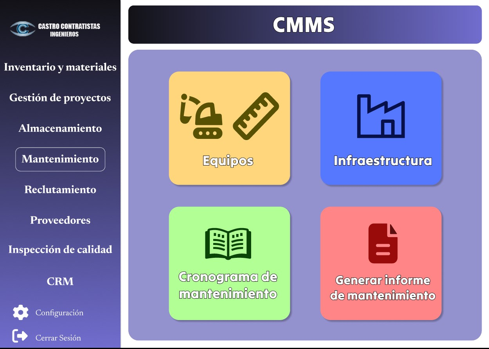
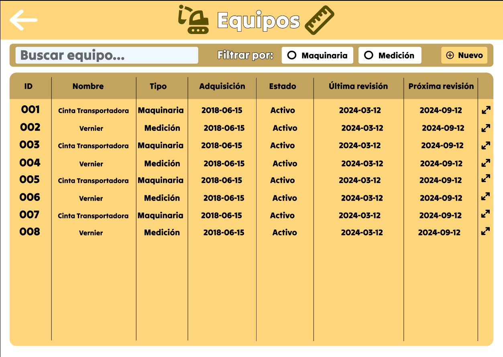
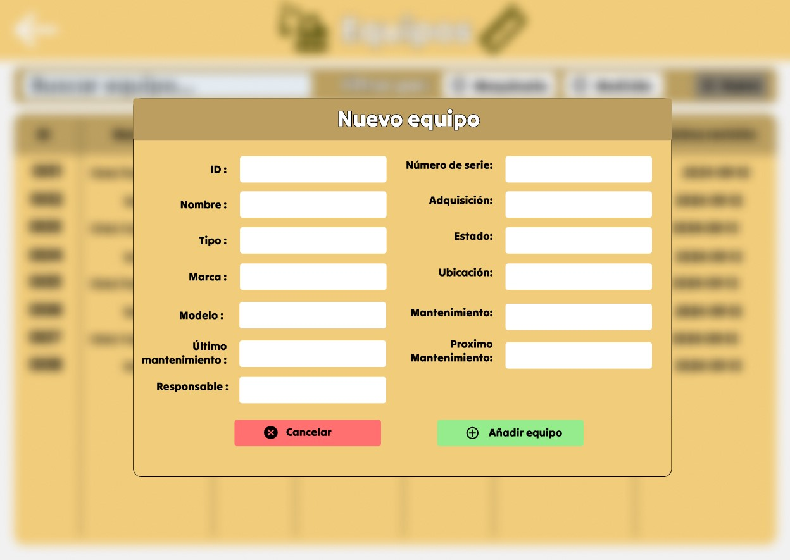
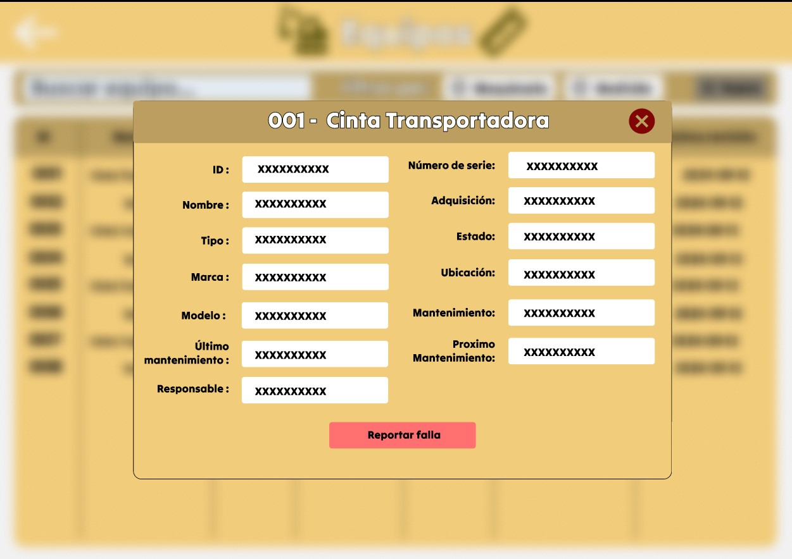
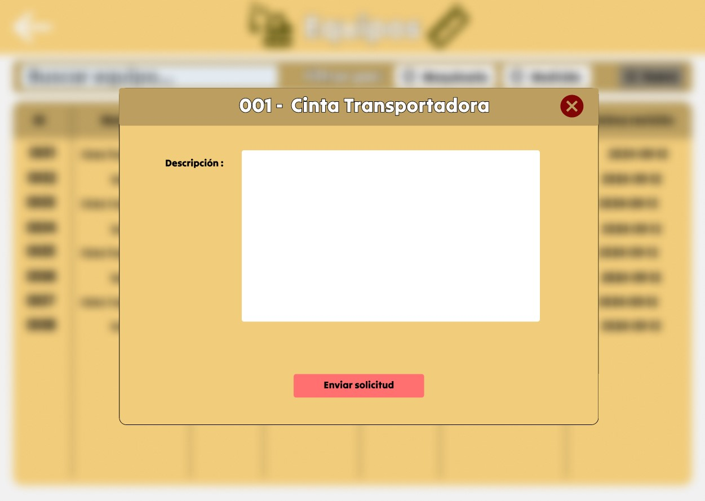
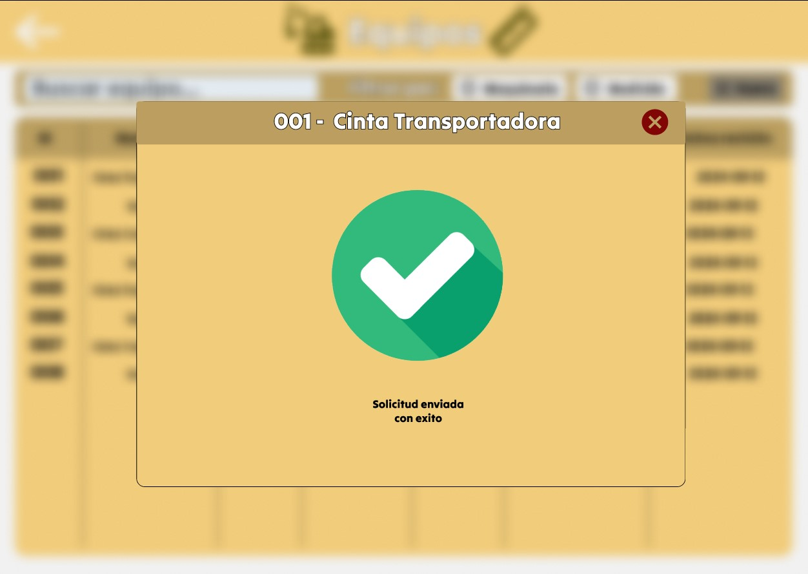
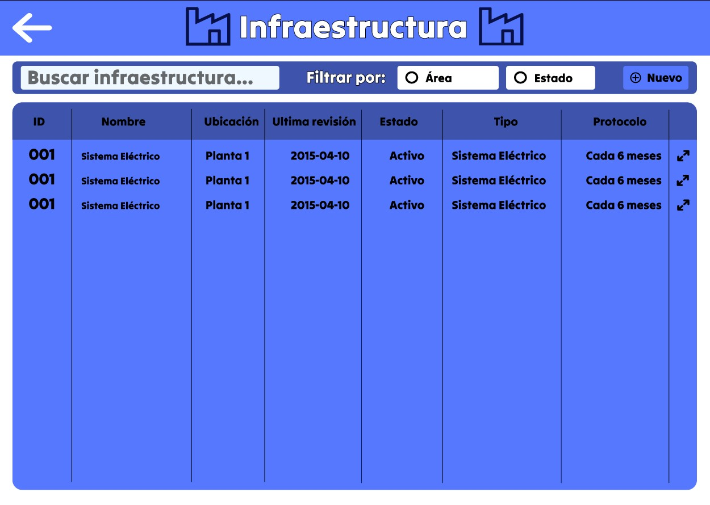
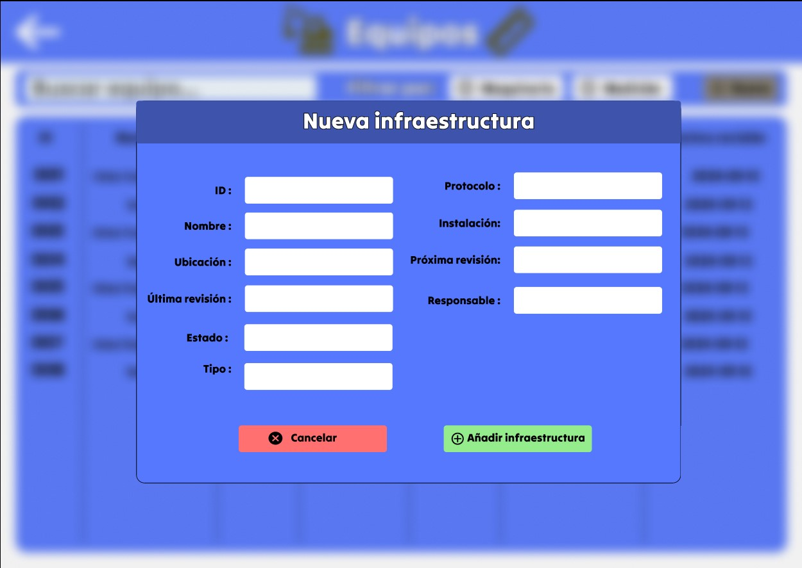
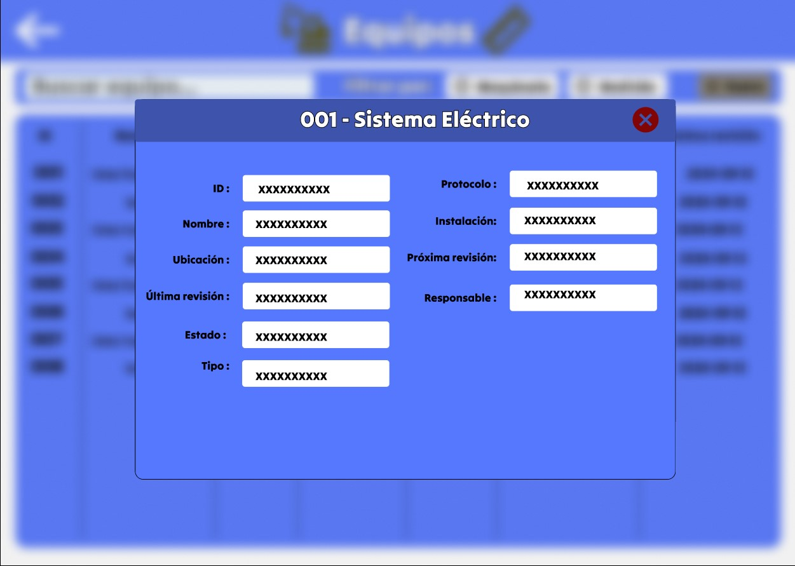
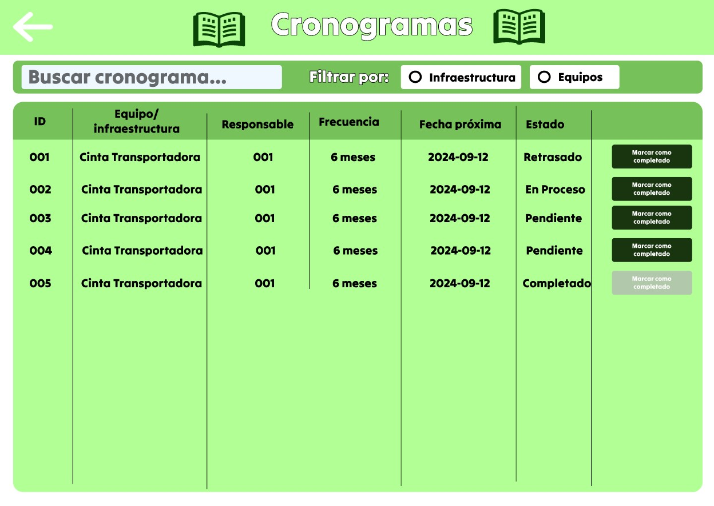

# 4.6. Módulo Mantenimiento (CMMS)

# Requerimientos del Módulo CMMS

## Requerimientos Funcionales

1. **Gestión de Mantenimiento Preventivo**\
El sistema debe permitir programar, gestionar y notificar los mantenimientos preventivos de los equipos en función de un cronograma establecido.

2. **Gestión de Mantenimiento Correctivo**\
El sistema debe permitir registrar fallas detectadas por los operarios, generar solicitudes de mantenimiento correctivo y programar la reparación de equipos.

3. **Generación de Informes de Mantenimiento**\
El sistema debe generar informes detallados sobre los mantenimientos preventivos y correctivos realizados en un período determinado, permitiendo su exportación en formatos PDF o Excel.

4. **Gestión de Infraestructura**\
El sistema debe gestionar y programar el mantenimiento de la infraestructura, similar al mantenimiento de equipos, con la posibilidad de realizar seguimientos y generar informes.

## Caso de uso
**Caso de Uso 1: Gestión de Mantenimiento Preventivo**
| Campo | Descripción |
|-------|-------------|
| Objetivo | Programar y gestionar el mantenimiento preventivo de los equipos según un cronograma. |
| Descripción | El sistema permite que el supervisor programe mantenimientos preventivos y los técnicos reciban notificaciones de las tareas asignadas. |
| Actor Primario | Supervisor de Mantenimiento |
| Precondiciones | El equipo debe estar registrado en el sistema y su cronograma debe estar disponible. |
| Paso | 1. El supervisor selecciona el equipo.   2. El sistema muestra el cronograma de mantenimiento.   3. El supervisor programa el mantenimiento preventivo.   4. El sistema genera una notificación del mantenimiento programado. |

**Caso de Uso 2: Gestión de Mantenimiento Correctivo**
| Campo | Descripción |
|-------|-------------|
| Objetivo | Registrar fallas y gestionar el mantenimiento correctivo de equipos. |
| Descripción | El sistema permite registrar fallas reportadas por los operarios y generar una solicitud de mantenimiento correctivo. |
| Actor Primario | Operario, Supervisor de Mantenimiento |
| Precondiciones | El equipo debe estar registrado en el sistema. |
| Paso | 1. El operario detecta la falla y la reporta en el sistema.   2. El sistema genera una solicitud de mantenimiento correctivo.   3. El supervisor evalúa la solicitud y programa la reparación.   4. El sistema actualiza el estado del equipo y envía una notificación. |

**Caso de Uso 3: Gestión de Infraestructura**

| Campo | Descripción |
|-------|-------------|
| Objetivo | Programar y gestionar el mantenimiento de la infraestructura. |
| Descripción | El sistema permite programar y gestionar el mantenimiento de la infraestructura de la empresa, similar a los equipos. |
| Actor Primario | Personal de Infraestructura, Supervisor de Mantenimiento |
| Precondiciones | La infraestructura debe estar registrada en el sistema. |
| Paso | 1. El personal de infraestructura programa el mantenimiento.   2. El sistema notifica al personal involucrado.   3. El mantenimiento es registrado y los resultados se reportan.   4. Se genera un informe de mantenimiento de la infraestructura. |

**Caso de Uso 4: Notificación de Mantenimientos Pendientes**

| Campo | Descripción |
|-------|-------------|
| Objetivo | Notificar sobre mantenimientos pendientes o próximos a realizarse. |
| Descripción | El sistema envía notificaciones automáticas sobre mantenimientos pendientes a los supervisores y técnicos. |
| Actor Primario | Supervisor de Mantenimiento, Técnico |
| Precondiciones | Existen mantenimientos programados en el cronograma. |
| Paso | 1. El sistema revisa el cronograma de mantenimiento.   2. El sistema identifica mantenimientos próximos o pendientes.   3. Se envía una notificación automática al supervisor y técnico asignado. |

**Caso de Uso 5: Generación de Informes de Mantenimiento**

| Campo | Descripción |
|-------|-------------|
| Objetivo | Generar informes detallados de los mantenimientos realizados. |
| Descripción | El sistema permite generar informes de los mantenimientos preventivos y correctivos realizados durante un período determinado. |
| Actor Primario | Supervisor de Mantenimiento |
| Precondiciones | Los mantenimientos deben estar completados y registrados en el sistema. |
| Paso | 1. El supervisor selecciona el rango de fechas.   2. El sistema muestra las actividades realizadas durante el período seleccionado.   3. El supervisor genera el informe y lo exporta en PDF o Excel.   4. El informe es archivado en el sistema. |

## Requerimientos de Atributos de Calidad

**Disponibilidad**

El sistema debe estar disponible el 99% del tiempo para los usuarios durante las horas laborales. Cualquier mantenimiento del sistema debe ser programado fuera de este horario.

**Escalabilidad**

El sistema debe poder gestionar más de 1000 equipos y 500 usuarios concurrentes sin afectar el rendimiento.

**Seguridad**

Debe contar con autenticación de usuario, roles y permisos para asegurar que solo el personal autorizado pueda acceder o modificar los datos del sistema.

**Rendimiento**

Las consultas de cronograma y mantenimientos no deben tardar más de 2 segundos en ser respondidas.

**Portabilidad**

El sistema debe ser accesible desde dispositivos móviles y computadoras de escritorio, con interfaces adaptables a las diferentes plataformas.

**Trazabilidad**

El sistema debe garantizar la trazabilidad de cada mantenimiento, asegurando un registro completo de quién realizó cada tarea, cuándo y con qué recursos.

**Usabilidad**

El sistema debe ser fácil de usar, con una curva de aprendizaje corta, para que los usuarios puedan gestionar mantenimientos sin necesidad de capacitación intensiva.
## Requerimientos de Restricciones

**Normativa Legal**

El sistema debe cumplir con las normativas locales de seguridad y mantenimiento de equipos industriales, así como con la ley de protección de datos.

**Uso de Tecnología**

El sistema debe utilizar PostgreSQL como base de datos, y debe estar implementado en una arquitectura web basada en RESTful APIs.

**Almacenamiento de Datos**

El sistema debe ser capaz de almacenar al menos 5 años de historial de mantenimientos sin degradar el rendimiento del sistema.

# Prototipo

## Pantalla principal del módulo

Se presenta la pagina principal del módulo donde se podrá elegir entre 4 opciones: Equipos, Infraestructura, Cronograma de mantenimiento y Generar informe de mantenimiento.

## Pantalla de Equipos
- Caso de uso 1:
El sistema permite que el supervisor programe mantenimientos preventivos y los técnicos reciban notificaciones de las tareas asignadas.
Se mostrará una lista de todos los equipos que posee la empresa.

## Pantalla de Nuevo Equipo

El Supervisor añadirá cada Equipo nuevo que es adquirido, especificando el ciclo de mantenimiento en el campo mantenimiento ej. cada 6 meses.

Entidades participantes:
- Equipo

## Pantalla de Detalles Equipo

- Caso de uso 2:
El sistema permite registrar fallas reportadas por los operarios y generar una solicitud de mantenimiento correctivo.

Al ver los detalles de cada equipo, el operario puede reportar una falla de esta.

## Pantalla Solicitud Mantenimiento

Aqui el operario podrá detallar el fallo del equipo y solicitar el mantenimiento del equipo.

## Pantalla de Solicitud enviada

Al ser enviado la solicitud exitosamente se le envia la solicitud al supervisor de mantenimiento y se le muestra el mensaje "Solicitud enviado con éxito"

Entidades participantes:
- Equipo
- Solicitud_mantenimiento

## Pantalla de Infraestructura

- Caso de uso 3:
El sistema permite programar y gestionar el mantenimiento de la infraestructura de la empresa, similar a los equipos.
Se le muestra una lista de las infraestructuras de la empresa, donde podrá ver sus detalles así como agregar nuevas infraestructuras.

## Pantalla de Nueva Infraestructura

Permite agregar nuevas infraestructuras, especificando el protocolo a seguir, ej: cada 3 meses (realizar mantenimiento).

## Pantalla de Detalle Infraestructura 

Permite ver los detalles de la infraestructura.

Entidades participantes:
- Infraestructura

## Pantalla de Cronograma de Mantimiento

- Caso de uso 4:
El sistema envía notificaciones automáticas sobre mantenimientos pendientes a los supervisores y técnicos.

Se muestra la lista de cronogramas hechos a partir de la informacion de Equipos y de Infraestructura, ademas del estado de dicho cronograma, en caso el mantenimiento esté proximo se le enviará una alerta al Supervisor de mantenimiento.
Ademas tambien se puede cambiar el estado a completado cuando este ya se ha completado y se genera un registro de mantenimiento.

Entidades participantes:
- Cronograma de mantenimiento
- Equipo
- Infraestructura
- Registro de mantenimiento

<= [4.5. Módulo 5](../4.5/4.5.md) | [ÍNDICE](../../README.md) | [4.7. Módulo 7](../4.7/4.7.md) =>