# 4.7. Módulo 7: Almacenamiento

**1.- Requerimientos del Módulo de Inventario y Materiales**

**1.1.- Requerimientos Funcionales**

 a. **Usuarios**
- **Jefe de Almacén:** Responsable de supervisar y gestionar todo el proceso de inventario y almacenamiento, así como la planificación y ejecución de las órdenes de producción y supervisión.
- **Almacenero:** Encargado de realizar las operaciones diarias en el almacén, como la recepción de materiales, almacenamiento, traslado de materiales y despacho de productos acabados.

**b. Casos de Uso**

**Caso de Uso #1: Recepción de Materiales**

| Código | M701 |
| --- | --- |
| Objetivo | Verificar la recepción de
  materiales y asegurar que las cantidades y calidad cumplen con los pedidos. |
| Descripción | Este caso de uso detalla el
  proceso por el cual el Almacenero verifica los materiales recibidos contra
  los pedidos y registra cualquier discrepancia. |
| Actor
  Primario | Almacenero |
| Actor
  Secundario | N/A |
| Precondiciones | Los materiales deben haber sido
  pedidos y el sistema debe tener registrados los pedidos correspondientes. |
| Paso | Acción |
| 1 | El Almacenero recibe los
  materiales y los verifica contra la orden de compra. |
| 2 | Verificar la calidad y las
  especificaciones de los materiales recibidos. |
| 3 | Registrar las discrepancias en el
  sistema y notificar al Jefe de Almacén. |
| 4 | Almacenar los materiales recibidos
  en las ubicaciones asignadas. |
| 5 | Confirmar la recepción de
  materiales en el sistema. |

Caso de Uso #2: Gestión de Inventario

| Código | M702 |
| --- | --- |
| Objetivo | Mantener un control preciso del
  inventario para optimizar el almacenamiento y la disponibilidad de
  materiales. |
| Descripción | Este caso de uso describe cómo el
  Almacenero mantiene y actualiza el inventario, incluyendo el registro de
  entradas y salidas de materiales. |
| Actor
  Primario | Almacenero |
| Actor
  Secundario | Jefe de Almacén |
| Precondiciones | Existencia de un sistema de
  inventario actualizado. |
| Paso | Acción |
| 1 | El Almacenero revisa el nivel
  actual del inventario. |
| 2 | Registrar la salida de materiales
  hacia la producción. |
| 3 | Actualizar el inventario en el
  sistema después de cada transacción. |
| 4 | Generar alertas cuando los niveles
  de inventario están bajos. |
| 5 | Revisar y aprobar las órdenes de
  reabastecimiento. |

Caso de Uso #3: Despacho de Productos Acabados

| Código | M703 |
| --- | --- |
| Objetivo | Asegurar que los productos
  acabados sean despachados correctamente a los clientes. |
| Descripción | Este caso de uso implica el
  proceso por el cual el Almacenero prepara, verifica y despacha los productos
  acabados, asegurando que los envíos sean correctos y a tiempo. |
| Actor
  Primario | Almacenero |
| Actor
  Secundario | N/A |
| Precondiciones | Los productos deben estar listos y
  aprobados para el despacho. |
| Paso | Acción |
| 1 | Preparar los productos para el
  despacho según las órdenes de venta. |
| 2 | Verificar las cantidades y la
  documentación de los productos. |
| 3 | Empaquetar los productos y
  etiquetarlos adecuadamente. |
| 4 | Registrar el despacho en el
  sistema y actualizar el inventario. |
| 5 | Coordinar la logística de entrega
  con el transporte. |

Caso de Uso #4: Ajuste de Inventario

| Código | M704 |
| --- | --- |
| Objetivo | Automatizar el ajuste de
  inventarios cuando haya diferencias entre el inventario físico y el
  registrado. |
| Descripción | Permite ajustar manual o
  automáticamente el inventario en base a las verificaciones físicas. |
| Actor
  Primario | Jefe de Almacén |
| Actor
  Secundario | N/A |
| Precondiciones | Discrepancias entre el inventario
  físico y el sistema. |
| Paso | Acción |
| 1 | El jefe de almacén detecta una
  diferencia entre el inventario físico y el registrado. |
| 2 | El sistema permite ajustar las
  cantidades de productos. |
| 3 | El sistema actualiza las bases de
  datos y genera un reporte del ajuste. |

Caso de Uso #5: Reabastecimiento Automatizado

| Código | M705 |
| --- | --- |
| Objetivo | Generar órdenes de
  reabastecimiento automáticamente cuando se alcancen los niveles mínimos de
  inventario. |
| Descripción | El sistema monitorea los niveles
  de inventario y, al llegar al umbral mínimo, genera órdenes de compra o
  fabricación. |
| Actor
  Primario | Sistema |
| Actor
  Secundario | Jefe de Compras |
| Precondiciones | Inventario en tiempo real y reglas
  de reabastecimiento configuradas. |
| Paso | Acción |
| 1 | El sistema detecta que un producto
  ha alcanzado el umbral mínimo. |
| 2 | El sistema genera automáticamente
  una notificación de reabastecimiento. |
| 3 | El jefe de compras revisa y
  aprueba la orden de reabastecimiento. |
| 4 | El sistema envía la orden al
  proveedor o a producción. |
| 5 | El reabastecimiento es registrado
  en el inventario. |

1.2.- Requerimientos de Atributos de Calidad

| Atributo | Descripción |
| --- | --- |
| a.
  Usabilidad | El sistema debe ser intuitivo y
  fácil de usar para los almaceneros y el jefe de almacén, con interfaces
  claras para gestionar inventarios, recepciones, y despachos. |
| b.
  Fiabilidad | El sistema debe asegurar que la
  información del inventario y los registros de despachos sean precisos y estén
  siempre disponibles, sin pérdida de datos. |
| c.
  Eficiencia | Capacidad para manejar un gran
  volumen de transacciones de inventario y despachos sin afectar el rendimiento
  o la velocidad del sistema. |
| d.
  Mantenibilidad | Facilidad para actualizar y
  mantener el sistema, permitiendo la adición de nuevas funcionalidades o
  ajustes sin interrupciones. |
| e.
  Seguridad | Asegurar la protección de los
  datos del inventario y las transacciones, cumpliendo con las normativas de
  protección de datos relevantes, e incluyendo autenticación segura y control
  de acceso por roles. |

1.3.- Requerimientos de Restricciones

| Nivel | Descripción |
| --- | --- |
| a. Nivel de Presentación (Frontend) | El frontend debe ser responsive y accesible desde
  dispositivos móviles. Utilizar frameworks como React.js o Vue.js
  es recomendable para una experiencia de usuario optimizada. Además, se debe
  implementar autenticación segura y gestión de sesiones. |
| b.
  Lógica (Backend) | El backend debe manejar la lógica
  del negocio, validaciones y la integración con la base de datos. Utilizar Spring Boot (Java) o Django (Python) para asegurar un
  backend robusto y escalable. Implementar control de acceso basado en roles y
  una API RESTful para comunicación con el frontend. |
| c. Data (Base de Datos) | La base de datos debe ser relacional (como PostgreSQL), para gestionar eficientemente las relaciones complejas entre inventarios, órdenes de
  producción y despachos. Implementar cifrado para proteger datos sensibles. |

Prototipo del Módulo Inventario y materiales:
Inicio
Inicio del Módulo: Pantalla principal de navegación para las funcionalidades clave del módulo de inventario. Desde aquí el usuario puede acceder a Recepciones, Entregas, Crear Solicitudes de Reabastecimiento e Informe de Stock.

Recepción
Recepciones (Frame Principal): Muestra un resumen de todas las recepciones de materiales pendientes o completadas, incluyendo detalles como la referencia, el proveedor, la fecha programada y el estado (Listo o Borrador). Desde esta pantalla, se pueden eliminar, confirmar o crear nuevas recepciones.

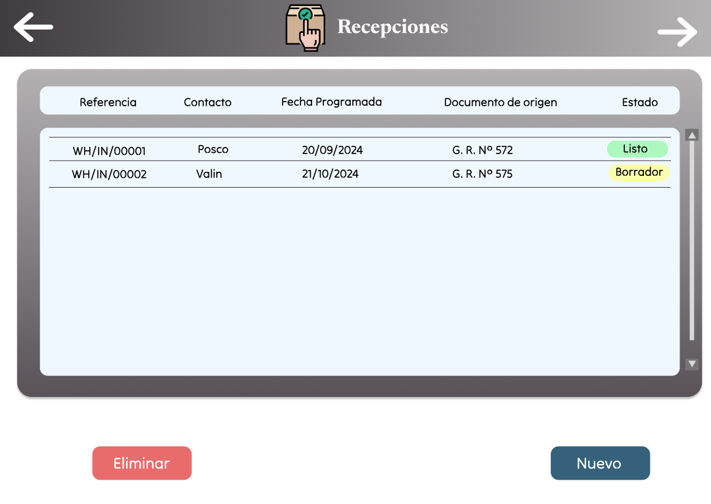

Recepciones (Detalle WH/IN/00001): Este frame detalla la recepción de materiales con toda la información relacionada: proveedor, tipo de operación (Recepción), prioridad, fecha efectiva, documento de origen y estado. Aquí se muestran los productos recibidos, como "Acero Laminado", con su cantidad.

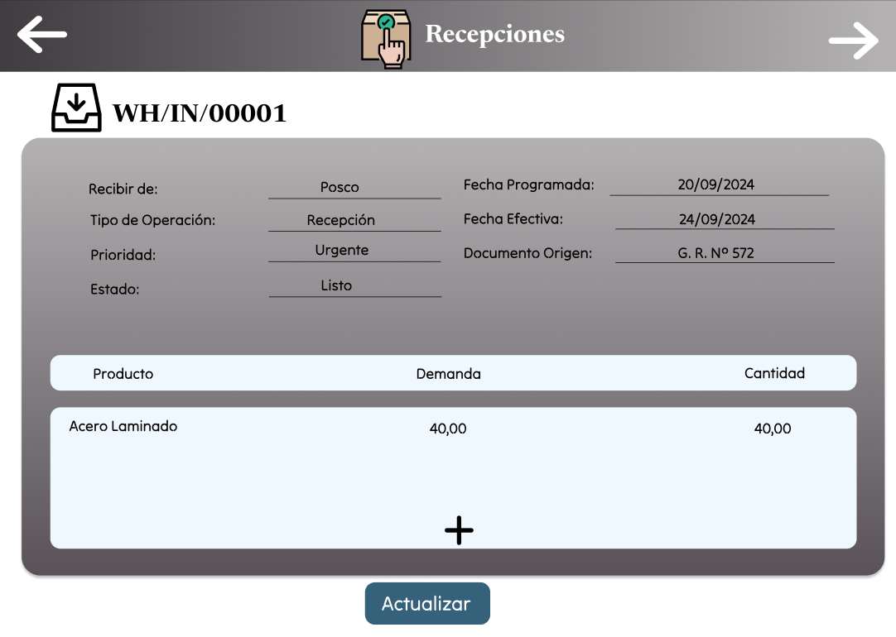

Recepciones (Detalle WH/IN/00002): Similar al anterior, este frame detalla otra recepción con un producto distinto, en este caso "Acero Inoxidable". Se puede ajustar la cantidad recibida, verificar la demanda y cambiar el estado de la recepción.

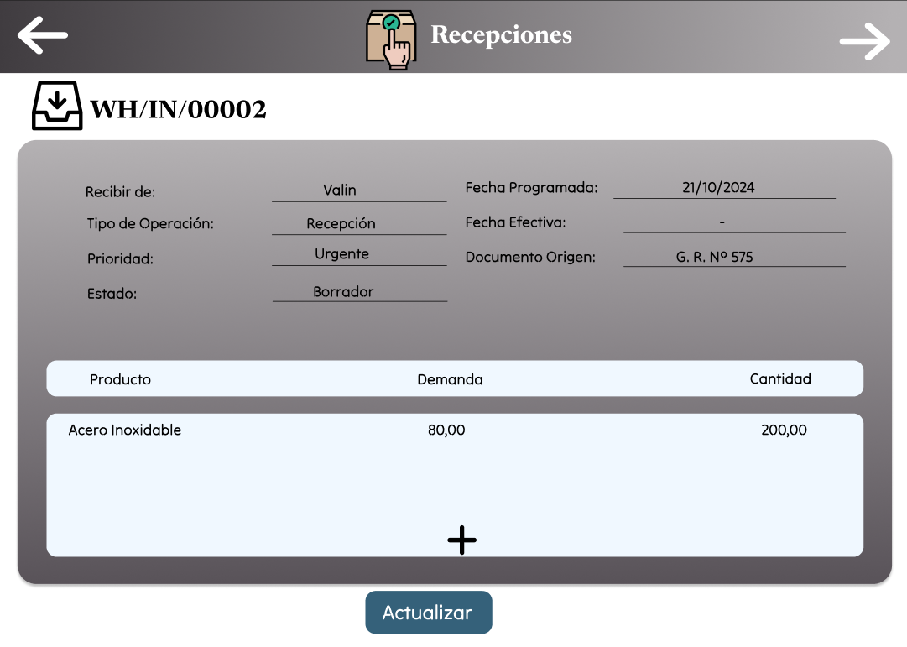

Recepciones (Nuevo): Pantalla para crear una nueva recepción, donde el usuario puede ingresar detalles como el proveedor, el tipo de operación, la prioridad, y añadir productos a recibir. Se asegura que la recepción esté correctamente registrada antes de su ejecución.

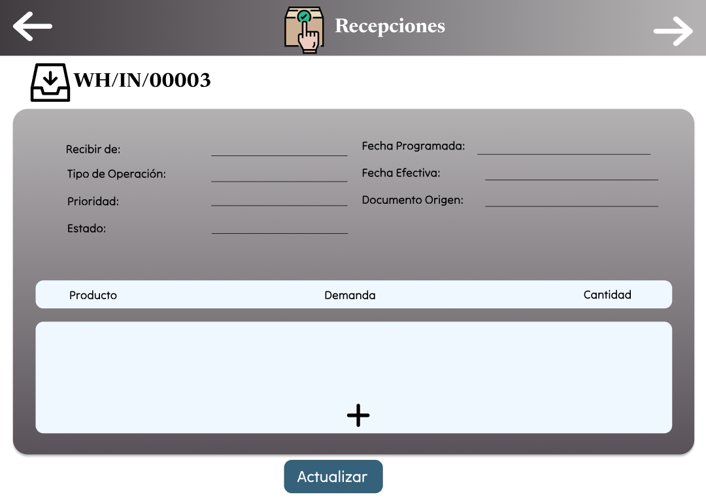

Recepciones (Resumen de Recepciones): Listado general de todas las recepciones creadas en el sistema, mostrando el estado de cada recepción (Listo o Borrador), junto con la referencia, contacto y fecha programada. Desde aquí se pueden seleccionar para ver más detalles o confirmar las recepciones pendientes.

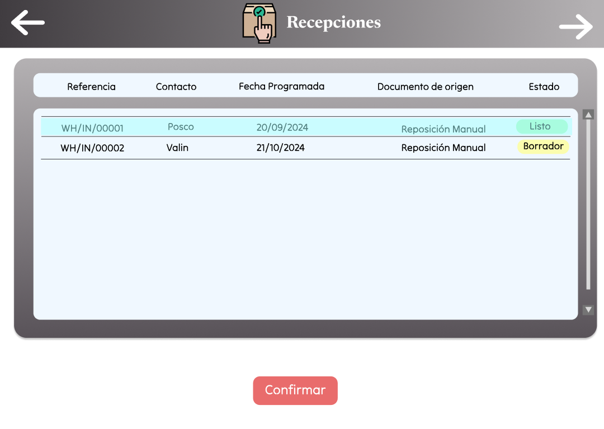

Entregas
Entregas (Frame Principal): Muestra las entregas programadas, con información clave como la referencia, contacto, fecha programada, documento de origen y estado (Listo o Borrador). Los usuarios pueden eliminar o confirmar entregas desde esta pantalla.

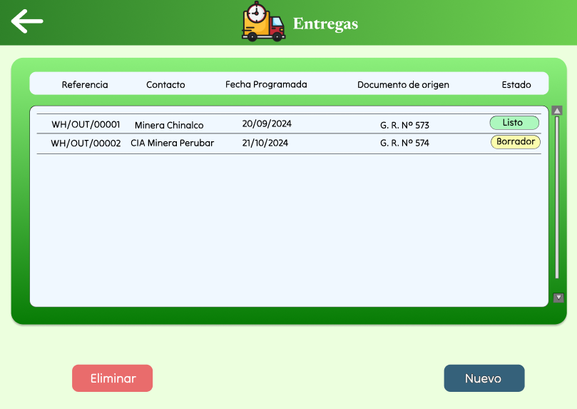

Entregas (Detalle WH/OUT/00001): Este frame detalla una entrega específica. Incluye información sobre el destinatario, el tipo de operación (Entrega), la prioridad, fecha efectiva y el estado de la entrega. El usuario puede verificar los productos a entregar, como "Acero Laminado".

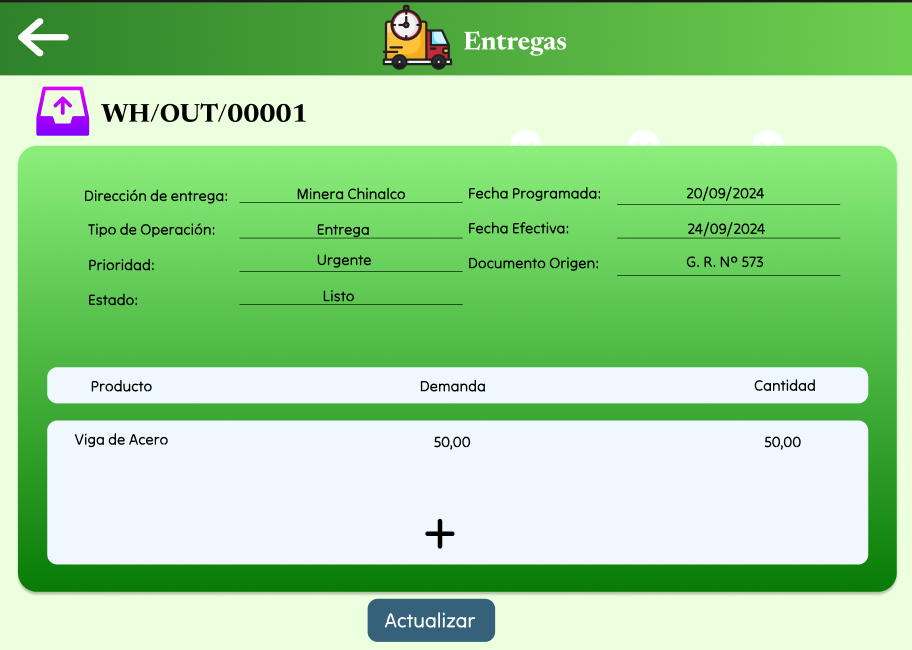

Entregas (Detalle WH/OUT/00002): Similar al frame anterior, pero detallando otra entrega que contiene "Ejes Metálicos". Los usuarios pueden modificar los detalles, incluyendo la cantidad a entregar y el estado del proceso.

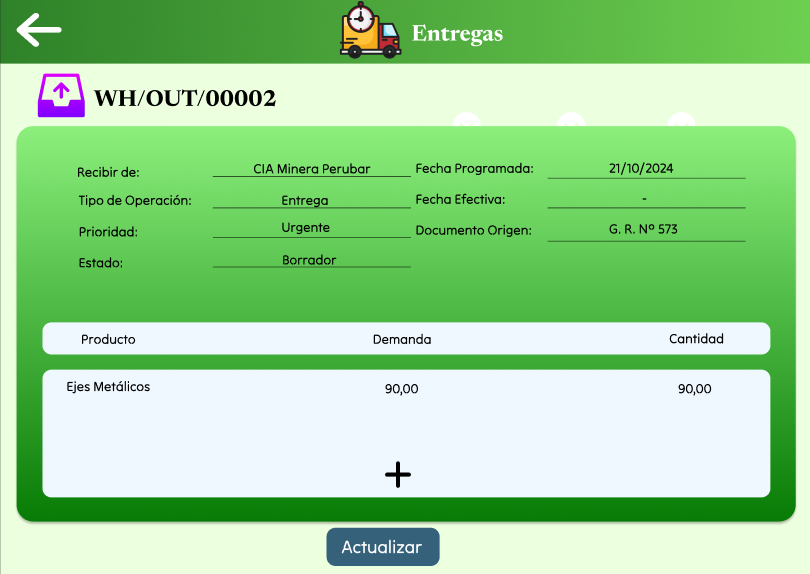

Entregas (Nuevo): Pantalla para crear una nueva entrega de productos. El usuario puede registrar el destinatario, la fecha programada, la prioridad y añadir productos que serán entregados, junto con sus respectivas cantidades.

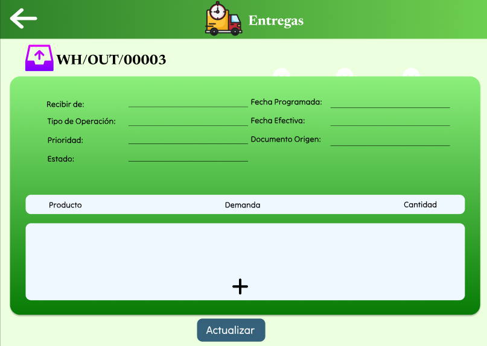

Entregas (Resumen de Entregas): Listado general de todas las entregas registradas, mostrando la referencia, contacto, fecha programada y estado (Listo o Borrador). Los usuarios pueden ver los detalles o confirmar las entregas desde esta pantalla.

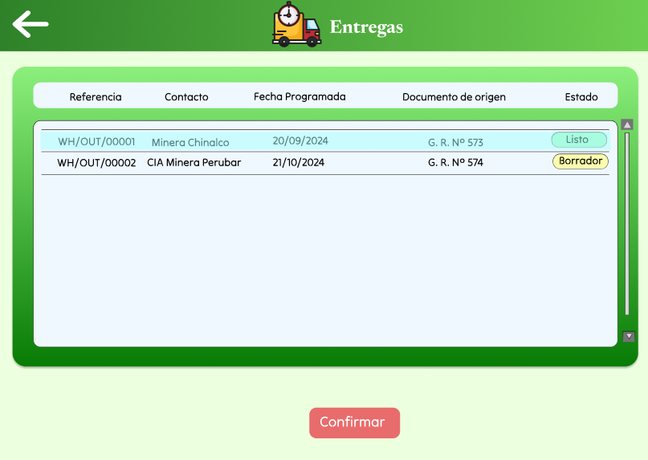

Solicitudes de Reabastecimiento
Solicitudes de Reabastecimiento (Frame Principal): Permite visualizar y gestionar las solicitudes de reabastecimiento. Muestra productos, stock real, pronóstico, niveles mínimo y máximo, y la cantidad a pedir. Aquí se seleccionan los productos para reabastecer.

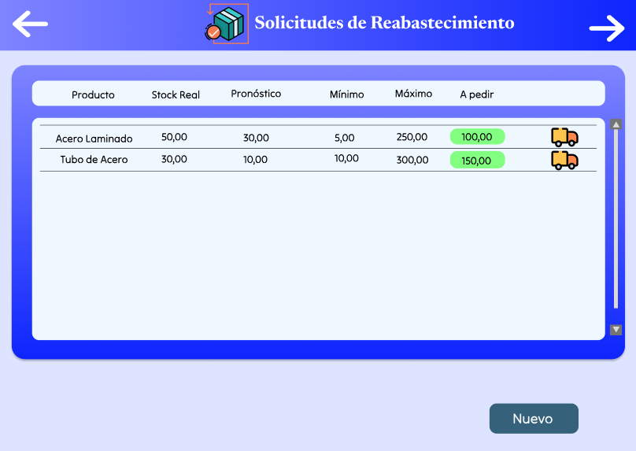

Solicitudes de Reabastecimiento (Edición de Pedido): Este frame permite editar las solicitudes de reabastecimiento antes de confirmarlas. El usuario puede ajustar las cantidades de reabastecimiento para cada producto, según las necesidades del inventario.

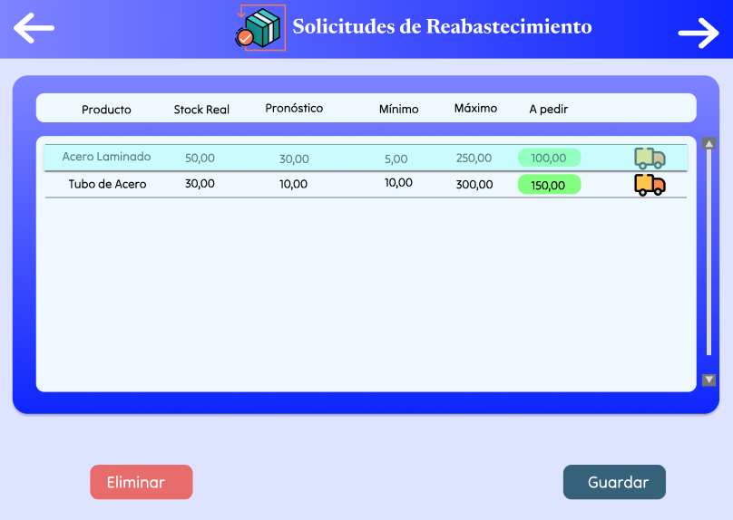

Solicitudes de Reabastecimiento (Confirmación Éxito): Pantalla de confirmación que informa que el pedido de reabastecimiento se ha realizado con éxito. Permite verificar que las cantidades solicitadas han sido procesadas correctamente.

Solicitudes de Reabastecimiento (Nuevo Pedido): Pantalla donde se crea una nueva solicitud de reabastecimiento desde cero, permitiendo al usuario revisar el stock real y pronósticos de los productos antes de generar la orden de compra.

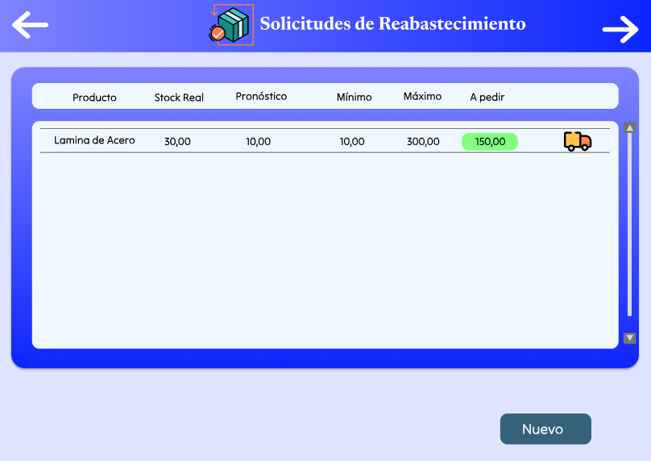

Informe de Stock
Informe de Stock (Frame Principal): Ofrece una vista general del inventario, mostrando el stock real, disponible, entrante y saliente de cada producto. Los usuarios pueden registrar nuevos productos, editar la información o eliminar productos existentes.

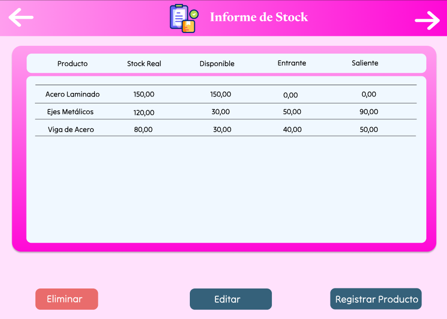

Informe de Stock (Registrar Producto Nuevo): Permite registrar un nuevo producto en el sistema. El usuario puede ingresar el nombre, descripción, peso, costo de fabricación, precio de venta, tiempo de fabricación y estado del producto.

Informe de Stock (Editar Producto): Este frame permite al usuario editar los detalles de un producto registrado, como el nombre, descripción, precio, costo de fabricación, peso y estado del producto.

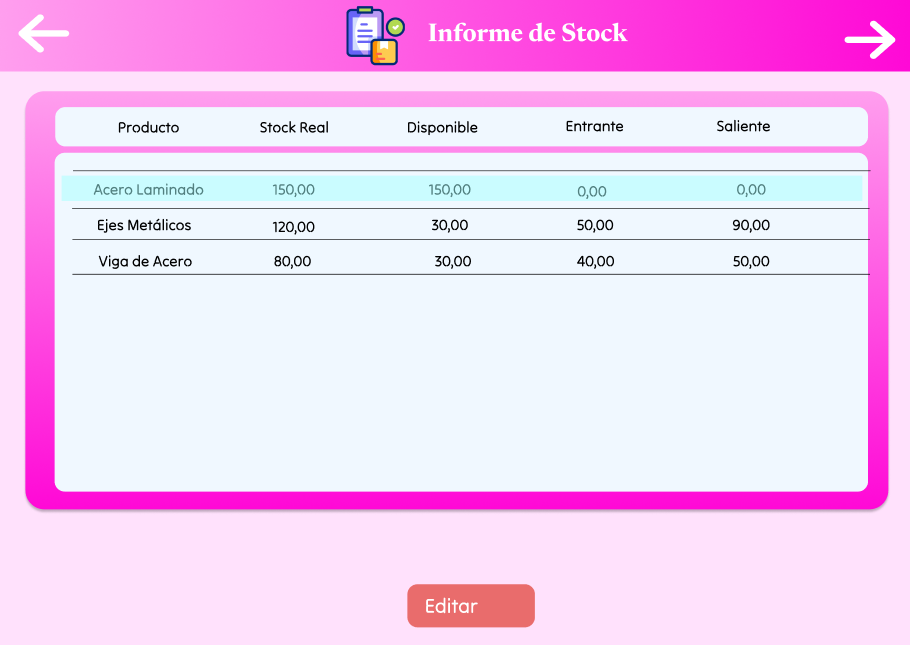

Informe de Stock (Confirmación de Edición): Después de registrar o editar un producto, esta pantalla muestra una vista confirmada del inventario actualizado, con los detalles de los productos y sus movimientos.

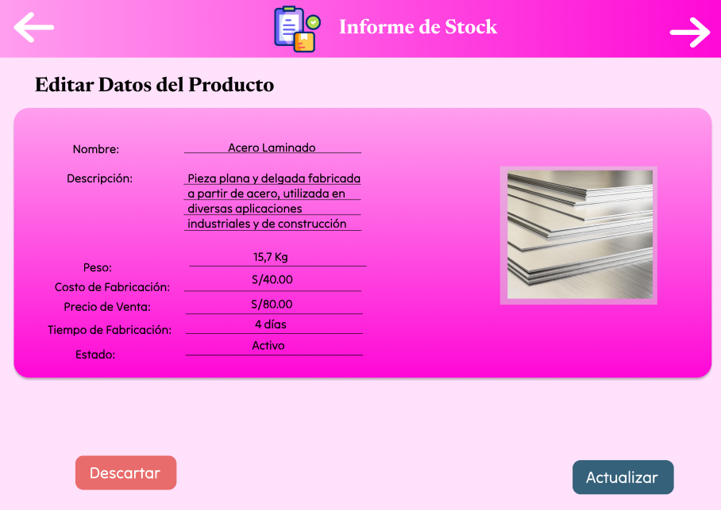

Informe de Stock (Edición de Acero Laminado): Este frame muestra la edición de un producto específico, "Acero Laminado", con información como peso, costo de fabricación, precio de venta, y tiempo de fabricación. El usuario puede actualizar cualquier dato relacionado con el producto.

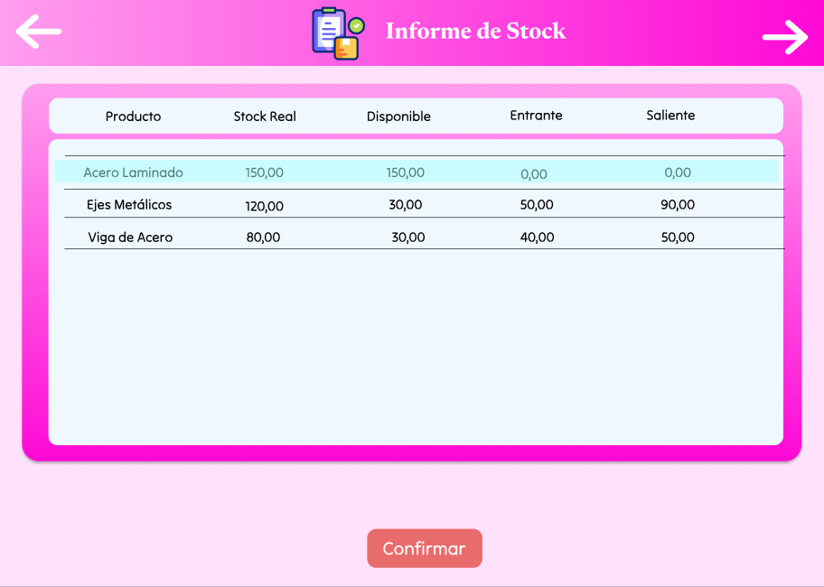

<= [4.6. Módulo 6](../4.6/4.6.md) | [ÍNDICE](../../README.md) | [5. Modelo Conceptual](../../5/5.md) =>
