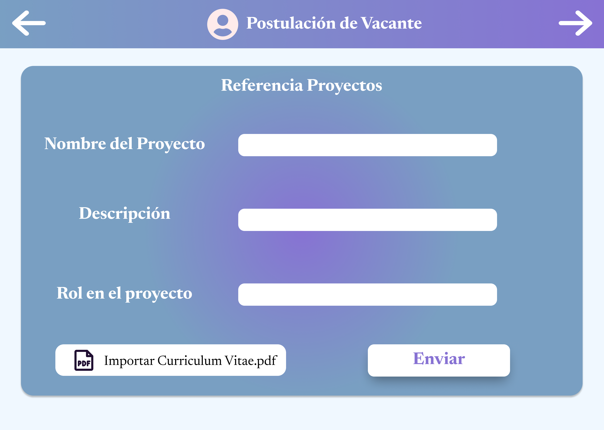
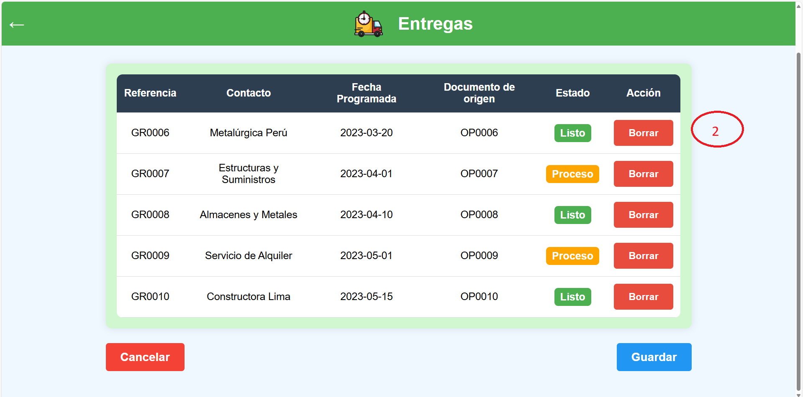
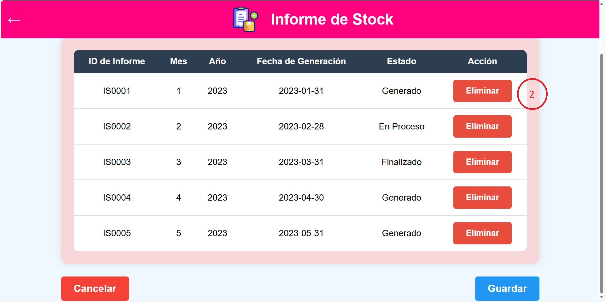

# 8.1. Sentencias SQL por módulo / prototipo

## 1. Sentencias SQL del módulo de Gestion de Proyectos 
**Caso 1**
|Codigo Requerimiento	|R101|
|---|---|
|Codigo Interfaz|	I101|
|Imagen Interfaz|	


Eventos:

1. Al cargar la página "Proyectos Activos (1)":

    Se muestra una lista de todos los proyectos activos con los siguientes campos:
        ID del Proyecto
        Nombre del Proyecto
        Fecha de Inicio
        Fecha Final
        Estado
        Descripción
        Responsable (ID Empleado)

``` sql
SELECT 
    p.ID_proyecto, 
    p.Nombre_proyecto, 
    p.Fecha_Inicio, 
    p.Fecha_Fin, 
    p.Estado_Proyecto, 
    p.Descripcion, 
    jp.ID_empleado AS Responsable 
FROM 
    Proyecto p
LEFT JOIN 
    Jefe_de_proyectos jp ON p.ID_empleado = jp.ID_empleado
WHERE 
    p.Estado_Proyecto IN ('En progreso', 'Pendiente');
;
```

**Caso 2**
|Codigo Requerimiento	|R102|
|---|---|
|Codigo Interfaz|	I102|
|Imagen Interfaz|	


Eventos:

1. Al presionar el botón "Guardar" (1):

    Descripción: Al seleccionar el botón "Guardar", se crea un nuevo registro en la tabla Proyecto con la información ingresada por el usuario en el formulario de creación de proyectos.

``` sql
INSERT INTO Proyecto (
    ID_proyecto, 
    Nombre_proyecto, 
    Fecha_Inicio, 
    Fecha_Fin, 
    Estado_Proyecto, 
    Descripcion, 
    ID_empleado, 
    ID_adjudicacion
) 
VALUES (
    'PR0099', 
    'Construcción de Puente Metálico', 
    '2023-01-01', 
    '2023-06-30', 
    'En progreso', 
    'Construcción de infraestructura metálica para puente vehicular.', 
    'E01007', 
    'AD0001'
);
```
Una vez ejecutado, este comando INSERT guarda un nuevo proyecto en la base de datos con los datos suministrados, asignando un jefe de proyecto específico (ID_empleado = 'E01007') y vinculando el proyecto a una adjudicación (ID_adjudicacion = 'ADJ001').


**Caso 3**
|Codigo Requerimiento	|R103|
|---|---|
|Codigo Interfaz|	I103|
|Imagen Interfaz|	


Eventos:

1. Al presionar el botón "Informes" (1):

    Descripción: Al hacer clic en el botón "Informes" del menú lateral, se muestra una lista completa de los informes de proyectos, con todas las columnas, ordenada por la fecha del informe en orden descendente.

``` sql
SELECT 
    ID_informe, 
    Fecha_informe, 
    Tipo_informe, 
    COALESCE(Progreso_porcentaje, 0) AS "Progreso (%)",
    COALESCE(Contenido, 'Sin contenido') AS "Contenido del Informe",
    Estado_actual,
    COALESCE(Responsable, 'No asignado') AS Responsable,
    COALESCE(Riesgos_identificados, 'Sin riesgos') AS "Riesgos Identificados",
    COALESCE(Acciones_mitigacion, 'Sin acciones') AS "Acciones de Mitigación",
    ID_proyecto 
FROM 
    Informe_proyecto
WHERE 
    Estado_actual IN ('En progreso', 'Completado') -- Muestra solo informes "En progreso" o "Completado"
ORDER BY 
    Fecha_informe DESC;

```
Esta consulta muestra todos los informes de proyectos con todas las columnas relevantes, ordena los resultados en orden descendente de acuerdo con la fecha del informe, de modo que los informes más recientes aparezcan primero.

## 2. Sentencias SQL del módulo de Reclutamiento
**Caso 1**
|Codigo Requerimiento	|R201|
|---|---|
|Codigo Interfaz|	I201|
|Imagen Interfaz|	   |

Eventos:

1. Al cargar la pagina se dara un formulario para la creación de vacante en 4 fases, al termino de las fases se lanza la vacante.

``` sql
INSERT INTO Vacante(NombrePuesto,DescripcionPuesto,Area,Ubicacion,TipoContrato,JornadaLaboral,Experiencia,NivelEducativo,Habilidades,Idiomas,Certificaciones,Salario,Bonos,Beneficios,FechaInicio,FechaCierre,Modalidad,ID_empleado) VALUES(?,?,?,?,?,?,?,?,?,?,?,?,?,?,?,?,?,?);
```
**Caso 2**
|Codigo Requerimiento	|R202|
|---|---|
|Codigo Interfaz|	I202|
|Imagen Interfaz|	|

Eventos:

2. Al cargar la pagina se mostrará información del trabajo de la vacante a la que se postulará.

``` sql
select nombrepuesto, descripcionpuesto, area, ubicacion, tipocontrato, jornadalaboral, experiencia, niveleducativo, idiomas, habilidades, certificaciones, salario, bonos, beneficios, modalidad from vacante where nombrepuesto like ?;
```


**Caso 3**
|Codigo Requerimiento	|R203|
|---|---|
|Codigo Interfaz|	I203|
|Imagen Interfaz|	  |

Eventos:

3. Al cargar la pagina se mostrará información del trabajo de la vacante a la que se postulará.

``` sql
select nombrepuesto, descripcionpuesto, area, ubicacion, tipocontrato, jornadalaboral, experiencia, niveleducativo, idiomas, habilidades, certificaciones, salario, bonos, beneficios, modalidad from vacante where id_vacante=?;
```

**Caso 4**
|Codigo Requerimiento	|R204|
|---|---|
|Codigo Interfaz|	I204|
|Imagen Interfaz|	     |

Eventos:

4. Al cargar la pagina se dara un formulario para ingresar los datos del candidato, al termino de las fases se lanza la vacante.

``` sql
INSERT INTO Candidato (Nombre, Correo, Telefono, FechaNacimiento, Direccion, Nacionalidad, DocumentoIdentidad, RedesSociales, NivelEstudios, Titulos, InstitucionEducativa, Certificaciones, Empresa, Cargos, Responsabilidades, ReferenciaLaboral, HabilidadesTecnicas, Idiomas, HabilidadesBlandas, NombreProyectoRef, DescripcionProyectoRef, RolProyectoRef)
VALUES (?, ?, ?, ?, ?, ?, ?, ?, ?, ?, ?, ?, ?, ?, ?, ?, ?, ?, ?, ?, ?, ?, ?);
INSERT INTO Postulacion(FechaPostulacion,Estado,ID_vacante,ID_candidato)VALUES(CURRENT_DATE,?,?,?);
```
**Caso 5**
|Codigo Requerimiento	|R205|
|---|---|
|Codigo Interfaz|	I205|
|Imagen Interfaz|	|

Eventos:

5. Al cargar la pagina se mostrará información de las postulaciones.

``` sql
select nombre, area, titulos, salario from postulacion
left join vacante on vacante.id_vacante = postulacion.id_vacante
left join candidato on candidato.id_candidato = postulacion.id_candidato
where estado = 1;
```
**Caso 6**
|Codigo Requerimiento	|R206|
|---|---|
|Codigo Interfaz|	I206|
|Imagen Interfaz|	|

Eventos:

6. Al cargar la pagina se mostrará información de las postulaciones.

``` sql
select nombrepuesto, area, ubicacion, tipocontrato, jornadalaboral from postulacion
left join vacante on vacante.id_vacante = postulacion.id_vacante
left join candidato on candidato.id_candidato = postulacion.id_candidato
where id_postulacion = ?
```

**Caso 7**
|Codigo Requerimiento	|R207|
|---|---|
|Codigo Interfaz|	I207|
|Imagen Interfaz|	|

Eventos:

7. Al cargar la pagina se mostrará información de las postulaciones.

``` sql
select experiencia, niveleducativo, vacante.habilidades, vacante.idiomas, vacante.certificaciones from postulacion
left join vacante on vacante.id_vacante = postulacion.id_vacante
left join candidato on candidato.id_candidato = postulacion.id_candidato
where id_postulacion = ?
```

**Caso 8**
|Codigo Requerimiento	|R208|
|---|---|
|Codigo Interfaz|	I208|
|Imagen Interfaz|	|

Eventos:

8. Al cargar la pagina se mostrará información de las postulaciones.

``` sql
select vacante.salario, vacante.bonos, vacante.beneficios from postulacion
left join vacante on vacante.id_vacante = postulacion.id_vacante
left join candidato on candidato.id_candidato = postulacion.id_candidato
where id_postulacion = ?
```

**Caso 9**
|Codigo Requerimiento	|R209|
|---|---|
|Codigo Interfaz|	I209|
|Imagen Interfaz|	|

Eventos:

9. Al cargar la pagina se mostrará información de las postulaciones.

``` sql
select candidato.nombre, candidato.fechanacimiento, candidato.direccion, candidato.telefono from postulacion
left join vacante on vacante.id_vacante = postulacion.id_vacante
left join candidato on candidato.id_candidato = postulacion.id_candidato
where id_postulacion = ?
```

**Caso 10**
|Codigo Requerimiento	|R210|
|---|---|
|Codigo Interfaz|	I210|
|Imagen Interfaz|	|

Eventos:

10. Al cargar la pagina se mostrará información de las postulaciones.

``` sql
select candidato.correo, candidato.nacionalidad, candidato.documentoidentidad, candidato.redessociales from postulacion
left join vacante on vacante.id_vacante = postulacion.id_vacante
left join candidato on candidato.id_candidato = postulacion.id_candidato
where id_postulacion = ?
```

**Caso 11**
|Codigo Requerimiento	|R211|
|---|---|
|Codigo Interfaz|	I211|
|Imagen Interfaz|	|

Eventos:

11. Al cargar la pagina se mostrará información de las postulaciones.

``` sql
select candidato.correo, candidato.nacionalidad, candidato.documentoidentidad, candidato.redessociales from postulacion
left join vacante on vacante.id_vacante = postulacion.id_vacante
left join candidato on candidato.id_candidato = postulacion.id_candidato
where id_postulacion = ?
```

**Caso 12**
|Codigo Requerimiento	|R212|
|---|---|
|Codigo Interfaz|	I212|
|Imagen Interfaz|	|

Eventos:

12. Al cargar la pagina se mostrará información de las postulaciones.

``` sql
select candidato.nivelestudios, candidato.titulos, candidato.institucioneducativa, candidato.certificaciones from postulacion
left join vacante on vacante.id_vacante = postulacion.id_vacante
left join candidato on candidato.id_candidato = postulacion.id_candidato
where id_postulacion = ?
```

**Caso 13**
|Codigo Requerimiento	|R213|
|---|---|
|Codigo Interfaz|	I213|
|Imagen Interfaz|	|

Eventos:

13. Al cargar la pagina se mostrará información de las postulaciones.

``` sql
select candidato.empresa, candidato.cargos, candidato.responsabilidades, candidato.referencialaboral from postulacion
left join vacante on vacante.id_vacante = postulacion.id_vacante
left join candidato on candidato.id_candidato = postulacion.id_candidato
where id_postulacion = ?
```

**Caso 14**
|Codigo Requerimiento	|R214|
|---|---|
|Codigo Interfaz|	I214|
|Imagen Interfaz|	|

Eventos:

14. Al cargar la pagina se mostrará información de las postulaciones.

``` sql
select candidato.habilidadestecnicas, candidato.idiomas, candidato.habilidadesblandas from postulacion
left join vacante on vacante.id_vacante = postulacion.id_vacante
left join candidato on candidato.id_candidato = postulacion.id_candidato
where id_postulacion = ?
```

**Caso 15**
|Codigo Requerimiento	|R215|
|---|---|
|Codigo Interfaz|	I215|
|Imagen Interfaz|	|

Eventos:

15. Al cargar la pagina se mostrará información de las postulaciones.

``` sql
select candidato.nombreproyectoref, candidato.descripcionproyectoref, candidato.rolproyectoref from postulacion
left join vacante on vacante.id_vacante = postulacion.id_vacante
left join candidato on candidato.id_candidato = postulacion.id_candidato
where id_postulacion = ?
```

**Caso 16**
|Codigo Requerimiento	|R216|
|---|---|
|Codigo Interfaz|	I216|
|Imagen Interfaz|	|

Eventos:

16. Al aceptar o rechazar la postulacion actualizara el estado de la postulacion.

``` sql
update postulacion set estado = 1 where postulacion.id_postulacion = ?

update postulacion set estado = 2 where postulacion.id_postulacion = ?
```

**Caso 17**
|Codigo Requerimiento	|R217|
|---|---|
|Codigo Interfaz|	I217|
|Imagen Interfaz|	|

Eventos:

17. Aquí se muestra la lista de candidatos aprobados

``` sql
select nombre, correo from postulacion 
left join candidato on candidato.id_candidato=postulacion.id_candidato
where postulacion.estado = 1
```

**Caso 18**
|Codigo Requerimiento	|R218|
|---|---|
|Codigo Interfaz|	I218|
|Imagen Interfaz|	|

Eventos:

18. Aquí se muestra la lista de candidatos aprobados

``` sql
select correo, telefono from postulacion 
left join candidato on candidato.id_candidato=postulacion.id_candidato
where postulacion.id_postulacion like ?
```

**Caso 19**
|Codigo Requerimiento	|R219|
|---|---|
|Codigo Interfaz|	I219|
|Imagen Interfaz|	|

Eventos:

19. Aquí se muestra la lista de candidatos no aprobados

``` sql
select nombre, correo from postulacion 
left join candidato on candidato.id_candidato=postulacion.id_candidato
where postulacion.estado = 2
```

**Caso 20**
|Codigo Requerimiento	|R220|
|---|---|
|Codigo Interfaz|	I220|
|Imagen Interfaz|	|

Eventos:

20. Aquí se muestra la lista de candidatos no aprobados

``` sql
select correo, telefono from postulacion 
left join candidato on candidato.id_candidato=postulacion.id_candidato
where postulacion.id_postulacion like ?
```

## 3. Sentencias SQL del módulo de CRM

**Caso 1**

|Codigo Requerimiento	|R301|
|---|---|
|Codigo Interfaz|	I301|
|Imagen Interfaz|	|

Eventos:

1. Al cargar la pagina se dara una presentacion de bienvenida al cliente mostrando como identenficacion su nombre, luego al presionar solicitar permiso se cargara otra pagina.

``` sql

select cli.Nombre as Nombre_Cliente from Cliente cli where cli.estado_cliente = 'Activo';
```

**Caso 2**

|Codigo Requerimiento|	R301|
|---|---|
|Codigo Interfaz|	I302|
|Imagen Interfaz| |

Eventos:

1. Al entrar a "registrar servicio" y llenar todo, al presionar el boton "enviar" se registrada una nueva invitacion.

``` sql

INSERT INTO Invitacion (ID_invitacion, Asunto_Invitacion, Requerimientos_Invitacion, Fecha_Envio, Tiempo_Maximo, Bases_Cotizacion, Direccion_Proyecto, Comentarios, Estado_Invitacion, ID_cliente) values 
(?,<1>,<2>,CURRENT_DATE,<3>,<4>,<5>,<6>,'No revisado',?);
```

**Caso 3**

|Codigo Requerimiento	|R302|
|---|---|
|Codigo Interfaz|	I303|
|Imagen Interfaz|	|

Eventos:

1. Al inicializar la pagina se mostrara una lista de cliente.

``` sql

SELECT 
    cli.Nombre AS Nombre_Cliente
FROM 
    Cliente cli 
LEFT JOIN Adjudicacion adj ON cli.ID_cliente = adj.ID_cliente 
LEFT JOIN Invitacion inv ON cli.ID_cliente = inv.ID_cliente  
WHERE 
    adj.Estado_Adjudicacion IN ('Aceptado', 'No aceptado') 
    OR inv.Estado_Invitacion IN ('Revisado', 'No revisado');
```

**Caso 4**

|Codigo Requerimiento|	R302|
|---|---|
|Codigo Interfaz	|I304|
|Imagen Interfaz| |

Eventos:

1. Al inicializar la pagina se vera la invitacion del cliente.

``` sql
SELECT 
    cli.Nombre AS Nombre_Cliente,
    inv.Asunto_Invitacion,
    inv.Requerimientos_Invitacion,
    inv.Tiempo_Maximo,
    inv.Bases_Cotizacion,
    inv.Direccion_Proyecto,
    inv.Comentarios
FROM 
    Invitacion inv
LEFT JOIN 
    Cliente cli ON inv.ID_cliente = cli.ID_cliente WHERE inv.estado_invitacion = 'Revisado';

SELECT 
    inf.stock_real AS Stock_Disponible 
FROM 
    Informe_stock inf
WHERE 
    inf.Fecha_generacion = (
        SELECT MAX(Fecha_generacion) 
        FROM Informe_stock
    );
```

2. Al presionar el boton "Si se participara".

``` sql

INSERT INTO Revision_tecnica (
    ID_revision_tecnica, 
    Estado_Participacion, 
    ID_empleado, 
    ID_invitacion, 
    ID_informe_stock
) 
VALUES 
    (?, 'Aceptado', (SELECT e.ID_empleado FROM empleado e WHERE e.tipo_empleado = 'Administrador Comercial'), (SELECT inv.ID_invitacion FROM invitacion inv LEFT JOIN cliente cli ON inv.ID_cliente = cli.ID_cliente WHERE cli.nombre = <3> AND inv.Estado_Invitacion = 'No revisado'), ?);
```

3. Al presionar el boton "No se participara".

``` sql

INSERT INTO Revision_tecnica (
    ID_revision_tecnica, 
    Estado_Participacion, 
    ID_empleado, 
    ID_invitacion, 
    ID_informe_stock
) 
VALUES 
    (?, 'Rechazado', (SELECT e.ID_empleado FROM empleado e WHERE e.tipo_empleado = 'Administrador Comercial'), (SELECT inv.ID_invitacion FROM invitacion inv LEFT JOIN cliente cli ON inv.ID_cliente = cli.ID_cliente WHERE cli.nombre = <3> AND inv.Estado_Invitacion = 'No revisado'), ?);
```

4. Al presionar cualquiera de los 2 botones se actualizar el estado de la invitacion.

``` sql

UPDATE Invitacion
SET Estado_Invitacion = 'Revisado'
FROM Cliente
WHERE Invitacion.ID_cliente = Cliente.ID_cliente
  AND Cliente.Nombre = <3>
  AND Invitacion.Estado_Invitacion = 'No revisado';
```

**Caso 5**

|Codigo Requerimiento|	R303|
|---|---|
|Codigo Interfaz|	I305|
|Imagen Interfaz|   |

Eventos:

1. Al entrar a esta pagina y llenar todo, al presionar el boton "Enviar propuesta" se registrada una nueva propuesta.

``` sql

INSERT INTO Presentacion_propuesta (
    ID_presentacion_propuesta, 
    Fecha_Presentacion, 
    Precio_Propuesto, 
    Descripcion_Tecnica, 
    Descripcion_Economica, 
    Calidad_Ofrecida, 
    Seguridad_Ofrecida, 
    Garantias, 
    Beneficios, 
    Condiciones_Pago, 
    Plazos_Ejecucion, 
    Obervaciones_Propuesta, 
    ID_empleado, 
    ID_revision_tecnica, 
    ID_cliente
) 
VALUES 
    (?, CURRENT_DATE, <3>, <1>, <2>, <4>, <5>, <6>, <7>, <8>, <9>, <10>, (SELECT e.ID_empleado FROM empleado e WHERE e.tipo_empleado = 'Administrador Comercial'), ?, (SELECT cli.ID_cliente FROM cliente cli WHERE cli.nombre = <11>));
```

**Caso 6**

|Codigo Requerimiento|	R304|
|---|---|
|Codigo Interfaz|	I306|
|Imagen Interfaz|   |

Eventos:

1. Al presionar el boton "Estado de servicio" al recibir la propuesta.

``` sql

SELECT 
    pro.Precio_Propuesto, 
    pro.Descripcion_Tecnica, 
    pro.Descripcion_Economica, 
    pro.Calidad_Ofrecida, 
    pro.Seguridad_Ofrecida, 
    pro.Garantias, 
    pro.Beneficios, 
    pro.Condiciones_Pago, 
    pro.Plazos_Ejecucion, 
    pro.Obervaciones_Propuesta 
FROM 
    Presentacion_propuesta pro 
LEFT JOIN Revision_tecnica rev ON pro.ID_revision_tecnica = rev.ID_revision_tecnica 
WHERE 
    rev.Estado_Participacion = 'Aceptado';
```

2. Al presionar el boton "Aceptar propuesta".

``` sql

INSERT INTO Adjudicacion (ID_adjudicacion, Fecha_Adjudicacion, Estado_Adjudicacion, ID_presentacion_propuesta, ID_cliente)
VALUES (?, CURRENT_DATE, 'Aceptado', ?, ?);
```

3. Al presionar el boton "Rechazar propuesta".

``` sql

INSERT INTO Adjudicacion (ID_adjudicacion, Fecha_Adjudicacion, Estado_Adjudicacion, ID_presentacion_propuesta, ID_cliente)
VALUES (?, CURRENT_DATE, 'No Aceptado', ?, ?);
```

## 4. Sentencias SQL del módulo de

## 5. Sentencias SQL del módulo de

## 6. Sentencias SQL del módulo de 

## 7. Sentencias SQL del módulo de Almacenamiento

**Caso 1**
|Codigo Requerimiento	|R701|
|---|---|
|Codigo Interfaz|	I701|
|Imagen Interfaz|	|

Eventos:

1. Al cargar la pagina se presentaran las 4 funcionalidades del modulo, para el primer requerimiento consideraremos la funcionalidad de recepción de materiales y al entrar a la función de recepciones se mostrara la tabla de guias de remisión de recepciones de recursos y/o productos.

``` sql
SELECT 
    id_guia_remision AS "ID",
    entidad_origendestino AS "Contacto",
    fecha_programada AS "Fecha Programada",
    documento_origen AS "Documento de Origen",
    CASE 
        WHEN cod_estado_guia = '1' THEN 'Listo'
        WHEN cod_estado_guia = '2' THEN 'Proceso'
        ELSE 'Pendiente'
    END AS "Estado"
FROM 
    guia_remision
ORDER BY 
    fecha_programada;
```

**Caso 2**
|Codigo Requerimiento	|R701|
|---|---|
|Codigo Interfaz|	I702|
|Imagen Interfaz|	|

Eventos:

2. Al presionar en una de las filas clickeables nos redireccionará a los detalles de la guía de remision seleccionada

``` sql
SELECT 
    p.nombre_producto AS "Nombre del Producto",
    dg.cantidad_producto AS "Cantidad Producto",
    r.nombre AS "Nombre del Recurso",
    dg.cantidad_recurso AS "Cantidad Recurso",
    dg.demanda AS "Demanda"
FROM 
    detalle_guia dg
JOIN 
    recurso r ON dg.id_detalle_guia = r.id_detalle_guia
JOIN 
    producto p ON dg.id_detalle_guia = p.id_detalle_guia
WHERE 
    p.nombre_producto = 'Tanque de Almacenamiento';
```
3. Al presionar en el botón de editar los detalles de una de las guías de remisión nos redireccionará a un apartado en el cual se podrán editar todos los datos menos el ID de la guía de Remisión.
4. Al darle al botón agregar podremos añadir registros en añadir un registro en la entidad Detalle Guía.
``` sql
INSERT INTO Detalle_guia (ID_detalle_guia, Cantidad_producto, Cantidad_recurso, Demanda, id_guia_remision) VALUES
('DG0001', 10, 5, 15, 'GR0001');

```

5. Al darle al botón de borrar podremos eliminar un registro de la entidad Detalle Guía.
``` sql
DELETE FROM Detalle_guia
WHERE ID_detalle_guia = 'DG0001';
```

**Caso 3**
|Codigo Requerimiento	|R701|
|---|---|
|Codigo Interfaz|	I703|
|Imagen Interfaz|	|

Eventos:

1. Al presionar en el botón eliminar nos redirigira a un apartado con un nuevo campo llamado Acción el cual cumplira la accion de eliminar datos.
2. Al presionar el botón Borrar de uno de los registros este se eliminará
``` sql
DELETE FROM Guia_remision
WHERE id_guia_remision = 'GR0001';
```

3. Al presionar el botón nuevo nos redirigira a un apartado para crear un nuevo registro.
``` sql
INSERT INTO Guia_remision (id_guia_remision, Cod_tipo_guia, Entidad_origendestino, Fecha_programada, Fecha_efectiva, Cod_tipo_operacion, Cod_estado_guia, Documento_origen, ID_empleado) VALUES
('GR0001', '1', 'Proveedores S.A.', '2023-01-01', '2023-01-02', '1', '1', 'OC0001', 'E01008'); 
```

**Caso 4**
|Codigo Requerimiento	|R702|
|---|---|
|Codigo Interfaz|	I702|
|Imagen Interfaz|	|

Eventos:

2. Al presionar en una de las filas clickeables nos redireccionará a los detalles de la guía de remision seleccionada

``` sql
SELECT 
    p.nombre_producto AS "Nombre del Producto",
    dg.cantidad_producto AS "Cantidad Producto",
    r.nombre AS "Nombre del Recurso",
    dg.cantidad_recurso AS "Cantidad Recurso",
    dg.demanda AS "Demanda"
FROM 
    detalle_guia dg
JOIN 
    recurso r ON dg.id_detalle_guia = r.id_detalle_guia
JOIN 
    producto p ON dg.id_detalle_guia = p.id_detalle_guia
WHERE 
    p.nombre_producto = 'Tanque de Almacenamiento';
```
3. Al presionar en el botón de editar los detalles de una de las guías de remisión nos redireccionará a un apartado en el cual se podrán editar todos los datos menos el ID de la guía de Remisión.
4. Al darle al botón agregar podremos añadir registros en añadir un registro en la entidad Detalle Guía.
``` sql
INSERT INTO Detalle_guia (ID_detalle_guia, Cantidad_producto, Cantidad_recurso, Demanda, id_guia_remision) VALUES
('DG0001', 10, 5, 15, 'GR0001');

```

5. Al darle al botón de borrar podremos eliminar un registro de la entidad Detalle Guía.
``` sql
DELETE FROM Detalle_guia
WHERE ID_detalle_guia = 'DG0001';
```

**Caso 5**
|Codigo Requerimiento	|R702|
|---|---|
|Codigo Interfaz|	I703|
|Imagen Interfaz|	|

Eventos:

3. Al presionar en el botón eliminar nos redirigira a un apartado con un nuevo campo llamado Acción el cual cumplira la accion de eliminar datos.
4. Al presionar el botón Borrar de uno de los registros este se eliminará
``` sql
DELETE FROM Guia_remision
WHERE id_guia_remision = 'GR0001';
```

5. Al presionar el botón nuevo nos redirigira a un apartado para crear un nuevo registro.
``` sql
INSERT INTO Guia_remision (id_guia_remision, Cod_tipo_guia, Entidad_origendestino, Fecha_programada, Fecha_efectiva, Cod_tipo_operacion, Cod_estado_guia, Documento_origen, ID_empleado) VALUES
('GR0001', '1', 'Proveedores S.A.', '2023-01-01', '2023-01-02', '1', '1', 'OC0001', 'E01008'); 
```


**Caso 4**
|Codigo Requerimiento	|R204|
|---|---|
|Codigo Interfaz|	I204|
|Imagen Interfaz|	     |

Eventos:

4. Al cargar la pagina se dara un formulario para ingresar los datos del candidato, al termino de las fases se lanza la vacante.

``` sql
INSERT INTO Candidato (Nombre, Correo, Telefono, FechaNacimiento, Direccion, Nacionalidad, DocumentoIdentidad, RedesSociales, NivelEstudios, Titulos, InstitucionEducativa, Certificaciones, Empresa, Cargos, Responsabilidades, ReferenciaLaboral, HabilidadesTecnicas, Idiomas, HabilidadesBlandas, NombreProyectoRef, DescripcionProyectoRef, RolProyectoRef)
VALUES (?, ?, ?, ?, ?, ?, ?, ?, ?, ?, ?, ?, ?, ?, ?, ?, ?, ?, ?, ?, ?, ?, ?);
INSERT INTO Postulacion(FechaPostulacion,Estado,ID_vacante,ID_candidato)VALUES(CURRENT_DATE,?,?,?);
```
**Caso 5**
|Codigo Requerimiento	|R205|
|---|---|
|Codigo Interfaz|	I205|
|Imagen Interfaz|	|

Eventos:

5. Al cargar la pagina se mostrará información de las postulaciones.

``` sql
select nombre, area, titulos, salario from postulacion
left join vacante on vacante.id_vacante = postulacion.id_vacante
left join candidato on candidato.id_candidato = postulacion.id_candidato
where estado = 1;
```
**Caso 6**
|Codigo Requerimiento	|R206|
|---|---|
|Codigo Interfaz|	I206|
|Imagen Interfaz|	|

Eventos:

6. Al cargar la pagina se mostrará información de las postulaciones.

``` sql
select nombrepuesto, area, ubicacion, tipocontrato, jornadalaboral from postulacion
left join vacante on vacante.id_vacante = postulacion.id_vacante
left join candidato on candidato.id_candidato = postulacion.id_candidato
where id_postulacion = ?
```

**Caso 7**
|Codigo Requerimiento	|R207|
|---|---|
|Codigo Interfaz|	I207|
|Imagen Interfaz|	|

Eventos:

7. Al cargar la pagina se mostrará información de las postulaciones.

``` sql
select experiencia, niveleducativo, vacante.habilidades, vacante.idiomas, vacante.certificaciones from postulacion
left join vacante on vacante.id_vacante = postulacion.id_vacante
left join candidato on candidato.id_candidato = postulacion.id_candidato
where id_postulacion = ?
```

**Caso 8**
|Codigo Requerimiento	|R208|
|---|---|
|Codigo Interfaz|	I208|
|Imagen Interfaz|	|

Eventos:

8. Al cargar la pagina se mostrará información de las postulaciones.

``` sql
select vacante.salario, vacante.bonos, vacante.beneficios from postulacion
left join vacante on vacante.id_vacante = postulacion.id_vacante
left join candidato on candidato.id_candidato = postulacion.id_candidato
where id_postulacion = ?
```

**Caso 9**
|Codigo Requerimiento	|R209|
|---|---|
|Codigo Interfaz|	I209|
|Imagen Interfaz|	|

Eventos:

9. Al cargar la pagina se mostrará información de las postulaciones.

``` sql
select candidato.nombre, candidato.fechanacimiento, candidato.direccion, candidato.telefono from postulacion
left join vacante on vacante.id_vacante = postulacion.id_vacante
left join candidato on candidato.id_candidato = postulacion.id_candidato
where id_postulacion = ?
```

**Caso 10**
|Codigo Requerimiento	|R210|
|---|---|
|Codigo Interfaz|	I210|
|Imagen Interfaz|	|

Eventos:

10. Al cargar la pagina se mostrará información de las postulaciones.

``` sql
select candidato.correo, candidato.nacionalidad, candidato.documentoidentidad, candidato.redessociales from postulacion
left join vacante on vacante.id_vacante = postulacion.id_vacante
left join candidato on candidato.id_candidato = postulacion.id_candidato
where id_postulacion = ?
```

**Caso 11**
|Codigo Requerimiento	|R211|
|---|---|
|Codigo Interfaz|	I211|
|Imagen Interfaz|	|

Eventos:

11. Al cargar la pagina se mostrará información de las postulaciones.

``` sql
select candidato.correo, candidato.nacionalidad, candidato.documentoidentidad, candidato.redessociales from postulacion
left join vacante on vacante.id_vacante = postulacion.id_vacante
left join candidato on candidato.id_candidato = postulacion.id_candidato
where id_postulacion = ?
```

**Caso 12**
|Codigo Requerimiento	|R212|
|---|---|
|Codigo Interfaz|	I212|
|Imagen Interfaz|	|

Eventos:

12. Al cargar la pagina se mostrará información de las postulaciones.

``` sql
select candidato.nivelestudios, candidato.titulos, candidato.institucioneducativa, candidato.certificaciones from postulacion
left join vacante on vacante.id_vacante = postulacion.id_vacante
left join candidato on candidato.id_candidato = postulacion.id_candidato
where id_postulacion = ?
```

**Caso 13**
|Codigo Requerimiento	|R213|
|---|---|
|Codigo Interfaz|	I213|
|Imagen Interfaz|	|

Eventos:

13. Al cargar la pagina se mostrará información de las postulaciones.

``` sql
select candidato.empresa, candidato.cargos, candidato.responsabilidades, candidato.referencialaboral from postulacion
left join vacante on vacante.id_vacante = postulacion.id_vacante
left join candidato on candidato.id_candidato = postulacion.id_candidato
where id_postulacion = ?
```

**Caso 14**
|Codigo Requerimiento	|R214|
|---|---|
|Codigo Interfaz|	I214|
|Imagen Interfaz|	|

Eventos:

14. Al cargar la pagina se mostrará información de las postulaciones.

``` sql
select candidato.habilidadestecnicas, candidato.idiomas, candidato.habilidadesblandas from postulacion
left join vacante on vacante.id_vacante = postulacion.id_vacante
left join candidato on candidato.id_candidato = postulacion.id_candidato
where id_postulacion = ?
```

**Caso 15**
|Codigo Requerimiento	|R215|
|---|---|
|Codigo Interfaz|	I215|
|Imagen Interfaz|	|

Eventos:

15. Al cargar la pagina se mostrará información de las postulaciones.

``` sql
select candidato.nombreproyectoref, candidato.descripcionproyectoref, candidato.rolproyectoref from postulacion
left join vacante on vacante.id_vacante = postulacion.id_vacante
left join candidato on candidato.id_candidato = postulacion.id_candidato
where id_postulacion = ?
```

**Caso 16**
|Codigo Requerimiento	|R216|
|---|---|
|Codigo Interfaz|	I216|
|Imagen Interfaz|	|

Eventos:

16. Al aceptar o rechazar la postulacion actualizara el estado de la postulacion.

``` sql
update postulacion set estado = 1 where postulacion.id_postulacion = ?

update postulacion set estado = 2 where postulacion.id_postulacion = ?
```

**Caso 17**
|Codigo Requerimiento	|R217|
|---|---|
|Codigo Interfaz|	I217|
|Imagen Interfaz|	|

Eventos:

17. Aquí se muestra la lista de candidatos aprobados

``` sql
select nombre, correo from postulacion 
left join candidato on candidato.id_candidato=postulacion.id_candidato
where postulacion.estado = 1
```

**Caso 18**
|Codigo Requerimiento	|R218|
|---|---|
|Codigo Interfaz|	I218|
|Imagen Interfaz|	|

Eventos:

18. Aquí se muestra la lista de candidatos aprobados

``` sql
select correo, telefono from postulacion 
left join candidato on candidato.id_candidato=postulacion.id_candidato
where postulacion.id_postulacion like ?
```

**Caso 19**
|Codigo Requerimiento	|R219|
|---|---|
|Codigo Interfaz|	I219|
|Imagen Interfaz|	|

Eventos:

19. Aquí se muestra la lista de candidatos no aprobados

``` sql
select nombre, correo from postulacion 
left join candidato on candidato.id_candidato=postulacion.id_candidato
where postulacion.estado = 2
```

**Caso 20**
|Codigo Requerimiento	|R220|
|---|---|
|Codigo Interfaz|	I220|
|Imagen Interfaz|	|

Eventos:

20. Aquí se muestra la lista de candidatos no aprobados

``` sql
select correo, telefono from postulacion 
left join candidato on candidato.id_candidato=postulacion.id_candidato
where postulacion.id_postulacion like ?
```


## 7. Sentencias SQL del módulo de Almacenamiento

**Caso 1**
|Codigo Requerimiento	|R701|
|---|---|
|Codigo Interfaz|	I701|
|Imagen Interfaz|	|

Eventos:

1. Al cargar la pagina se presentaran las 4 funcionalidades del modulo, para el primer requerimiento consideraremos la funcionalidad de recepción de materiales y al entrar a la función de recepciones se mostrara la tabla de guias de remisión de recepciones de recursos y/o productos.

``` sql
SELECT 
    id_guia_remision AS "ID",
    entidad_origendestino AS "Contacto",
    fecha_programada AS "Fecha Programada",
    documento_origen AS "Documento de Origen",
    CASE 
        WHEN cod_estado_guia = '1' THEN 'Listo'
        WHEN cod_estado_guia = '2' THEN 'Proceso'
        ELSE 'Pendiente'
    END AS "Estado"
FROM 
    guia_remision
ORDER BY 
    fecha_programada;
```

**Caso 2**
|Codigo Requerimiento	|R701|
|---|---|
|Codigo Interfaz|	I702|
|Imagen Interfaz|	|

Eventos:

2. Al presionar en una de las filas clickeables nos redireccionará a los detalles de la guía de remision seleccionada

``` sql
SELECT 
    p.nombre_producto AS "Nombre del Producto",
    dg.cantidad_producto AS "Cantidad Producto",
    r.nombre AS "Nombre del Recurso",
    dg.cantidad_recurso AS "Cantidad Recurso",
    dg.demanda AS "Demanda"
FROM 
    detalle_guia dg
JOIN 
    recurso r ON dg.id_detalle_guia = r.id_detalle_guia
JOIN 
    producto p ON dg.id_detalle_guia = p.id_detalle_guia
WHERE 
    p.nombre_producto = 'Tanque de Almacenamiento';
```
3. Al presionar en el botón de editar los detalles de una de las guías de remisión nos redireccionará a un apartado en el cual se podrán editar todos los datos menos el ID de la guía de Remisión.
4. Al darle al botón agregar podremos añadir registros en añadir un registro en la entidad Detalle Guía.
``` sql
INSERT INTO Detalle_guia (ID_detalle_guia, Cantidad_producto, Cantidad_recurso, Demanda, id_guia_remision) VALUES
('DG0001', 10, 5, 15, 'GR0001');

```

5. Al darle al botón de borrar podremos eliminar un registro de la entidad Detalle Guía.
``` sql
DELETE FROM Detalle_guia
WHERE ID_detalle_guia = 'DG0001';
```
**Caso 3**
|Codigo Requerimiento	|R701|
|---|---|
|Codigo Interfaz|	I703|
|Imagen Interfaz|	|

Eventos:

1. Al presioanr el botón eliminar nos redirigirá a un apartado de eliminacion de guías de remisión, el cual añadirá un campo con la opición de borrar individualmente
2. Al presionar el botón borrar dentro de una de las filas podremos eliminar este registro.
``` sql
DELETE FROM Guia_remision
WHERE id_guia_remision = 'GR0001';
```
3. Al presionar el botón nuevo podremos insertar un registro de gría de remisión.
``` sql
INSERT INTO Detalle_guia (ID_detalle_guia, Cantidad_producto, Cantidad_recurso, Demanda, id_guia_remision) VALUES
('DG0001', 10, 5, 15, 'GR0001');
```


**Caso 4**
|Codigo Requerimiento	|R702|
|---|---|
|Codigo Interfaz|	I704|
|Imagen Interfaz|	|

Eventos:

1. Al cargar la pagina se presentaran las 4 funcionalidades del modulo, para el primer requerimiento consideraremos la funcionalidad de entrega de materiales y al entrar a la función de entregas se mostrara la tabla de guias de remisión de entregas de recursos y/o productos.

``` sql
SELECT 
    id_guia_remision AS "Referencia",
    entidad_origendestino AS "Contacto",
    fecha_programada AS "Fecha Programada",
    documento_origen AS "Documento de origen",
    CASE 
        WHEN cod_estado_guia = '1' THEN 'Listo'
        WHEN cod_estado_guia = '2' THEN 'Proceso'
        ELSE 'Pendiente'
    END AS "Estado"
FROM 
    guia_remision
WHERE 
    id_guia_remision IN ('GR0006', 'GR0007', 'GR0008', 'GR0009', 'GR0010')
ORDER BY 
    fecha_programada;
```

**Caso 5**
|Codigo Requerimiento	|R702|
|---|---|
|Codigo Interfaz|	I705|
|Imagen Interfaz|	|

Eventos:

2. Al presionar en una de las filas clickeables nos redireccionará a los detalles de la guía de remision seleccionada

``` sql
SELECT 
    p.nombre_producto AS "Nombre del Producto",
    dg.cantidad_producto AS "Cantidad Producto",
    r.nombre AS "Nombre del Recurso",
    dg.cantidad_recurso AS "Cantidad Recurso",
    dg.demanda AS "Demanda"
FROM 
    detalle_guia dg
JOIN 
    recurso r ON dg.id_detalle_guia = r.id_detalle_guia
JOIN 
    producto p ON dg.id_detalle_guia = p.id_detalle_guia
WHERE 
    p.nombre_producto = 'Tanque de Almacenamiento';
```
3. Al presionar en el botón de editar los detalles de una de las guías de remisión nos redireccionará a un apartado en el cual se podrán editar todos los datos menos el ID de la guía de Remisión.
4. Al darle al botón agregar podremos añadir registros en añadir un registro en la entidad Detalle Guía.
``` sql
INSERT INTO Detalle_guia (ID_detalle_guia, Cantidad_producto, Cantidad_recurso, Demanda, id_guia_remision) VALUES
('DG0001', 10, 5, 15, 'GR0001');

```

5. Al darle al botón de borrar podremos eliminar un registro de la entidad Detalle Guía.
``` sql
DELETE FROM Detalle_guia
WHERE ID_detalle_guia = 'DG0001';
```


**Caso 6**
|Codigo Requerimiento	|R701|
|---|---|
|Codigo Interfaz|	I706|
|Imagen Interfaz|	|

Eventos:

1. Al presioanr el botón eliminar nos redirigirá a un apartado de eliminacion de guías de remisión, el cual añadirá un campo con la opición de borrar individualmente
2. Al presionar el botón borrar dentro de una de las filas podremos eliminar este registro.
``` sql
DELETE FROM Guia_remision
WHERE id_guia_remision = 'GR0006';
```
3. Al presionar el botón nuevo podremos insertar un registro de gría de remisión.
``` sql
INSERT INTO Detalle_guia (ID_detalle_guia, Cantidad_producto, Cantidad_recurso, Demanda, id_guia_remision) VALUES
('DG0001', 25, 8, 20, 'GR0006');
```


**Caso 7**
|Codigo Requerimiento	|R703|
|---|---|
|Codigo Interfaz|	I707|
|Imagen Interfaz|	|

Eventos:

1. Al cargar la pagina se presentaran las 4 funcionalidades del modulo, para el tercer requerimiento consideraremos la funcionalidad de reabastecimiento de materiales y al entrar a la función de reabastecimiento se mostrara la tabla de guias de recursos y sus valores a considerar para un reabastecimiento futuro.

``` sql
SELECT 
    r.nombre AS "Producto",
    r.costo_unitario AS "Stock", 
    r.peso AS "Disponible", 
    r.volumen AS "Mínimo", 
    r.plazo_entrega AS "Máximo",
    (r.costo_unitario * 2) AS "A pedir" 
FROM 
    recurso r
WHERE 
    r.cod_estado_recurso = 'A';
```

**Caso 8**
|Codigo Requerimiento	|R703|
|---|---|
|Codigo Interfaz|	I708|
|Imagen Interfaz|	|

Eventos:

2. Al presionar en una de las filas clickeables nos redireccionará a los detalles de las guías de remisión que han entregado o recibido a dicho recurso.

``` sql
SELECT 
    R.id_recurso AS "ID del Recurso",
    R.nombre AS "Nombre",
    R.descripcion AS "Descripción",
    R.costo_unitario AS "Costo Unitario",
    R.peso AS "Peso",
    R.volumen AS "Volumen",
    R.plazo_entrega AS "Plazo de Entrega",
    R.cod_estado_recurso AS "Estado del Recurso",
    R.fecha_registro AS "Fecha de Registro",
    G.id_guia_remision AS "Documento",
    D.cantidad_recurso AS "Cantidad",
    G.fecha_efectiva AS "Fecha"
FROM 
    recurso R
JOIN 
    detalle_guia D ON R.id_detalle_guia = D.id_detalle_guia
JOIN 
    guia_remision G ON D.id_guia_remision = G.id_guia_remision
WHERE 
    R.id_recurso = 'RC0001';
```
3. Al presionar en el botón de editar los detalles de una de los recursos nos redireccionará a un apartado en el cual se podrán editar todos los datos menos el ID del Recurso.
4. Al darle al botón agregar podremos añadir registros en añadir un registro en la entidad Guía de Remisión.
``` sql
INSERT INTO Guia_remision (id_guia_remision, Cod_tipo_guia, Entidad_origendestino, Fecha_programada, Fecha_efectiva, Cod_tipo_operacion, Cod_estado_guia, Documento_origen, ID_empleado) VALUES
('GR0001', '1', 'Proveedores S.A.', '2023-01-01', '2023-01-02', '1', '1', 'OC0001', 'E01008');
```

5. Al darle al botón de borrar podremos eliminar un registro de la entidad Detalle Guía.
``` sql
DELETE FROM Guia_remision
WHERE ID_guia_remision = 'GR0001';
```
**Caso 9**
|Codigo Requerimiento	|R703|
|---|---|
|Codigo Interfaz|	I709|
|Imagen Interfaz|	|

Eventos:

1. Al presionar el botón eliminar nos redirigirá a un apartado de eliminacion de recursos, el cual añadirá un campo con la opición de borrar individualmente
2. Al presionar el botón borrar dentro de una de las filas podremos eliminar este registro.
``` sql
DELETE FROM Recurso
WHERE id_recurso = 'RC0001';
```
3. Al presionar el botón nuevo podremos insertar un registro de recurso.
``` sql
INSERT INTO Recurso (ID_recurso, Nombre, Descripcion, Cod_tipo_recurso, Rastreo_inventario, Costo_unitario, Peso, Volumen, Plazo_entrega, Cod_estado_recurso, Fecha_registro, ID_inspeccion, ID_lote, ID_certificado_calidad, ID_ficha_tecnica, ID_informe_stock, ID_detalle_orden, ID_detalle_guia) VALUES
('RC0001', 'Acero', 'Acero para construcción de estructuras', '1', TRUE, 1000.00, 100.00, 1.00, 7, 'A', '2023-01-01', 'IP0001', 'L00101', 'CC0001', 'FT0001', 'IS0001', 'DO0001', 'DG0001');
```


**Caso 10**
|Codigo Requerimiento	|R704|
|---|---|
|Codigo Interfaz|	I710|
|Imagen Interfaz|	|

Eventos:

1. Al cargar la pagina se presentaran las 4 funcionalidades del modulo, para el cuarto requerimiento consideraremos la funcionalidad de entrega de reportes de stock y al entrar a la función de informes de stock se mostrara la tabla de informes de stock recursos y/o productos.

``` sql
SELECT 
    id_informe_stock AS "ID de Informe",
    mes_informe AS "Mes",
    año_informe AS "Año",
    fecha_generacion AS "Fecha de Generación",
    CASE 
        WHEN estado_informe = 'A' THEN 'Generado'
        WHEN estado_informe = 'B' THEN 'En Proceso'
        WHEN estado_informe = 'C' THEN 'Finalizado'
        ELSE 'Desconocido'
    END AS "Estado"
FROM 
    informe_stock
ORDER BY 
    año_informe, mes_informe;
```

**Caso 11**
|Codigo Requerimiento	|R704|
|---|---|
|Codigo Interfaz|	I711|
|Imagen Interfaz|	|

Eventos:

2. Al presionar en una de las filas clickeables nos redireccionará a los detalles del informe de stock

``` sql
SELECT 
    informe_stock.id_informe_stock AS "ID del Informe",
    informe_stock.mes_informe AS "Mes",
    informe_stock.año_informe AS "Año",
    informe_stock.fecha_generacion AS "Fecha de Generación",
    CASE
        WHEN informe_stock.estado_informe = 'A' THEN 'Generado'
        WHEN informe_stock.estado_informe = 'B' THEN 'En Proceso'
        WHEN informe_stock.estado_informe = 'C' THEN 'Finalizado'
        ELSE 'Desconocido'
    END AS "Estado del Informe",
    detalle_orden.id_detalle_orden AS "ID Detalle Orden",
    recurso.nombre AS "Nombre Recurso",
    detalle_orden.cantidad_recurso AS "Cantidad Recurso",
    producto.nombre_producto AS "Nombre Producto",
    detalle_orden.cantidad_producto AS "Cantidad Producto",
    orden_produccion.fecha_creacion AS "Fecha Creación"
FROM 
    informe_stock
JOIN recurso ON recurso.id_informe_stock = informe_stock.id_informe_stock
JOIN detalle_orden ON recurso.id_detalle_orden = detalle_orden.id_detalle_orden
JOIN producto ON detalle_orden.id_detalle_orden = producto.id_detalle_orden
JOIN orden_produccion ON detalle_orden.id_orden_produccion = orden_produccion.id_orden_produccion
WHERE informe_stock.id_informe_stock = 'IS0001'; 
```
3. Al presionar en el botón de editar los detalles de una de las guías de remisión nos redireccionará a un apartado en el cual se podrán editar todos los datos menos el ID de la guía de Remisión.
4. Al darle al botón agregar podremos añadir registros en añadir un registro en la entidad Detalle Guía.
``` sql
INSERT INTO Informe_stock (ID_informe_stock, Mes_informe, Año_informe, Fecha_generacion, Cantidad_actual_recurso, Cantidad_actual_producto, Stock_inicial, Stock_final, Stock_real, Stock_teorico, Observaciones, Estado_informe,id_empleado) VALUES
('IS0001', 1, 2023, '2023-01-31', 500, 300, 400, 600, 450, 500, 'Inventario de enero', 'A','E01003');

```

5. Al darle al botón de borrar podremos eliminar un registro de la entidad Detalle Guía.
``` sql
DELETE FROM Informe_stock
WHERE ID_informe_stock = 'IS0001';
```


**Caso 12**
|Codigo Requerimiento	|R704|
|---|---|
|Codigo Interfaz|	I712|
|Imagen Interfaz|	|

Eventos:

1. Al presioanr el botón eliminar nos redirigirá a un apartado de eliminacion de guías de remisión, el cual añadirá un campo con la opición de borrar individualmente
2. Al presionar el botón borrar dentro de una de las filas podremos eliminar este registro.
``` sql
DELETE FROM Informe_stock
WHERE ID_informe_stock = 'IS0001';
```
3. Al presionar el botón nuevo podremos insertar un registro de gría de remisión.
``` sql
INSERT INTO Informe_stock (ID_informe_stock, Mes_informe, Año_informe, Fecha_generacion, Cantidad_actual_recurso, Cantidad_actual_producto, Stock_inicial, Stock_final, Stock_real, Stock_teorico, Observaciones, Estado_informe,id_empleado) VALUES
('IS0001', 1, 2023, '2023-01-31', 500, 300, 400, 600, 450, 500, 'Inventario de enero', 'A','E01003');

```

