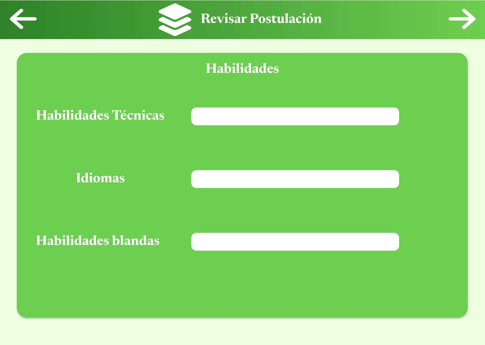
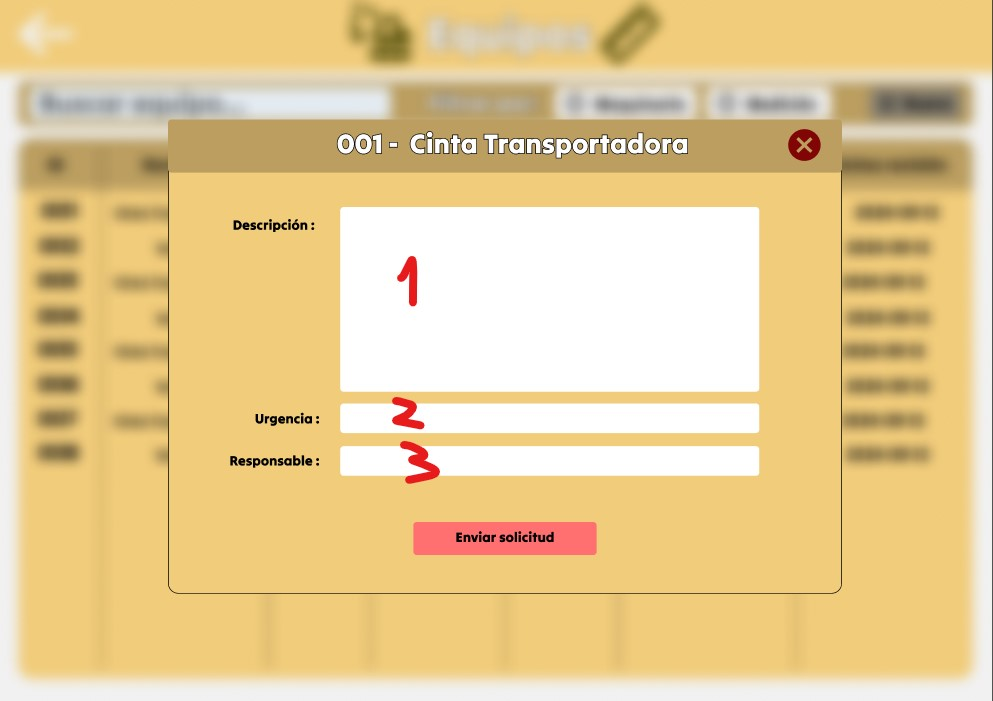
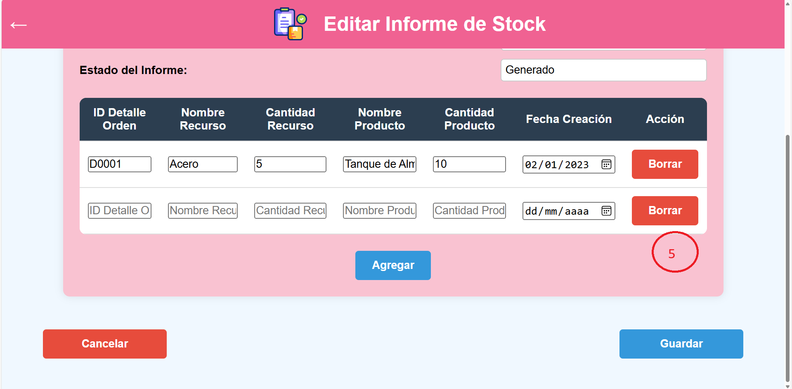

# 8.1. Sentencias SQL por módulo / prototipo

## 1. Sentencias SQL del módulo de Gestion de Proyectos

**Caso 1**
|Codigo Requerimiento |R101|
|---|---|
|Codigo Interfaz| I101|
|Imagen Interfaz| 

Eventos:

1. Al cargar la página "Proyectos Activos (1)":

   Se muestra una lista de todos los proyectos activos con los siguientes campos:
   ID del Proyecto
   Nombre del Proyecto
   Fecha de Inicio
   Fecha Final
   Estado
   Descripción
   Responsable (ID Empleado)

```sql
SELECT
    p.ID_proyecto,
    p.Nombre_proyecto,
    p.Fecha_Inicio,
    p.Fecha_Fin,
    p.Estado_Proyecto,
    p.Descripcion,
    jp.ID_empleado AS Responsable
FROM
    Proyecto p
LEFT JOIN
    Jefe_de_proyectos jp ON p.ID_empleado = jp.ID_empleado
WHERE
    p.Estado_Proyecto IN ('En progreso', 'Pendiente');
;
```

**Caso 2**
|Codigo Requerimiento |R102|
|---|---|
|Codigo Interfaz| I102|
|Imagen Interfaz| 

Eventos:

1. Al presionar el botón "Guardar" (1):

   Descripción: Al seleccionar el botón "Guardar", se crea un nuevo registro en la tabla Proyecto con la información ingresada por el usuario en el formulario de creación de proyectos.

```sql
INSERT INTO Proyecto (
    ID_proyecto,
    Nombre_proyecto,
    Fecha_Inicio,
    Fecha_Fin,
    Estado_Proyecto,
    Descripcion,
    ID_empleado,
    ID_adjudicacion
)
VALUES (
    'PR0099',
    'Construcción de Puente Metálico',
    '2023-01-01',
    '2023-06-30',
    'En progreso',
    'Construcción de infraestructura metálica para puente vehicular.',
    'E01007',
    'AD0001'
);
```

Una vez ejecutado, este comando INSERT guarda un nuevo proyecto en la base de datos con los datos suministrados, asignando un jefe de proyecto específico (ID_empleado = 'E01007') y vinculando el proyecto a una adjudicación (ID_adjudicacion = 'ADJ001').

**Caso 3**
|Codigo Requerimiento |R103|
|---|---|
|Codigo Interfaz| I103|
|Imagen Interfaz| 

Eventos:

1. Al presionar el botón "Informes" (1):

   Descripción: Al hacer clic en el botón "Informes" del menú lateral, se muestra una lista completa de los informes de proyectos, con todas las columnas, ordenada por la fecha del informe en orden descendente.

```sql
SELECT
    ID_informe,
    Fecha_informe,
    Tipo_informe,
    COALESCE(Progreso_porcentaje, 0) AS "Progreso (%)",
    COALESCE(Contenido, 'Sin contenido') AS "Contenido del Informe",
    Estado_actual,
    COALESCE(Responsable, 'No asignado') AS Responsable,
    COALESCE(Riesgos_identificados, 'Sin riesgos') AS "Riesgos Identificados",
    COALESCE(Acciones_mitigacion, 'Sin acciones') AS "Acciones de Mitigación",
    ID_proyecto
FROM
    Informe_proyecto
WHERE
    Estado_actual IN ('En progreso', 'Completado') -- Muestra solo informes "En progreso" o "Completado"
ORDER BY
    Fecha_informe DESC;

```

Esta consulta muestra todos los informes de proyectos con todas las columnas relevantes, ordena los resultados en orden descendente de acuerdo con la fecha del informe, de modo que los informes más recientes aparezcan primero.

## 2. Sentencias SQL del módulo de Reclutamiento

**Caso 1**
|Codigo Requerimiento |R201|
|---|---|
|Codigo Interfaz| I201|
|Imagen Interfaz|    |

Eventos:

1. Al cargar la pagina se dara un formulario para la creación de vacante en 4 fases, al termino de las fases se lanza la vacante.

```sql
INSERT INTO Vacante(NombrePuesto,DescripcionPuesto,Area,Ubicacion,TipoContrato,JornadaLaboral,Experiencia,NivelEducativo,Habilidades,Idiomas,Certificaciones,Salario,Bonos,Beneficios,FechaInicio,FechaCierre,Modalidad,ID_empleado) VALUES(?,?,?,?,?,?,?,?,?,?,?,?,?,?,?,?,?,?);
```

**Caso 2**
|Codigo Requerimiento |R202|
|---|---|
|Codigo Interfaz| I202|
|Imagen Interfaz| |

Eventos:

2. Al cargar la pagina se mostrará información del trabajo de la vacante a la que se postulará.

```sql
select nombrepuesto, descripcionpuesto, area, ubicacion, tipocontrato, jornadalaboral, experiencia, niveleducativo, idiomas, habilidades, certificaciones, salario, bonos, beneficios, modalidad from vacante where nombrepuesto like ?;
```

**Caso 3**
|Codigo Requerimiento |R203|
|---|---|
|Codigo Interfaz| I203|
|Imagen Interfaz|   |

Eventos:

3. Al cargar la pagina se mostrará información del trabajo de la vacante a la que se postulará.

```sql
select nombrepuesto, descripcionpuesto, area, ubicacion, tipocontrato, jornadalaboral, experiencia, niveleducativo, idiomas, habilidades, certificaciones, salario, bonos, beneficios, modalidad from vacante where id_vacante=?;
```

**Caso 4**
|Codigo Requerimiento |R204|
|---|---|
|Codigo Interfaz| I204|
|Imagen Interfaz|      |

Eventos:

4. Al cargar la pagina se dara un formulario para ingresar los datos del candidato, al termino de las fases se lanza la vacante.

```sql
INSERT INTO Candidato (Nombre, Correo, Telefono, FechaNacimiento, Direccion, Nacionalidad, DocumentoIdentidad, RedesSociales, NivelEstudios, Titulos, InstitucionEducativa, Certificaciones, Empresa, Cargos, Responsabilidades, ReferenciaLaboral, HabilidadesTecnicas, Idiomas, HabilidadesBlandas, NombreProyectoRef, DescripcionProyectoRef, RolProyectoRef)
VALUES (?, ?, ?, ?, ?, ?, ?, ?, ?, ?, ?, ?, ?, ?, ?, ?, ?, ?, ?, ?, ?, ?, ?);
INSERT INTO Postulacion(FechaPostulacion,Estado,ID_vacante,ID_candidato)VALUES(CURRENT_DATE,?,?,?);
```

**Caso 5**
|Codigo Requerimiento |R205|
|---|---|
|Codigo Interfaz| I205|
|Imagen Interfaz| |

Eventos:

5. Al cargar la pagina se mostrará información de las postulaciones.

```sql
select nombre, area, titulos, salario from postulacion
left join vacante on vacante.id_vacante = postulacion.id_vacante
left join candidato on candidato.id_candidato = postulacion.id_candidato
where estado = 1;
```

**Caso 6**
|Codigo Requerimiento |R206|
|---|---|
|Codigo Interfaz| I206|
|Imagen Interfaz| |

Eventos:

6. Al cargar la pagina se mostrará información de las postulaciones.

```sql
select nombrepuesto, area, ubicacion, tipocontrato, jornadalaboral from postulacion
left join vacante on vacante.id_vacante = postulacion.id_vacante
left join candidato on candidato.id_candidato = postulacion.id_candidato
where id_postulacion = ?
```

**Caso 7**
|Codigo Requerimiento |R207|
|---|---|
|Codigo Interfaz| I207|
|Imagen Interfaz| |

Eventos:

7. Al cargar la pagina se mostrará información de las postulaciones.

```sql
select experiencia, niveleducativo, vacante.habilidades, vacante.idiomas, vacante.certificaciones from postulacion
left join vacante on vacante.id_vacante = postulacion.id_vacante
left join candidato on candidato.id_candidato = postulacion.id_candidato
where id_postulacion = ?
```

**Caso 8**
|Codigo Requerimiento |R208|
|---|---|
|Codigo Interfaz| I208|
|Imagen Interfaz| |

Eventos:

8. Al cargar la pagina se mostrará información de las postulaciones.

```sql
select vacante.salario, vacante.bonos, vacante.beneficios from postulacion
left join vacante on vacante.id_vacante = postulacion.id_vacante
left join candidato on candidato.id_candidato = postulacion.id_candidato
where id_postulacion = ?
```

**Caso 9**
|Codigo Requerimiento |R209|
|---|---|
|Codigo Interfaz| I209|
|Imagen Interfaz| |

Eventos:

9. Al cargar la pagina se mostrará información de las postulaciones.

```sql
select candidato.nombre, candidato.fechanacimiento, candidato.direccion, candidato.telefono from postulacion
left join vacante on vacante.id_vacante = postulacion.id_vacante
left join candidato on candidato.id_candidato = postulacion.id_candidato
where id_postulacion = ?
```

**Caso 10**
|Codigo Requerimiento |R210|
|---|---|
|Codigo Interfaz| I210|
|Imagen Interfaz| |

Eventos:

10. Al cargar la pagina se mostrará información de las postulaciones.

```sql
select candidato.correo, candidato.nacionalidad, candidato.documentoidentidad, candidato.redessociales from postulacion
left join vacante on vacante.id_vacante = postulacion.id_vacante
left join candidato on candidato.id_candidato = postulacion.id_candidato
where id_postulacion = ?
```

**Caso 11**
|Codigo Requerimiento |R211|
|---|---|
|Codigo Interfaz| I211|
|Imagen Interfaz| |

Eventos:

11. Al cargar la pagina se mostrará información de las postulaciones.

```sql
select candidato.correo, candidato.nacionalidad, candidato.documentoidentidad, candidato.redessociales from postulacion
left join vacante on vacante.id_vacante = postulacion.id_vacante
left join candidato on candidato.id_candidato = postulacion.id_candidato
where id_postulacion = ?
```

**Caso 12**
|Codigo Requerimiento |R212|
|---|---|
|Codigo Interfaz| I212|
|Imagen Interfaz| |

Eventos:

12. Al cargar la pagina se mostrará información de las postulaciones.

```sql
select candidato.nivelestudios, candidato.titulos, candidato.institucioneducativa, candidato.certificaciones from postulacion
left join vacante on vacante.id_vacante = postulacion.id_vacante
left join candidato on candidato.id_candidato = postulacion.id_candidato
where id_postulacion = ?
```

**Caso 13**
|Codigo Requerimiento |R213|
|---|---|
|Codigo Interfaz| I213|
|Imagen Interfaz| |

Eventos:

13. Al cargar la pagina se mostrará información de las postulaciones.

```sql
select candidato.empresa, candidato.cargos, candidato.responsabilidades, candidato.referencialaboral from postulacion
left join vacante on vacante.id_vacante = postulacion.id_vacante
left join candidato on candidato.id_candidato = postulacion.id_candidato
where id_postulacion = ?
```

**Caso 14**
|Codigo Requerimiento |R214|
|---|---|
|Codigo Interfaz| I214|
|Imagen Interfaz| |

Eventos:

14. Al cargar la pagina se mostrará información de las postulaciones.

```sql
select candidato.habilidadestecnicas, candidato.idiomas, candidato.habilidadesblandas from postulacion
left join vacante on vacante.id_vacante = postulacion.id_vacante
left join candidato on candidato.id_candidato = postulacion.id_candidato
where id_postulacion = ?
```

**Caso 15**
|Codigo Requerimiento |R215|
|---|---|
|Codigo Interfaz| I215|
|Imagen Interfaz| |

Eventos:

15. Al cargar la pagina se mostrará información de las postulaciones.

```sql
select candidato.nombreproyectoref, candidato.descripcionproyectoref, candidato.rolproyectoref from postulacion
left join vacante on vacante.id_vacante = postulacion.id_vacante
left join candidato on candidato.id_candidato = postulacion.id_candidato
where id_postulacion = ?
```

**Caso 16**
|Codigo Requerimiento |R216|
|---|---|
|Codigo Interfaz| I216|
|Imagen Interfaz| |

Eventos:

16. Al aceptar o rechazar la postulacion actualizara el estado de la postulacion.

```sql
update postulacion set estado = 1 where postulacion.id_postulacion = ?

update postulacion set estado = 2 where postulacion.id_postulacion = ?
```

**Caso 17**
|Codigo Requerimiento |R217|
|---|---|
|Codigo Interfaz| I217|
|Imagen Interfaz| |

Eventos:

17. Aquí se muestra la lista de candidatos aprobados

```sql
select nombre, correo from postulacion
left join candidato on candidato.id_candidato=postulacion.id_candidato
where postulacion.estado = 1
```

**Caso 18**
|Codigo Requerimiento |R218|
|---|---|
|Codigo Interfaz| I218|
|Imagen Interfaz| |

Eventos:

18. Aquí se muestra la lista de candidatos aprobados

```sql
select correo, telefono from postulacion
left join candidato on candidato.id_candidato=postulacion.id_candidato
where postulacion.id_postulacion like ?
```

**Caso 19**
|Codigo Requerimiento |R219|
|---|---|
|Codigo Interfaz| I219|
|Imagen Interfaz| |

Eventos:

19. Aquí se muestra la lista de candidatos no aprobados

```sql
select nombre, correo from postulacion
left join candidato on candidato.id_candidato=postulacion.id_candidato
where postulacion.estado = 2
```

**Caso 20**
|Codigo Requerimiento |R220|
|---|---|
|Codigo Interfaz| I220|
|Imagen Interfaz| |

Eventos:

20. Aquí se muestra la lista de candidatos no aprobados

```sql
select correo, telefono from postulacion
left join candidato on candidato.id_candidato=postulacion.id_candidato
where postulacion.id_postulacion like ?
```

## 3. Sentencias SQL del módulo de CRM

**Caso 1**

| Codigo Requerimiento | R301                                                                                           |
| -------------------- | ---------------------------------------------------------------------------------------------- |
| Codigo Interfaz      | I301                                                                                           |
| Imagen Interfaz      |  |

Eventos:

1. Al cargar la pagina se dara una presentacion de bienvenida al cliente mostrando como identenficacion su nombre, luego al presionar solicitar permiso se cargara otra pagina.

```sql

select cli.Nombre as Nombre_Cliente from Cliente cli where cli.estado_cliente = 'Activo';
```

**Caso 2**

| Codigo Requerimiento | R301                                                                                                                                                                                        |
| -------------------- | ------------------------------------------------------------------------------------------------------------------------------------------------------------------------------------------- |
| Codigo Interfaz      | I302                                                                                                                                                                                        |
| Imagen Interfaz      |   |

Eventos:

1. Al entrar a "registrar servicio" y llenar todo, al presionar el boton "enviar" se registrada una nueva invitacion.

```sql

INSERT INTO Invitacion (ID_invitacion, Asunto_Invitacion, Requerimientos_Invitacion, Fecha_Envio, Tiempo_Maximo, Bases_Cotizacion, Direccion_Proyecto, Comentarios, Estado_Invitacion, ID_cliente) values
(?,<1>,<2>,CURRENT_DATE,<3>,<4>,<5>,<6>,'No Revisado',?);
```

**Caso 3**

| Codigo Requerimiento | R302                                                                                          |
| -------------------- | --------------------------------------------------------------------------------------------- |
| Codigo Interfaz      | I303                                                                                          |
| Imagen Interfaz      |  |

Eventos:

1. Al inicializar la pagina se mostrara una lista de cliente.

```sql

SELECT
    cli.Nombre AS Nombre_Cliente
FROM
    Cliente cli
LEFT JOIN Adjudicacion adj ON cli.ID_cliente = adj.ID_cliente
LEFT JOIN Invitacion inv ON cli.ID_cliente = inv.ID_cliente
WHERE
    adj.Estado_Adjudicacion IN ('Aceptado', 'No aceptado')
    OR inv.Estado_Invitacion IN ('Revisado', 'No revisado');
```

**Caso 4**

| Codigo Requerimiento | R302                                                                                                                                                                                          |
| -------------------- | --------------------------------------------------------------------------------------------------------------------------------------------------------------------------------------------- |
| Codigo Interfaz      | I304                                                                                                                                                                                          |
| Imagen Interfaz      |   |

Eventos:

1. Al inicializar la pagina se vera la invitacion del cliente.

```sql
SELECT
    cli.Nombre AS Nombre_Cliente,
    inv.Asunto_Invitacion,
    inv.Requerimientos_Invitacion,
    inv.Tiempo_Maximo,
    inv.Bases_Cotizacion,
    inv.Direccion_Proyecto,
    inv.Comentarios
FROM
    Invitacion inv
LEFT JOIN
    Cliente cli ON inv.ID_cliente = cli.ID_cliente WHERE inv.estado_invitacion = 'Revisado';

SELECT
    inf.stock_real AS Stock_Disponible
FROM
    Informe_stock inf
WHERE
    inf.Fecha_generacion = (
        SELECT MAX(Fecha_generacion)
        FROM Informe_stock
    );
```

2. Al presionar el boton "Si se participara".

```sql

INSERT INTO Revision_tecnica (
    ID_revision_tecnica,
    Estado_Participacion,
    ID_empleado,
    ID_invitacion,
    ID_informe_stock
)
VALUES
    (?, 'Aceptado', (SELECT e.ID_empleado FROM empleado e WHERE e.tipo_empleado = 'Administrador Comercial'), (SELECT inv.ID_invitacion FROM invitacion inv LEFT JOIN cliente cli ON inv.ID_cliente = cli.ID_cliente WHERE cli.nombre = <3> AND inv.Estado_Invitacion = 'No revisado'), ?);
VALUES
    (?, 'Aceptado', (SELECT e.ID_empleado FROM empleado e WHERE e.tipo_empleado = 'Administrador Comercial'), (SELECT cli.ID_cliente FROM cliente cli WHERE cli.nombre = <3>), ?);
```

3. Al presionar el boton "No se participara".

```sql

INSERT INTO Revision_tecnica (
    ID_revision_tecnica,
    Estado_Participacion,
    ID_empleado,
    ID_invitacion,
    ID_informe_stock
)
VALUES
    (?, 'Rechazado', (SELECT e.ID_empleado FROM empleado e WHERE e.tipo_empleado = 'Administrador Comercial'), (SELECT inv.ID_invitacion FROM invitacion inv LEFT JOIN cliente cli ON inv.ID_cliente = cli.ID_cliente WHERE cli.nombre = <3> AND inv.Estado_Invitacion = 'No revisado'), ?);
```

4. Al presionar cualquiera de los 2 botones se actualizar el estado de la invitacion.

```sql

UPDATE Invitacion
SET Estado_Invitacion = 'Revisado'
FROM Cliente
WHERE Invitacion.ID_cliente = Cliente.ID_cliente
  AND Cliente.Nombre = <3>
  AND Invitacion.Estado_Invitacion = 'No revisado';
```

**Caso 5**

| Codigo Requerimiento | R303                                                                                                                                                                                                                                                                                                                                                                                    |
| -------------------- | --------------------------------------------------------------------------------------------------------------------------------------------------------------------------------------------------------------------------------------------------------------------------------------------------------------------------------------------------------------------------------------- |
| Codigo Interfaz      | I305                                                                                                                                                                                                                                                                                                                                                                                    |
| Imagen Interfaz      |     |

Eventos:

1. Al entrar a esta pagina y llenar todo, al presionar el boton "Enviar propuesta" se registrada una nueva propuesta.

```sql

INSERT INTO Presentacion_propuesta (
    ID_presentacion_propuesta,
    Fecha_Presentacion,
    Precio_Propuesto,
    Descripcion_Tecnica,
    Descripcion_Economica,
    Calidad_Ofrecida,
    Seguridad_Ofrecida,
    Garantias,
    Beneficios,
    Condiciones_Pago,
    Plazos_Ejecucion,
    Obervaciones_Propuesta,
    ID_empleado,
    ID_revision_tecnica,
    ID_cliente
)
VALUES
    (?, CURRENT_DATE, <3>, <1>, <2>, <4>, <5>, <6>, <7>, <8>, <9>, <10>, (SELECT e.ID_empleado FROM empleado e WHERE e.tipo_empleado = 'Administrador Comercial'), ?, (SELECT cli.ID_cliente FROM cliente cli WHERE cli.nombre = <11>));
```

**Caso 6**

| Codigo Requerimiento | R304                                                                                                                                                                                                                                                                                                                                                                                        |
| -------------------- | ------------------------------------------------------------------------------------------------------------------------------------------------------------------------------------------------------------------------------------------------------------------------------------------------------------------------------------------------------------------------------------------- |
| Codigo Interfaz      | I306                                                                                                                                                                                                                                                                                                                                                                                        |
| Imagen Interfaz      |     |

Eventos:

1. Al presionar el boton "Estado de servicio" al recibir la propuesta.

```sql

SELECT
    pro.Precio_Propuesto,
    pro.Descripcion_Tecnica,
    pro.Descripcion_Economica,
    pro.Calidad_Ofrecida,
    pro.Seguridad_Ofrecida,
    pro.Garantias,
    pro.Beneficios,
    pro.Condiciones_Pago,
    pro.Plazos_Ejecucion,
    pro.Obervaciones_Propuesta
FROM
    Presentacion_propuesta pro
LEFT JOIN Revision_tecnica rev ON pro.ID_revision_tecnica = rev.ID_revision_tecnica
WHERE
    rev.Estado_Participacion = 'Aceptado';
SELECT
    pro.Precio_Propuesto,
    pro.Descripcion_Tecnica,
    pro.Descripcion_Economica,
    pro.Calidad_Ofrecida,
    pro.Seguridad_Ofrecida,
    pro.Garantias,
    pro.Beneficios,
    pro.Condiciones_Pago,
    pro.Plazos_Ejecucion,
    pro.Obervaciones_Propuesta
FROM
    Presentacion_propuesta pro
LEFT JOIN Revision_tecnica rev ON pro.ID_revision_tecnica = rev.ID_revision_tecnica
WHERE
    rev.Estado_Participacion = 'Si Participar';
```

2. Al presionar el boton "Aceptar propuesta".

```sql

INSERT INTO Adjudicacion (ID_adjudicacion, Fecha_Adjudicacion, Estado_Adjudicacion, ID_presentacion_propuesta, ID_cliente)
VALUES (?, CURRENT_DATE, 'Aceptado', ?, ?);
```

3. Al presionar el boton "Rechazar propuesta".

```sql

INSERT INTO Adjudicacion (ID_adjudicacion, Fecha_Adjudicacion, Estado_Adjudicacion, ID_presentacion_propuesta, ID_cliente)
VALUES (?, CURRENT_DATE, 'No Aceptado', ?, ?);
```

## 4. Sentencias SQL del módulo de Proveedores

**Caso 1**
|Codigo Requerimiento |P401|
|---|---|
|Codigo Interfaz| I401|
|Imagen Interfaz| |

Eventos:

1.

```sql
INSERT INTO Orden_de_compra (ID_orden_compra, Fecha_emision, Hora_emision, Monto_total, Plazo_pago, Forma_pago, Metodo_pago, Condiciones_pago, Observaciones, ID_proveedor) VALUES
('OC0001', '2023-01-01', '08:00', 15000, '30 días', 'Transferencia', 'Efectivo', 'Pago al recibir', 'Orden de compra para materiales metálicos','P00001'),
INSERT INTO Entrega (ID_entrega, Fecha_entrega, Hora_entrega, Cantidad_entregada, Estado_entrega, Lugar_entrega, Condiciones_entrega, Observaciones_entrega, ID_orden_compra) VALUES
('ET0001', '2023-01-02', '08:30', 100, 'Completo', 'Almacén Norte', 'En buen estado', 'Entrega de materiales metálicos','OC0001'),
INSERT INTO Proveedor (ID_proveedor, Nombre_empresa, RUC, Direccion, Telefono, Correo, Tipo_material, ID_lote) VALUES
('P00001', 'Proveedores S.A.', '12345678901', 'Av. Industrial 123', '987654321', 'contacto@proveedores.com', 'Materiales Metálicos', 'L00101'),
```

**Caso 2**
|Codigo Requerimiento |P402|
|---|---|
|Codigo Interfaz| I402|
|Imagen Interfaz| |

Eventos:

1.

```sql
SELECT
    oc.ID_orden_compra,
    p.ID_proveedor,
    p.Tipo_material,
    e.Fecha_entrega,
    e.Hora_entrega,
    e.Lugar_entrega,
    e.Estado_entrega
FROM
    Orden_de_compra oc
JOIN
    Entrega e ON oc.ID_orden_compra = e.ID_orden_compra
JOIN
    Proveedor p ON oc.ID_proveedor = p.ID_proveedor;

```

**Caso 3**
|Codigo Requerimiento |P403|
|---|---|
|Codigo Interfaz| I403|
|Imagen Interfaz| .|

Eventos:

1.

```sql
INSERT INTO Evaluación_del_proveedor (ID_evaluacion_proveedor, Fecha_evaluacion, Hora_evaluacion, Puntuacion_calidad, Puntuacion_tiempo_entrega, Puntuacion_comunicacion, Tiempo_entrega, Puntuacion_resultado_final, ID_proveedor)
VALUES
('EP0001', '2023-01-15', '09:00', 4, 5, 4, '2 semanas', 4, 'P00001'),
```

**Caso 4**
|Codigo Requerimiento |P404|
|---|---|
|Codigo Interfaz| I404|
|Imagen Interfaz| .|

Eventos:

1.

```sql
UPDATE Proveedor p
JOIN Contrato c ON p.ID_proveedor = c.ID_proveedor
SET
    p.Nombre_empresa = 'Nuevo Nombre Empresa',
    p.Direccion = 'Nueva Dirección',
    p.Telefono = 'Nuevo Teléfono',
    p.Correo = 'nuevoemail@proveedor.com',
    p.RUC = 'NuevoRUC12345',
    c.Tipo_contrato = 'Nuevo Tipo de Contrato',
    c.Terminos_condiciones = 'Nuevos términos y condiciones'
WHERE
    p.ID_proveedor = 'P00001';
```

**Caso 5**
|Codigo Requerimiento |P405|
|---|---|
|Codigo Interfaz| I405|
|Imagen Interfaz| .|
Eventos:

1.

```sql
SELECT
    ID_proveedor,
    Nombre_empresa,
    Direccion,
    RUC,
    Telefono,
    Correo
FROM
    Proveedor;

```

**Caso 6**
|Codigo Requerimiento |P406|
|---|---|
|Codigo Interfaz| I406|
|Imagen Interfaz| .|
Eventos:

1.

```sql
INSERT INTO Proveedor (ID_proveedor, Nombre_empresa, RUC, Direccion, Telefono, Correo, Tipo_material, ID_lote) VALUES
('P00001', 'Proveedores S.A.', '12345678901', 'Av. Industrial 123', '987654321', 'contacto@proveedores.com', 'Materiales Metálicos', 'L00101'),
INSERT INTO Contrato (ID_contrato, Fecha_inicio_contrato, Hora_inicio_contrato, Fecha_fin_contrato, Hora_fin_contrato, Tipo_contrato, Terminos_condiciones, ID_proveedor) VALUES
('CN0001', '2023-01-01', '09:00', '2023-12-31', '17:00', 'Temporal', 'Condiciones de pago al finalizar el servicio', 'P00001'),
INSERT INTO Contacto (ID_contacto, Nombre_contacto, Cargo, Telefono, Horario_disponible, Correo, Tipo_de_contacto, Fecha_incorporacion, ID_empleado, ID_proveedor) VALUES
('CT0001', 'Luis Pérez', 'Jefe de Compras', '965432198', '09:00-17:00', 'luis.perez@empresa.com', 'Proveedor', '2023-01-01', 'E01005', 'P00001'),

```

**Caso 7**
|Codigo Requerimiento |P407|
|---|---|
|Codigo Interfaz| I407|
|Imagen Interfaz| .|

Eventos:

1.

```sql
SELECT
    p.ID_proveedor,
    p.Nombre_empresa,
    p.Direccion,
    p.Tipo_material,
    c.Telefono AS Telefono_contacto,
    c.Correo AS Correo_electronico_contacto
FROM
    Proveedor p
JOIN
    Contacto c ON p.ID_proveedor = c.ID_proveedor;
```

## 5. Sentencias SQL del módulo de Inspeccion de Calidad

**Caso 1**

| Codigo Requerimiento | R501                                                                                      |
| -------------------- | ----------------------------------------------------------------------------------------- |
| Codigo Interfaz      | I501                                                                                      |
| Imagen Interfaz      |  |

Eventos:

1. Botón **Verificacion de Documentos** : Al presionar el botón se le llevará a la interfaz I5.
2. Botón **Inspección de Calidad** : Al presionar el botón se le llevará a la interfaz I5.
3. Botón **Registrar Resultados** : Al presionar el botón se le llevará a la interfaz I5.
4. Boton **No Conformidades** : Al presionar el botón se le llevará a la interfaz I5.

**Caso 2**
|Codigo Requerimiento |P502|
|---|---|
|Codigo Interfaz| I502|
|Imagen Interfaz| .|

Eventos:

0. Carga de página

```sql
SELECT
    l.ID_Lote AS "Código Producto",
    p.Descripcion_Producto,
    l.Cantidad AS "Cantidad del Lote",
    l.ID_Lote AS "Lote",
    l.Unidad AS "Unidad",
    i.Estado_Insp AS "Estado-Insp"
FROM
    Lote l
JOIN
    Producto p ON l.ID_Producto = p.ID_Producto
JOIN
    Inspeccion i ON l.ID_Lote = i.ID_Lote;
```

1. Botón de Filtro

```sql
SELECT
    l.ID_Lote AS "Código Producto",
    p.Descripcion_Producto,
    l.Cantidad AS "Cantidad del Lote",
    l.ID_Lote AS "Lote",
    l.Unidad AS "Unidad",
    i.Estado_Insp AS "Estado-Insp"
FROM
    Lote l
JOIN
    Producto p ON l.ID_Producto = p.ID_Producto
JOIN
    Inspeccion i ON l.ID_Lote = i.ID_Lote
WHERE
    (p.Descripcion_Producto LIKE '%<Descripcion>%' OR '<Descripcion>' = '')
    AND (l.ID_Lote LIKE '%<CodigoProducto>%' OR '<CodigoProducto>' = '')
    AND (i.Estado_Insp LIKE '%<EstadoInsp>%' OR '<EstadoInsp>' = '')
    AND (l.Cantidad >= <CantidadMinima> OR <CantidadMinima> IS NULL)
ORDER BY
    l.ID_Lote;
```

2. Boton Nuevo: Lleva a la Interfaz I503
3. Barra de búsqueda

```sql
SELECT
    l.ID_Lote AS "Código Producto",
    p.Descripcion_Producto,
    l.Cantidad AS "Cantidad del Lote",
    l.ID_Lote AS "Lote",
    l.Unidad AS "Unidad",
    i.Estado_Insp AS "Estado-Insp"
FROM
    Lote l
JOIN
    Producto p ON l.ID_Producto = p.ID_Producto
JOIN
    Inspeccion i ON l.ID_Lote = i.ID_Lote
WHERE
    (p.Descripcion_Producto LIKE '%<Busqueda>%' OR l.ID_Lote LIKE '%<Busqueda>%')
ORDER BY
    l.ID_Lote;
```

## 6. Sentencias SQL del módulo de CMMS

**Caso 1**

| Codigo Requerimiento | R601                            |
| -------------------- | ------------------------------- |
| Codigo Interfaz      | I601                            |
| Imagen Interfaz      |  |

Eventos:

1. Botón **Equipos** : Al presionar el botón se le llevará a la interfaz I602.
2. Botón **Infraestructura** : Al presionar el botón se le llevará a la interfaz I603.
3. Botón **Cronograma de mantenimiento** : Al presionar el botón se le llevará a la interfaz I604.

**Caso 2**

| Codigo Requerimiento | R601                            |
| -------------------- | ------------------------------- |
| Codigo Interfaz      | I602                            |
| Imagen Interfaz      |  |

Eventos:

0. **Carga de página** : Se llenará la lista de equipos.

```sql
SELECT
    e.ID_equipo AS ID,
    e.Nombre,
    e.Tipo,
    e.Fecha_adquisicion AS "Fecha de Adquisición",
    e.Estado,
    MAX(m.Fecha_mantenimiento) AS "Última revisión",
    c.Proximo_mantenimiento AS "Próximo mantenimiento"
FROM
    Equipo e
LEFT JOIN
    Cronograma__de_mantenimiento c ON e.ID_equipo = c.ID_equipo
LEFT JOIN
    Mantenimiento m ON e.ID_equipo = m.ID_equipo
GROUP BY
    e.ID_equipo, e.Nombre, e.Tipo, e.Fecha_adquisicion, e.Estado, c.Proximo_mantenimiento
ORDER BY
    e.ID_equipo;
```

1. **Botón filtro de 'Maquinaria'** : Filtrará los equipos por tipo 'Maquinaria'.

```sql
SELECT
    e.ID_equipo AS ID,
    e.Nombre,
    e.Tipo,
    e.Fecha_adquisicion AS "Fecha de Adquisición",
    e.Estado,
    MAX(m.Fecha_mantenimiento) AS "Última revisión",
    c.Proximo_mantenimiento AS "Próximo mantenimiento"
FROM
    Equipo e
LEFT JOIN
    Cronograma__de_mantenimiento c ON e.ID_equipo = c.ID_equipo
LEFT JOIN
    Mantenimiento m ON e.ID_equipo = m.ID_equipo
WHERE
    e.Tipo = 'Maquinaria'  -- Filtrar por tipo 'Maquinaria'
GROUP BY
    e.ID_equipo, e.Nombre, e.Tipo, e.Fecha_adquisicion, e.Estado, c.Proximo_mantenimiento
ORDER BY
    e.ID_equipo;
```

2. **Botón filtro de 'Medición'** : Filtrará los equipos por tipo 'Medición'.

```sql
SELECT
    e.ID_equipo AS ID,
    e.Nombre,
    e.Tipo,
    e.Fecha_adquisicion AS "Fecha de Adquisición",
    e.Estado,
    MAX(m.Fecha_mantenimiento) AS "Última revisión",
    c.Proximo_mantenimiento AS "Próximo mantenimiento"
FROM
    Equipo e
LEFT JOIN
    Cronograma__de_mantenimiento c ON e.ID_equipo = c.ID_equipo
LEFT JOIN
    Mantenimiento m ON e.ID_equipo = m.ID_equipo
WHERE
    e.Tipo = 'Medición'  -- Filtrar por tipo 'Medición'
GROUP BY
    e.ID_equipo, e.Nombre, e.Tipo, e.Fecha_adquisicion, e.Estado, c.Proximo_mantenimiento
ORDER BY
    e.ID_equipo;
```

3. **Botón 'Nuevo'**: Llevará a la interfaz I605.
4. **Barra de búsqueda**: Filtrará los equipos por nombre o ID.

```sql
SELECT
    e.ID_equipo AS ID,
    e.Nombre,
    e.Tipo,
    e.Fecha_adquisicion AS "Fecha de Adquisición",
    e.Estado,
    MAX(m.Fecha_mantenimiento) AS "Última revisión",
    c.Proximo_mantenimiento AS "Próximo mantenimiento"
FROM
    Equipo e
LEFT JOIN
    Cronograma__de_mantenimiento c ON e.ID_equipo = c.ID_equipo
LEFT JOIN
    Mantenimiento m ON e.ID_equipo = m.ID_equipo
WHERE
    (e.Nombre LIKE '%<4>%' OR e.ID_equipo LIKE '%<4>%')  -- Filtrar por contener el <4> en nombre o ID
GROUP BY
    e.ID_equipo, e.Nombre, e.Tipo, e.Fecha_adquisicion, e.Estado, c.Proximo_mantenimiento
ORDER BY
    e.ID_equipo;
```

5. **Botón 'Ampliar'**: Llevará a la interfaz I606.

**Caso 3**

| Codigo Requerimiento | R601                            |
| -------------------- | ------------------------------- |
| Codigo Interfaz      | I605                            |
| Imagen Interfaz      |  |

Eventos:

1. **Botón 'Cancelar'**: Llevará a la interfaz I602.
2. **Botón 'Añadir Equipo'**: Añadirá un equipo a la lista.

```sql
INSERT INTO Equipo (ID_equipo, Nombre, Tipo, Marca, Modelo, Numero_serie, Fecha_adquisicion, Estado, Ubicacion, Frecuencia_mantenimiento, Descripcion) VALUES
('<1>', '<2>', '<3>', '<4>', '<5>', '<6>', '<7>', '<8>', '<9>', <10>, '<11>');

```

**Caso 4**

| Codigo Requerimiento | R601                            |
| -------------------- | ------------------------------- |
| Codigo Interfaz      | I606                            |
| Imagen Interfaz      |  |

Eventos: 0. **Carga de datos** : Al entrar a la interfaz se cargaran los datos del equipo seleccionado.

```sql
SELECT
    e.ID_equipo AS ID,
    e.Nombre,
    e.Tipo,
    e.Marca,
    e.Modelo,
    e.Numero_serie AS "Número de Serie",
    e.Fecha_adquisicion AS "Fecha de Adquisición",
    e.Estado,
    e.Ubicacion AS "Ubicación",
    e.Frecuencia_mantenimiento AS "Frecuencia de Mantenimiento",
    e.Descripcion
FROM
    Equipo e
WHERE
    e.ID_equipo = 'EQ027'  -- Reemplaza 'valor' con el ID del equipo que deseas consultar
ORDER BY
    e.ID_equipo;
```

1. **Botón 'Reportar falla'** : Llevará a la interfaz I607.

**Caso 5**

| Codigo Requerimiento | R602                            |
| -------------------- | ------------------------------- |
| Codigo Interfaz      | I607                            |
| Imagen Interfaz      |  |

Eventos:

1. **Botón 'Enviar solicitud'** : Enviará una solicitud de mantenimiento para el equipo seleccionado.

```sql
INSERT INTO Solicitud_de_Mantenimiento (ID_solicitud_mantenimiento, Fecha_solicitud, Descripcion, Urgencia, ID_empleado) VALUES
('SMXXX', '<Tiempo actual>', '<1>', '<2>', '<3>');
```

2. **Botón 'X'**: Vuelve a la interfaz I602.

**Caso 6**

| Codigo Requerimiento | R604                            |
| -------------------- | ------------------------------- |
| Codigo Interfaz      | I603                            |
| Imagen Interfaz      |  |

Eventos:

0. **Carga de página** : Se llenará la lista de Infraestructuras.

```sql
SELECT
    i.ID_infraestructura AS ID,
    i.Nombre,
    i.Ubicacion AS "Ubicación",
    MAX(m.Fecha_mantenimiento) AS "Última revisión",
    i.Estado,
    i.Tipo,
    c.Proximo_mantenimiento AS "Próxima revisión"
FROM
    Infraestructura i
LEFT JOIN
    Mantenimiento m ON i.ID_infraestructura = m.ID_infraestructura
LEFT JOIN
    Cronograma__de_mantenimiento c ON i.ID_infraestructura = c.ID_infraestructura
GROUP BY
    i.ID_infraestructura, i.Nombre, i.Ubicacion, i.Estado, i.Tipo, c.Proximo_mantenimiento
ORDER BY
    i.ID_infraestructura;
```

1. **Botón filtro de 'Tipo'** : Filtrará los equipos por tipo 'Tipo'.

```sql
SELECT
    i.ID_infraestructura AS ID,
    i.Nombre,
    i.Ubicacion AS "Ubicación",
    MAX(m.Fecha_mantenimiento) AS "Última revisión",
    i.Estado,
    i.Tipo,
    c.Proximo_mantenimiento AS "Próxima revisión"
FROM
    Infraestructura i
LEFT JOIN
    Mantenimiento m ON i.ID_infraestructura = m.ID_infraestructura
LEFT JOIN
    Cronograma__de_mantenimiento c ON i.ID_infraestructura = c.ID_infraestructura
WHERE
    i.Tipo = 'Logística'  -- Reemplaza 'valor' con el tipo de infraestructura que deseas consultar
GROUP BY
    i.ID_infraestructura, i.Nombre, i.Ubicacion, i.Estado, i.Tipo, c.Proximo_mantenimiento
ORDER BY
    i.ID_infraestructura;
```

2. **Botón filtro de 'Estado'** : Filtrará las infraestructuras por 'Estado'.

```sql
SELECT
    i.ID_infraestructura AS ID,
    i.Nombre,
    i.Ubicacion AS "Ubicación",
    MAX(m.Fecha_mantenimiento) AS "Última revisión",
    i.Estado,
    i.Tipo,
    c.Proximo_mantenimiento AS "Próxima revisión"
FROM
    Infraestructura i
LEFT JOIN
    Mantenimiento m ON i.ID_infraestructura = m.ID_infraestructura
LEFT JOIN
    Cronograma__de_mantenimiento c ON i.ID_infraestructura = c.ID_infraestructura
WHERE
    i.Estado = 'Activo'  -- Reemplaza 'valor' con el estado de infraestructura que deseas consultar
GROUP BY
    i.ID_infraestructura, i.Nombre, i.Ubicacion, i.Estado, i.Tipo, c.Proximo_mantenimiento
ORDER BY
    i.ID_infraestructura;
```

3. **Botón 'Nuevo'**: Llevará a la interfaz I608.
4. **Barra de búsqueda**: Filtrará los equipos por nombre o ID.

```sql
SELECT
    i.ID_infraestructura AS ID,
    i.Nombre,
    i.Ubicacion AS "Ubicación",
    MAX(m.Fecha_mantenimiento) AS "Última revisión",
    i.Estado,
    i.Tipo,
    c.Proximo_mantenimiento AS "Próxima revisión"
FROM
    Infraestructura i
LEFT JOIN
    Mantenimiento m ON i.ID_infraestructura = m.ID_infraestructura
LEFT JOIN
    Cronograma__de_mantenimiento c ON i.ID_infraestructura = c.ID_infraestructura
WHERE
    i.Nombre LIKE '%<4>%' OR i.ID_infraestructura LIKE '%<4>%'  -- Reemplaza '<4>' con el término que deseas buscar
GROUP BY
    i.ID_infraestructura, i.Nombre, i.Ubicacion, i.Estado, i.Tipo, c.Proximo_mantenimiento
ORDER BY
    i.ID_infraestructura;
```

5. **Botón 'Ampliar'**: Llevará a la interfaz I609.

**Caso 7**

| Codigo Requerimiento | R604                            |
| -------------------- | ------------------------------- |
| Codigo Interfaz      | I608                            |
| Imagen Interfaz      |  |

Eventos:

1. **Botón 'Cancelar'**: Llevará a la interfaz I603.
2. **Botón 'Añadir Infraestructura'**: Añadirá una infraestructura a la lista.

```sql
INSERT INTO Infraestructura (ID_infraestructura, Nombre, Ubicacion, Estado, Tipo, ID_empleado) VALUES
('<1>', '<2>', '<3>', '<4>', '<6>', '<5>');
```

**Caso 8**

| Codigo Requerimiento | R604                            |
| -------------------- | ------------------------------- |
| Codigo Interfaz      | I609                            |
| Imagen Interfaz      |  |

Eventos: 0. **Carga de datos** : Al entrar a la interfaz se cargaran los datos del equipo seleccionado.

```sql
SELECT
    ID_infraestructura AS ID,
    Nombre,
    Ubicacion AS "Ubicación",
    Estado,
    Tipo,
    ID_empleado AS "ID Empleado"
FROM
    Infraestructura;
```

1. **Botón 'X'** : Llevará a la interfaz I603.

**Caso 9**

| Codigo Requerimiento | R603                            |
| -------------------- | ------------------------------- |
| Codigo Interfaz      | I604                            |
| Imagen Interfaz      |  |

Eventos: 0. **Carga de datos** : Al entrar a la interfaz se cargaran los datos de los cronogramas de mantenimiento.

```sql
SELECT
    c.ID_cronograma AS ID,
    e.ID_equipo AS "Equipo/Infraestructura",
    c.fecha_inicio AS "Fecha Inicial",
    c.fecha_fin AS "Fecha Final",
    c.Proximo_mantenimiento AS "Próximo Mantenimiento",
    c.Estado
FROM
    Cronograma__de_mantenimiento c
JOIN
    Equipo e ON c.ID_equipo = e.ID_equipo  -- Asegúrate de que la relación sea correcta
UNION ALL
SELECT
    c.ID_cronograma AS ID,
    i.ID_infraestructura AS "Equipo/Infraestructura",
    c.fecha_inicio AS "Fecha Inicial",
    c.Fecha_fin AS "Fecha Final",
    c.Proximo_mantenimiento AS "Próximo Mantenimiento",
    c.Estado
FROM
    Cronograma__de_mantenimiento c
JOIN
    Infraestructura i ON c.ID_infraestructura = i.ID_infraestructura;
```

1. **Botón filtrar por 'Estado'**: Filtrará la lista de cronogramas por 'Estado'.

```sql
SELECT
    c.ID_cronograma AS ID,
    e.ID_equipo AS "Equipo/Infraestructura",
    c.fecha_inicio AS "Fecha Inicial",
    c.fecha_fin AS "Fecha Final",
    c.Proximo_mantenimiento AS "Próximo Mantenimiento",
    c.Estado
FROM
    Cronograma__de_mantenimiento c
JOIN
    Equipo e ON c.ID_equipo = e.ID_equipo  -- Asegúrate de que la relación sea correcta
UNION ALL
SELECT
    c.ID_cronograma AS ID,
    i.ID_infraestructura AS "Equipo/Infraestructura",
    c.fecha_inicio AS "Fecha Inicial",
    c.Fecha_fin AS "Fecha Final",
    c.Proximo_mantenimiento AS "Próximo Mantenimiento",
    c.Estado
FROM
    Cronograma__de_mantenimiento c
JOIN
    Infraestructura i ON c.ID_infraestructura = i.ID_infraestructura;  -- Asegúrate de que la relación sea correcta

    SELECT
    c.ID_cronograma AS ID,
    e.ID_equipo AS "Equipo/Infraestructura",
    c.fecha_inicio AS "Fecha Inicial",
    c.Fecha_fin AS "Fecha Final",
    c.Proximo_mantenimiento AS "Próximo Mantenimiento",
    c.Estado
FROM
    Cronograma__de_mantenimiento c
JOIN
    Equipo e ON c.ID_equipo = e.ID_equipo  -- Asegúrate de que la relación sea correcta
WHERE
    c.Estado = 'Activo'  -- Cambia 'Activo' por el estado que necesites
UNION ALL
SELECT
    c.ID_cronograma AS ID,
    i.ID_infraestructura AS "Equipo/Infraestructura",
    c.Fecha_inicio AS "Fecha Inicial",
    c.Fecha_fin AS "Fecha Final",
    c.Proximo_mantenimiento AS "Próximo Mantenimiento",
    c.Estado
FROM
    Cronograma__de_mantenimiento c
JOIN
    Infraestructura i ON c.ID_infraestructura = i.ID_infraestructura  -- Asegúrate de que la relación sea correcta
WHERE
    c.Estado = 'Activo';  -- Cambia 'Activo' por el estado que necesites
```

2. **Botón 'Descargar'**: Descargará en un arhcivo PDF la lista de mantenimientos programados.

3. **Barra de búsqueda**: Filtrará la lista de mantenimientos por el ID del equipo o infraestructura o el ID de cronograma.

```sql
SELECT
    c.ID_cronograma AS ID,
    e.ID_equipo AS "Equipo/Infraestructura",
    c.Fecha_inicial AS "Fecha Inicial",
    c.Fecha_final AS "Fecha Final",
    c.Proximo_mantenimiento AS "Próximo Mantenimiento",
    c.Estado
FROM
    Cronograma_de_mantenimiento c
JOIN
    Equipos e ON c.ID_equipo = e.ID_equipo  -- Asegúrate de que la relación sea correcta
WHERE
    c.ID_cronograma = 'EQ007' OR e.ID_equipo = 'EQ007'  -- Cambia 'EQ007' por el ID que necesites
UNION ALL
SELECT
    c.ID_cronograma AS ID,
    i.ID_infraestructura AS "Equipo/Infraestructura",
    c.Fecha_inicial AS "Fecha Inicial",
    c.Fecha_final AS "Fecha Final",
    c.Proximo_mantenimiento AS "Próximo Mantenimiento",
    c.Estado
FROM
    Cronograma_de_mantenimiento c
JOIN
    Infraestructura i ON c.ID_infraestructura = i.ID_infraestructura  -- Asegúrate de que la relación sea correcta
WHERE
    c.ID_cronograma = 'EQ007' OR i.ID_infraestructura = 'EQ007';  -- Cambia 'EQ007' por el ID que necesites
```

4. **Botón 'Marcar como completado'**: Cambia el estado del cronograma a completado.

```sql
UPDATE Cronograma_de_mantenimiento c
SET c.Estado = 'Completado'
WHERE c.ID_cronograma = 'EQ007' OR c.ID_equipo = 'EQ007';  -- Cambia 'EQ007' por el ID que necesites
```

## 7. Sentencias SQL del módulo de Almacenamiento

**Caso 1**
|Codigo Requerimiento |R701|
|---|---|
|Codigo Interfaz| I701|
|Imagen Interfaz| |

Eventos:

1. Al cargar la pagina se presentaran las 4 funcionalidades del modulo, para el primer requerimiento consideraremos la funcionalidad de recepción de materiales y al entrar a la función de recepciones se mostrara la tabla de guias de remisión de recepciones de recursos y/o productos.

```sql
SELECT
    id_guia_remision AS "ID",
    entidad_origendestino AS "Contacto",
    fecha_programada AS "Fecha Programada",
    documento_origen AS "Documento de Origen",
    CASE
        WHEN cod_estado_guia = '1' THEN 'Listo'
        WHEN cod_estado_guia = '2' THEN 'Proceso'
        ELSE 'Pendiente'
    END AS "Estado"
FROM
    guia_remision
ORDER BY
    fecha_programada;
```

**Caso 2**
|Codigo Requerimiento |R701|
|---|---|
|Codigo Interfaz| I702|
|Imagen Interfaz| |

Eventos:

2. Al presionar en una de las filas clickeables nos redireccionará a los detalles de la guía de remision seleccionada

```sql
SELECT
    p.nombre_producto AS "Nombre del Producto",
    dg.cantidad_producto AS "Cantidad Producto",
    r.nombre AS "Nombre del Recurso",
    dg.cantidad_recurso AS "Cantidad Recurso",
    dg.demanda AS "Demanda"
FROM
    detalle_guia dg
JOIN
    recurso r ON dg.id_detalle_guia = r.id_detalle_guia
JOIN
    producto p ON dg.id_detalle_guia = p.id_detalle_guia
WHERE
    p.nombre_producto = 'Tanque de Almacenamiento';
```

3. Al presionar en el botón de editar los detalles de una de las guías de remisión nos redireccionará a un apartado en el cual se podrán editar todos los datos menos el ID de la guía de Remisión.
4. Al darle al botón agregar podremos añadir registros en añadir un registro en la entidad Detalle Guía.

```sql
INSERT INTO Detalle_guia (ID_detalle_guia, Cantidad_producto, Cantidad_recurso, Demanda, id_guia_remision) VALUES
('DG0001', 10, 5, 15, 'GR0001');

```

5. Al darle al botón de borrar podremos eliminar un registro de la entidad Detalle Guía.

```sql
DELETE FROM Detalle_guia
WHERE ID_detalle_guia = 'DG0001';
```

**Caso 3**
|Codigo Requerimiento |R701|
|---|---|
|Codigo Interfaz| I703|
|Imagen Interfaz| |

Eventos:

1. Al presionar en el botón eliminar nos redirigira a un apartado con un nuevo campo llamado Acción el cual cumplira la accion de eliminar datos.
2. Al presionar el botón Borrar de uno de los registros este se eliminará

```sql
DELETE FROM Guia_remision
WHERE id_guia_remision = 'GR0001';
```

3. Al presionar el botón nuevo nos redirigira a un apartado para crear un nuevo registro.

```sql
INSERT INTO Guia_remision (id_guia_remision, Cod_tipo_guia, Entidad_origendestino, Fecha_programada, Fecha_efectiva, Cod_tipo_operacion, Cod_estado_guia, Documento_origen, ID_empleado) VALUES
('GR0001', '1', 'Proveedores S.A.', '2023-01-01', '2023-01-02', '1', '1', 'OC0001', 'E01008');
```

**Caso 4**
|Codigo Requerimiento |R702|
|---|---|
|Codigo Interfaz| I702|
|Imagen Interfaz| |

Eventos:

2. Al presionar en una de las filas clickeables nos redireccionará a los detalles de la guía de remision seleccionada

```sql
SELECT
    p.nombre_producto AS "Nombre del Producto",
    dg.cantidad_producto AS "Cantidad Producto",
    r.nombre AS "Nombre del Recurso",
    dg.cantidad_recurso AS "Cantidad Recurso",
    dg.demanda AS "Demanda"
FROM
    detalle_guia dg
JOIN
    recurso r ON dg.id_detalle_guia = r.id_detalle_guia
JOIN
    producto p ON dg.id_detalle_guia = p.id_detalle_guia
WHERE
    p.nombre_producto = 'Tanque de Almacenamiento';
```

3. Al presionar en el botón de editar los detalles de una de las guías de remisión nos redireccionará a un apartado en el cual se podrán editar todos los datos menos el ID de la guía de Remisión.
4. Al darle al botón agregar podremos añadir registros en añadir un registro en la entidad Detalle Guía.

```sql
INSERT INTO Detalle_guia (ID_detalle_guia, Cantidad_producto, Cantidad_recurso, Demanda, id_guia_remision) VALUES
('DG0001', 10, 5, 15, 'GR0001');

```

5. Al darle al botón de borrar podremos eliminar un registro de la entidad Detalle Guía.

```sql
DELETE FROM Detalle_guia
WHERE ID_detalle_guia = 'DG0001';
```

**Caso 5**
|Codigo Requerimiento |R702|
|---|---|
|Codigo Interfaz| I703|
|Imagen Interfaz| |

Eventos:

3. Al presionar en el botón eliminar nos redirigira a un apartado con un nuevo campo llamado Acción el cual cumplira la accion de eliminar datos.
4. Al presionar el botón Borrar de uno de los registros este se eliminará

```sql
DELETE FROM Guia_remision
WHERE id_guia_remision = 'GR0001';
```

5. Al presionar el botón nuevo nos redirigira a un apartado para crear un nuevo registro.

```sql
INSERT INTO Guia_remision (id_guia_remision, Cod_tipo_guia, Entidad_origendestino, Fecha_programada, Fecha_efectiva, Cod_tipo_operacion, Cod_estado_guia, Documento_origen, ID_empleado) VALUES
('GR0001', '1', 'Proveedores S.A.', '2023-01-01', '2023-01-02', '1', '1', 'OC0001', 'E01008');
```

**Caso 4**
|Codigo Requerimiento |R204|
|---|---|
|Codigo Interfaz| I204|
|Imagen Interfaz|      |

Eventos:

4. Al cargar la pagina se dara un formulario para ingresar los datos del candidato, al termino de las fases se lanza la vacante.

```sql
INSERT INTO Candidato (Nombre, Correo, Telefono, FechaNacimiento, Direccion, Nacionalidad, DocumentoIdentidad, RedesSociales, NivelEstudios, Titulos, InstitucionEducativa, Certificaciones, Empresa, Cargos, Responsabilidades, ReferenciaLaboral, HabilidadesTecnicas, Idiomas, HabilidadesBlandas, NombreProyectoRef, DescripcionProyectoRef, RolProyectoRef)
VALUES (?, ?, ?, ?, ?, ?, ?, ?, ?, ?, ?, ?, ?, ?, ?, ?, ?, ?, ?, ?, ?, ?, ?);
INSERT INTO Postulacion(FechaPostulacion,Estado,ID_vacante,ID_candidato)VALUES(CURRENT_DATE,?,?,?);
```

**Caso 5**
|Codigo Requerimiento |R205|
|---|---|
|Codigo Interfaz| I205|
|Imagen Interfaz| |

Eventos:

5. Al cargar la pagina se mostrará información de las postulaciones.

```sql
select nombre, area, titulos, salario from postulacion
left join vacante on vacante.id_vacante = postulacion.id_vacante
left join candidato on candidato.id_candidato = postulacion.id_candidato
where estado = 1;
```

**Caso 6**
|Codigo Requerimiento |R206|
|---|---|
|Codigo Interfaz| I206|
|Imagen Interfaz| |

Eventos:

6. Al cargar la pagina se mostrará información de las postulaciones.

```sql
select nombrepuesto, area, ubicacion, tipocontrato, jornadalaboral from postulacion
left join vacante on vacante.id_vacante = postulacion.id_vacante
left join candidato on candidato.id_candidato = postulacion.id_candidato
where id_postulacion = ?
```

**Caso 7**
|Codigo Requerimiento |R207|
|---|---|
|Codigo Interfaz| I207|
|Imagen Interfaz| |

Eventos:

7. Al cargar la pagina se mostrará información de las postulaciones.

```sql
select experiencia, niveleducativo, vacante.habilidades, vacante.idiomas, vacante.certificaciones from postulacion
left join vacante on vacante.id_vacante = postulacion.id_vacante
left join candidato on candidato.id_candidato = postulacion.id_candidato
where id_postulacion = ?
```

**Caso 8**
|Codigo Requerimiento |R208|
|---|---|
|Codigo Interfaz| I208|
|Imagen Interfaz| |

Eventos:

8. Al cargar la pagina se mostrará información de las postulaciones.

```sql
select vacante.salario, vacante.bonos, vacante.beneficios from postulacion
left join vacante on vacante.id_vacante = postulacion.id_vacante
left join candidato on candidato.id_candidato = postulacion.id_candidato
where id_postulacion = ?
```

**Caso 9**
|Codigo Requerimiento |R209|
|---|---|
|Codigo Interfaz| I209|
|Imagen Interfaz| |

Eventos:

9. Al cargar la pagina se mostrará información de las postulaciones.

```sql
select candidato.nombre, candidato.fechanacimiento, candidato.direccion, candidato.telefono from postulacion
left join vacante on vacante.id_vacante = postulacion.id_vacante
left join candidato on candidato.id_candidato = postulacion.id_candidato
where id_postulacion = ?
```

**Caso 10**
|Codigo Requerimiento |R210|
|---|---|
|Codigo Interfaz| I210|
|Imagen Interfaz| |

Eventos:

10. Al cargar la pagina se mostrará información de las postulaciones.

```sql
select candidato.correo, candidato.nacionalidad, candidato.documentoidentidad, candidato.redessociales from postulacion
left join vacante on vacante.id_vacante = postulacion.id_vacante
left join candidato on candidato.id_candidato = postulacion.id_candidato
where id_postulacion = ?
```

**Caso 11**
|Codigo Requerimiento |R211|
|---|---|
|Codigo Interfaz| I211|
|Imagen Interfaz| |

Eventos:

11. Al cargar la pagina se mostrará información de las postulaciones.

```sql
select candidato.correo, candidato.nacionalidad, candidato.documentoidentidad, candidato.redessociales from postulacion
left join vacante on vacante.id_vacante = postulacion.id_vacante
left join candidato on candidato.id_candidato = postulacion.id_candidato
where id_postulacion = ?
```

**Caso 12**
|Codigo Requerimiento |R212|
|---|---|
|Codigo Interfaz| I212|
|Imagen Interfaz| |

Eventos:

12. Al cargar la pagina se mostrará información de las postulaciones.

```sql
select candidato.nivelestudios, candidato.titulos, candidato.institucioneducativa, candidato.certificaciones from postulacion
left join vacante on vacante.id_vacante = postulacion.id_vacante
left join candidato on candidato.id_candidato = postulacion.id_candidato
where id_postulacion = ?
```

**Caso 13**
|Codigo Requerimiento |R213|
|---|---|
|Codigo Interfaz| I213|
|Imagen Interfaz| |

Eventos:

13. Al cargar la pagina se mostrará información de las postulaciones.

```sql
select candidato.empresa, candidato.cargos, candidato.responsabilidades, candidato.referencialaboral from postulacion
left join vacante on vacante.id_vacante = postulacion.id_vacante
left join candidato on candidato.id_candidato = postulacion.id_candidato
where id_postulacion = ?
```

**Caso 14**
|Codigo Requerimiento |R214|
|---|---|
|Codigo Interfaz| I214|
|Imagen Interfaz| |

Eventos:

14. Al cargar la pagina se mostrará información de las postulaciones.

```sql
select candidato.habilidadestecnicas, candidato.idiomas, candidato.habilidadesblandas from postulacion
left join vacante on vacante.id_vacante = postulacion.id_vacante
left join candidato on candidato.id_candidato = postulacion.id_candidato
where id_postulacion = ?
```

**Caso 15**
|Codigo Requerimiento |R215|
|---|---|
|Codigo Interfaz| I215|
|Imagen Interfaz| |

Eventos:

15. Al cargar la pagina se mostrará información de las postulaciones.

```sql
select candidato.nombreproyectoref, candidato.descripcionproyectoref, candidato.rolproyectoref from postulacion
left join vacante on vacante.id_vacante = postulacion.id_vacante
left join candidato on candidato.id_candidato = postulacion.id_candidato
where id_postulacion = ?
```

**Caso 16**
|Codigo Requerimiento |R216|
|---|---|
|Codigo Interfaz| I216|
|Imagen Interfaz| |

Eventos:

16. Al aceptar o rechazar la postulacion actualizara el estado de la postulacion.

```sql
update postulacion set estado = 1 where postulacion.id_postulacion = ?

update postulacion set estado = 2 where postulacion.id_postulacion = ?
```

**Caso 17**
|Codigo Requerimiento |R217|
|---|---|
|Codigo Interfaz| I217|
|Imagen Interfaz| |

Eventos:

17. Aquí se muestra la lista de candidatos aprobados

```sql
select nombre, correo from postulacion
left join candidato on candidato.id_candidato=postulacion.id_candidato
where postulacion.estado = 1
```

**Caso 18**
|Codigo Requerimiento |R218|
|---|---|
|Codigo Interfaz| I218|
|Imagen Interfaz| |

Eventos:

18. Aquí se muestra la lista de candidatos aprobados

```sql
select correo, telefono from postulacion
left join candidato on candidato.id_candidato=postulacion.id_candidato
where postulacion.id_postulacion like ?
```

**Caso 19**
|Codigo Requerimiento |R219|
|---|---|
|Codigo Interfaz| I219|
|Imagen Interfaz| |

Eventos:

19. Aquí se muestra la lista de candidatos no aprobados

```sql
select nombre, correo from postulacion
left join candidato on candidato.id_candidato=postulacion.id_candidato
where postulacion.estado = 2
```

**Caso 20**
|Codigo Requerimiento |R220|
|---|---|
|Codigo Interfaz| I220|
|Imagen Interfaz| |

Eventos:

20. Aquí se muestra la lista de candidatos no aprobados

```sql
select correo, telefono from postulacion
left join candidato on candidato.id_candidato=postulacion.id_candidato
where postulacion.id_postulacion like ?
```

## 7. Sentencias SQL del módulo de Almacenamiento

**Caso 1**
|Codigo Requerimiento |R701|
|---|---|
|Codigo Interfaz| I701|
|Imagen Interfaz| |

Eventos:

1. Al cargar la pagina se presentaran las 4 funcionalidades del modulo, para el primer requerimiento consideraremos la funcionalidad de recepción de materiales y al entrar a la función de recepciones se mostrara la tabla de guias de remisión de recepciones de recursos y/o productos.

```sql
SELECT
    id_guia_remision AS "ID",
    entidad_origendestino AS "Contacto",
    fecha_programada AS "Fecha Programada",
    documento_origen AS "Documento de Origen",
    CASE
        WHEN cod_estado_guia = '1' THEN 'Listo'
        WHEN cod_estado_guia = '2' THEN 'Proceso'
        ELSE 'Pendiente'
    END AS "Estado"
FROM
    guia_remision
ORDER BY
    fecha_programada;
```

**Caso 2**
|Codigo Requerimiento |R701|
|---|---|
|Codigo Interfaz| I702|
|Imagen Interfaz| |

Eventos:

2. Al presionar en una de las filas clickeables nos redireccionará a los detalles de la guía de remision seleccionada

```sql
SELECT
    p.nombre_producto AS "Nombre del Producto",
    dg.cantidad_producto AS "Cantidad Producto",
    r.nombre AS "Nombre del Recurso",
    dg.cantidad_recurso AS "Cantidad Recurso",
    dg.demanda AS "Demanda"
FROM
    detalle_guia dg
JOIN
    recurso r ON dg.id_detalle_guia = r.id_detalle_guia
JOIN
    producto p ON dg.id_detalle_guia = p.id_detalle_guia
WHERE
    p.nombre_producto = 'Tanque de Almacenamiento';
```

3. Al presionar en el botón de editar los detalles de una de las guías de remisión nos redireccionará a un apartado en el cual se podrán editar todos los datos menos el ID de la guía de Remisión.
4. Al darle al botón agregar podremos añadir registros en añadir un registro en la entidad Detalle Guía.

```sql
INSERT INTO Detalle_guia (ID_detalle_guia, Cantidad_producto, Cantidad_recurso, Demanda, id_guia_remision) VALUES
('DG0001', 10, 5, 15, 'GR0001');

```

5. Al darle al botón de borrar podremos eliminar un registro de la entidad Detalle Guía.

```sql
DELETE FROM Detalle_guia
WHERE ID_detalle_guia = 'DG0001';
```

**Caso 3**
|Codigo Requerimiento |R701|
|---|---|
|Codigo Interfaz| I703|
|Imagen Interfaz| |

Eventos:

1. Al presioanr el botón eliminar nos redirigirá a un apartado de eliminacion de guías de remisión, el cual añadirá un campo con la opición de borrar individualmente
2. Al presionar el botón borrar dentro de una de las filas podremos eliminar este registro.

```sql
DELETE FROM Guia_remision
WHERE id_guia_remision = 'GR0001';
```

3. Al presionar el botón nuevo podremos insertar un registro de gría de remisión.

```sql
INSERT INTO Detalle_guia (ID_detalle_guia, Cantidad_producto, Cantidad_recurso, Demanda, id_guia_remision) VALUES
('DG0001', 10, 5, 15, 'GR0001');
```

**Caso 4**
|Codigo Requerimiento |R702|
|---|---|
|Codigo Interfaz| I704|
|Imagen Interfaz| |

Eventos:

1. Al cargar la pagina se presentaran las 4 funcionalidades del modulo, para el primer requerimiento consideraremos la funcionalidad de entrega de materiales y al entrar a la función de entregas se mostrara la tabla de guias de remisión de entregas de recursos y/o productos.

```sql
SELECT
    id_guia_remision AS "Referencia",
    entidad_origendestino AS "Contacto",
    fecha_programada AS "Fecha Programada",
    documento_origen AS "Documento de origen",
    CASE
        WHEN cod_estado_guia = '1' THEN 'Listo'
        WHEN cod_estado_guia = '2' THEN 'Proceso'
        ELSE 'Pendiente'
    END AS "Estado"
FROM
    guia_remision
WHERE
    id_guia_remision IN ('GR0006', 'GR0007', 'GR0008', 'GR0009', 'GR0010')
ORDER BY
    fecha_programada;
```

**Caso 5**
|Codigo Requerimiento |R702|
|---|---|
|Codigo Interfaz| I705|
|Imagen Interfaz| |

Eventos:

2. Al presionar en una de las filas clickeables nos redireccionará a los detalles de la guía de remision seleccionada

```sql
SELECT
    p.nombre_producto AS "Nombre del Producto",
    dg.cantidad_producto AS "Cantidad Producto",
    r.nombre AS "Nombre del Recurso",
    dg.cantidad_recurso AS "Cantidad Recurso",
    dg.demanda AS "Demanda"
FROM
    detalle_guia dg
JOIN
    recurso r ON dg.id_detalle_guia = r.id_detalle_guia
JOIN
    producto p ON dg.id_detalle_guia = p.id_detalle_guia
WHERE
    p.nombre_producto = 'Tanque de Almacenamiento';
```

3. Al presionar en el botón de editar los detalles de una de las guías de remisión nos redireccionará a un apartado en el cual se podrán editar todos los datos menos el ID de la guía de Remisión.
4. Al darle al botón agregar podremos añadir registros en añadir un registro en la entidad Detalle Guía.

```sql
INSERT INTO Detalle_guia (ID_detalle_guia, Cantidad_producto, Cantidad_recurso, Demanda, id_guia_remision) VALUES
('DG0001', 10, 5, 15, 'GR0001');

```

5. Al darle al botón de borrar podremos eliminar un registro de la entidad Detalle Guía.

```sql
DELETE FROM Detalle_guia
WHERE ID_detalle_guia = 'DG0001';
```

**Caso 6**
|Codigo Requerimiento |R701|
|---|---|
|Codigo Interfaz| I706|
|Imagen Interfaz| |

Eventos:

1. Al presioanr el botón eliminar nos redirigirá a un apartado de eliminacion de guías de remisión, el cual añadirá un campo con la opición de borrar individualmente
2. Al presionar el botón borrar dentro de una de las filas podremos eliminar este registro.

```sql
DELETE FROM Guia_remision
WHERE id_guia_remision = 'GR0006';
```

3. Al presionar el botón nuevo podremos insertar un registro de gría de remisión.

```sql
INSERT INTO Detalle_guia (ID_detalle_guia, Cantidad_producto, Cantidad_recurso, Demanda, id_guia_remision) VALUES
('DG0001', 25, 8, 20, 'GR0006');
```

**Caso 7**
|Codigo Requerimiento |R703|
|---|---|
|Codigo Interfaz| I707|
|Imagen Interfaz| |

Eventos:

1. Al cargar la pagina se presentaran las 4 funcionalidades del modulo, para el tercer requerimiento consideraremos la funcionalidad de reabastecimiento de materiales y al entrar a la función de reabastecimiento se mostrara la tabla de guias de recursos y sus valores a considerar para un reabastecimiento futuro.

```sql
SELECT
    r.nombre AS "Producto",
    r.costo_unitario AS "Stock",
    r.peso AS "Disponible",
    r.volumen AS "Mínimo",
    r.plazo_entrega AS "Máximo",
    (r.costo_unitario * 2) AS "A pedir"
FROM
    recurso r
WHERE
    r.cod_estado_recurso = 'A';
```

**Caso 8**
|Codigo Requerimiento |R703|
|---|---|
|Codigo Interfaz| I708|
|Imagen Interfaz| |

Eventos:

2. Al presionar en una de las filas clickeables nos redireccionará a los detalles de las guías de remisión que han entregado o recibido a dicho recurso.

```sql
SELECT
    R.id_recurso AS "ID del Recurso",
    R.nombre AS "Nombre",
    R.descripcion AS "Descripción",
    R.costo_unitario AS "Costo Unitario",
    R.peso AS "Peso",
    R.volumen AS "Volumen",
    R.plazo_entrega AS "Plazo de Entrega",
    R.cod_estado_recurso AS "Estado del Recurso",
    R.fecha_registro AS "Fecha de Registro",
    G.id_guia_remision AS "Documento",
    D.cantidad_recurso AS "Cantidad",
    G.fecha_efectiva AS "Fecha"
FROM
    recurso R
JOIN
    detalle_guia D ON R.id_detalle_guia = D.id_detalle_guia
JOIN
    guia_remision G ON D.id_guia_remision = G.id_guia_remision
WHERE
    R.id_recurso = 'RC0001';
```

3. Al presionar en el botón de editar los detalles de una de los recursos nos redireccionará a un apartado en el cual se podrán editar todos los datos menos el ID del Recurso.
4. Al darle al botón agregar podremos añadir registros en añadir un registro en la entidad Guía de Remisión.

```sql
INSERT INTO Guia_remision (id_guia_remision, Cod_tipo_guia, Entidad_origendestino, Fecha_programada, Fecha_efectiva, Cod_tipo_operacion, Cod_estado_guia, Documento_origen, ID_empleado) VALUES
('GR0001', '1', 'Proveedores S.A.', '2023-01-01', '2023-01-02', '1', '1', 'OC0001', 'E01008');
```

5. Al darle al botón de borrar podremos eliminar un registro de la entidad Detalle Guía.

```sql
DELETE FROM Guia_remision
WHERE ID_guia_remision = 'GR0001';
```

**Caso 9**
|Codigo Requerimiento |R703|
|---|---|
|Codigo Interfaz| I709|
|Imagen Interfaz| |

Eventos:

1. Al presionar el botón eliminar nos redirigirá a un apartado de eliminacion de recursos, el cual añadirá un campo con la opición de borrar individualmente
2. Al presionar el botón borrar dentro de una de las filas podremos eliminar este registro.

```sql
DELETE FROM Recurso
WHERE id_recurso = 'RC0001';
```

3. Al presionar el botón nuevo podremos insertar un registro de recurso.

```sql
INSERT INTO Recurso (ID_recurso, Nombre, Descripcion, Cod_tipo_recurso, Rastreo_inventario, Costo_unitario, Peso, Volumen, Plazo_entrega, Cod_estado_recurso, Fecha_registro, ID_inspeccion, ID_lote, ID_certificado_calidad, ID_ficha_tecnica, ID_informe_stock, ID_detalle_orden, ID_detalle_guia) VALUES
('RC0001', 'Acero', 'Acero para construcción de estructuras', '1', TRUE, 1000.00, 100.00, 1.00, 7, 'A', '2023-01-01', 'IP0001', 'L00101', 'CC0001', 'FT0001', 'IS0001', 'DO0001', 'DG0001');
```

**Caso 10**
|Codigo Requerimiento |R704|
|---|---|
|Codigo Interfaz| I710|
|Imagen Interfaz| |

Eventos:

1. Al cargar la pagina se presentaran las 4 funcionalidades del modulo, para el cuarto requerimiento consideraremos la funcionalidad de entrega de reportes de stock y al entrar a la función de informes de stock se mostrara la tabla de informes de stock recursos y/o productos.

```sql
SELECT
    id_informe_stock AS "ID de Informe",
    mes_informe AS "Mes",
    año_informe AS "Año",
    fecha_generacion AS "Fecha de Generación",
    CASE
        WHEN estado_informe = 'A' THEN 'Generado'
        WHEN estado_informe = 'B' THEN 'En Proceso'
        WHEN estado_informe = 'C' THEN 'Finalizado'
        ELSE 'Desconocido'
    END AS "Estado"
FROM
    informe_stock
ORDER BY
    año_informe, mes_informe;
```

**Caso 11**
|Codigo Requerimiento |R704|
|---|---|
|Codigo Interfaz| I711|
|Imagen Interfaz| |

Eventos:

2. Al presionar en una de las filas clickeables nos redireccionará a los detalles del informe de stock

```sql
SELECT
    informe_stock.id_informe_stock AS "ID del Informe",
    informe_stock.mes_informe AS "Mes",
    informe_stock.año_informe AS "Año",
    informe_stock.fecha_generacion AS "Fecha de Generación",
    CASE
        WHEN informe_stock.estado_informe = 'A' THEN 'Generado'
        WHEN informe_stock.estado_informe = 'B' THEN 'En Proceso'
        WHEN informe_stock.estado_informe = 'C' THEN 'Finalizado'
        ELSE 'Desconocido'
    END AS "Estado del Informe",
    detalle_orden.id_detalle_orden AS "ID Detalle Orden",
    recurso.nombre AS "Nombre Recurso",
    detalle_orden.cantidad_recurso AS "Cantidad Recurso",
    producto.nombre_producto AS "Nombre Producto",
    detalle_orden.cantidad_producto AS "Cantidad Producto",
    orden_produccion.fecha_creacion AS "Fecha Creación"
FROM
    informe_stock
JOIN recurso ON recurso.id_informe_stock = informe_stock.id_informe_stock
JOIN detalle_orden ON recurso.id_detalle_orden = detalle_orden.id_detalle_orden
JOIN producto ON detalle_orden.id_detalle_orden = producto.id_detalle_orden
JOIN orden_produccion ON detalle_orden.id_orden_produccion = orden_produccion.id_orden_produccion
WHERE informe_stock.id_informe_stock = 'IS0001';
```

3. Al presionar en el botón de editar los detalles de una de las guías de remisión nos redireccionará a un apartado en el cual se podrán editar todos los datos menos el ID de la guía de Remisión.
4. Al darle al botón agregar podremos añadir registros en añadir un registro en la entidad Detalle Guía.

```sql
INSERT INTO Informe_stock (ID_informe_stock, Mes_informe, Año_informe, Fecha_generacion, Cantidad_actual_recurso, Cantidad_actual_producto, Stock_inicial, Stock_final, Stock_real, Stock_teorico, Observaciones, Estado_informe,id_empleado) VALUES
('IS0001', 1, 2023, '2023-01-31', 500, 300, 400, 600, 450, 500, 'Inventario de enero', 'A','E01003');

```

5. Al darle al botón de borrar podremos eliminar un registro de la entidad Detalle Guía.

```sql
DELETE FROM Informe_stock
WHERE ID_informe_stock = 'IS0001';
```

**Caso 12**
|Codigo Requerimiento |R704|
|---|---|
|Codigo Interfaz| I712|
|Imagen Interfaz| |

Eventos:

1. Al presioanr el botón eliminar nos redirigirá a un apartado de eliminacion de guías de remisión, el cual añadirá un campo con la opición de borrar individualmente
2. Al presionar el botón borrar dentro de una de las filas podremos eliminar este registro.

```sql
DELETE FROM Informe_stock
WHERE ID_informe_stock = 'IS0001';
```

3. Al presionar el botón nuevo podremos insertar un registro de gría de remisión.

```sql
INSERT INTO Informe_stock (ID_informe_stock, Mes_informe, Año_informe, Fecha_generacion, Cantidad_actual_recurso, Cantidad_actual_producto, Stock_inicial, Stock_final, Stock_real, Stock_teorico, Observaciones, Estado_informe,id_empleado) VALUES
('IS0001', 1, 2023, '2023-01-31', 500, 300, 400, 600, 450, 500, 'Inventario de enero', 'A','E01003');

```
